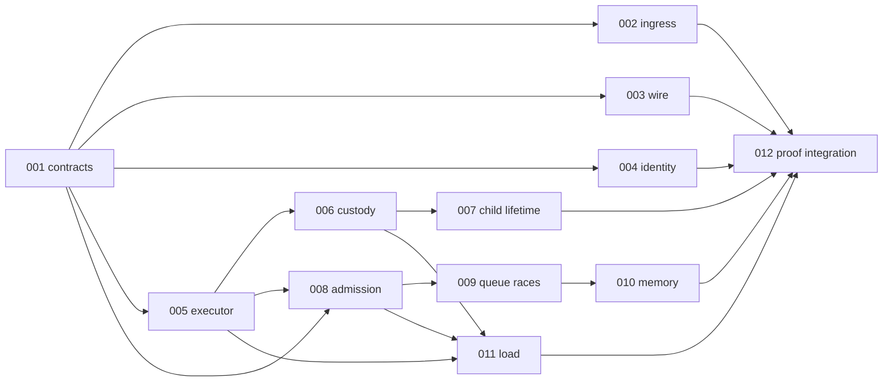

# Parallel execution and ownership — historical integration record

The W0–W4 lanes below describe the historical integration sequence, not active work assignments. The 104-row structural validator passes; semantic review records bounded H04 evidence and focused H16 Governor replay separately. The manifest remains a static candidate map; CI and nightly execution require their own clean final-HEAD receipts. D1–D9 human review and external ingress/planner/wire adoption remain OPEN. Re-freeze HEAD, tree, dirty paths, and ownership before further work.

## Historical launch conditions

1. The integrator owns the main checkout and its existing dirty `strict_ingress.rs` change. Commit/reconcile that fix separately, then run focused Clippy/ingress proof; do not treat the failed receipt as qualification. Defer the expensive full CI-profile run until W4. No worker stages or overwrites main's dirty path.
2. Give each production lane a branch/worktree from one recorded base, a disjoint file manifest, and a separate `CARGO_TARGET_DIR`. Workers may prepare test-only fixtures against that base; the integrator rebases and reruns changed selectors after each merge. One Mac Cargo build slot runs at a time. Never use GitHub CI for this plan.
3. BG25-001's D1–D9 are proposals until each relevant consumer, compatibility/semver choice, typed error, and owner is accepted. In-repo strict ingress exists, but external bytes ingress, planner, and wire consumers have no identified call site; their deployment adoption stays OPEN rather than being inferred from library tests.
4. Treat BG25-008–010 as proof-first. Add deterministic independent oracles before changing engine source. A missing test is not a confirmed production defect. Mutation, modelcheck, TSan, fuzz campaigns, and release qualification are outside this routine plan unless explicitly authorized.

## Dependency graph

## Historical work lanes (three workers plus one serial integrator)

| Lane | Historical scope | Parallel-safe first output | Exclusive write window |
|---|---|---|---|
| A — contract/identity | 001 unresolved D1–D9; 003 consumer/version boundary; 004 cross-Governor collision reproduction and handle design; 002 external adoption inventory | Read-only consumer search, decision sheet, new `cross_governor_ids` RED fixture, wire negatives. The already implemented library parser is not reimplemented. | One writer for `taskmesh-contract/src/**` and both public specs. If D4/semver accepts owner-bound handles, 004 contract → engine → host migration is one serial integration window. |
| B — host/lifetime | 005 closure audit; 006 combined response/custody timeline; 007 root/child scope; host portion of 011 | New independent timeline and root-scope fixtures in distinct test files; prove existing H34/H30 controls. No runtime patch without a RED counterexample. | One writer for `taskmesh/src/runtime.rs` and `builder.rs`. Wait for 004 host migration before any overlapping runtime change; then 006 → 007. |
| C — engine/evidence | 008 compound admission; 009 queue/waker histories; 010 memory ledger; 011 simulator per-class ledger | Separate input-derived test/model fixtures and `taskmesh-bench` simulator ledger tests. No production snapshot as expected-value oracle. | One writer for `engine/{governor,state}.rs`: 004 migration → 008 → 009 → 010. Host open-loop fixture is handed to B, not written concurrently. |
| Integrator — proof rails | 012 evidence schema, scenario mapping, test discovery, selectors, source-bound local receipt | Draft schema/validator and map 51 K + 53 P/G rows to existing or proposed cases; keep missing rows OPEN. Reconcile the dirty Clippy fix and reserve Cargo build slot. | Integrator alone edits `Justfile`, `tools/gates/**`, model producer manifest, release checklist, and main. Wire selectors only after test targets actually collect. |

These were ownership tracks, not unrestricted writers. The implemented source and per-ticket limits are recorded in BG25-001–012; this historical handoff table is not a current defect list or permission for concurrent edits. Library-local evidence still does not close deployment adoption.

## Historical merge and proof waves

| Wave | Concurrent work | Serial gate |
|---|---|---|
| W0 — baseline | A freezes decisions/consumer owners; B/C inspect controls; integrator resolves the known Clippy literal and runs focused Clippy/strict-ingress checks. | Record clean HEAD/tree and focused results. Preserve the failed prior receipt as diagnostic only; avoid a redundant full CI-profile run before integration. |
| W1 — independent RED proofs | A builds foreign-ID and wire/ingress-consumer negatives; B builds combined custody and root-scope timelines; C builds independent admission/queue/memory and simulator ledgers; integrator drafts 104-row evidence schema. | Each fixture must collect and assert externally derived expected values. Classify RED as production defect, contract gap, or test-only gap. Resolve D4/semver before 004 migration. |
| W2 — authority bridge | A owns 004 contract/engine/host migration in one short window; B/C continue only nonoverlapping test/bench files; integrator reviews consumer/MSRV and public docs. | Cross-Governor collided-ID control and facade tests pass on one source. If D4/semver is unresolved, leave 004 OPEN and do not silently replace public aliases. |
| W3 — owner fixes | B owns 006 → 007 runtime changes only if fixtures fail; C owns 008 → 009 → 010 engine changes only if fixtures fail; B integrates host open-loop after 006/008, C completes simulator 011. | One writer per shared source file, one Cargo build slot. Rebase and rerun direct consumers at every handoff; no PASS from a stale base. |
| W4 — evidence integration | Integrator wires actual collected cases, default/Rayon selectors, 104-row statuses, and gate inventory. A resolves identified external adoption/consumer proofs or records them OPEN with owner. | `just dev`, then clean unchanged-HEAD `just verify-macos-ci` locally; verify source HEAD/tree/digest, denominator, PASS/FAIL/NOT_RUN, and exclusions. No GitHub Actions spend or implied nightly qualification. |

## File ownership and collision rules

| Shared path | Collision | Resolution |
|---|---|---|
| `crates/taskmesh/src/builder.rs` | 002/005 | Descriptor freeze and strict config promotion are already integrated. Any follow-up is owned by the host lane after reviewing both contracts. |
| `crates/taskmesh/src/runtime.rs` | 004/005/006/007 and host fixtures | 005 is already implemented; 004 migration → 006 → 007. 008/011 cannot edit it directly. |
| `crates/taskmesh-engine/src/engine/{governor,state}.rs` | 004/008/009/010 | 004 migration → 008 → 009 → 010; tests in distinct files can be prepared earlier. |
| `crates/taskmesh-contract/src/**`, `docs/taskmesh-{library-spec,external-interface}.md` | 001/002/003/004/006/007 | Contract owner merges public type/doc changes; host and engine owners submit contract wording and API requirements. |
| `crates/taskmesh/tests/host_open_loop.rs` and host capacity fixtures | 008/011 versus 005/006 | Host owner creates or integrates these fixtures after runtime semantics settle; bench owner keeps simulator tests in `taskmesh-bench`. |
| `Justfile`, `tools/gates/**`, `tools/modelcheck/producer-manifest.json`, `docs/release-checklist.md` | functional lanes versus 012 | 012 owned selector and evidence changes after test collection. The `strict_ingress.rs` dirty path was specific to the historical W0 handoff; recheck current ownership before edits. |

## Worker handoff

Each lane returns: ticket/scenario IDs; base HEAD/tree; changed paths; contract decision used; pre-fix reproduction or proof-only classification; exact test target and case; command, exit status, feature/platform, and raw output location; unresolved consumer or compatibility question. The integrator rejects a handoff when its test is uncollected, its source base differs from the integrated source without a rerun, its oracle reads only the production snapshot, or it silently changes another lane's owned path.

Keep `RunFor` worker-budget and `CompleteBy` caller-response contracts distinct. BG25-006's early normal async response must retain worker lease custody while a blocking child lives; the existing synchronous requested-stack release-before-result fence remains a separate behavior. BG25-005 Tokio-context preflight applies only to paths requiring ambient Tokio, so a valid custom/Rayon executor is not blanket-rejected.

## Completion and stop conditions

- BG25-012 closes only with all 104 scenarios inventoried: 51 existing K baselines retained and 53 P/G rows assigned once, with actual selected cases and exact-source evidence. `validate_plan.py` checks planning consistency only. Do not claim all 104 PASS if a deployment consumer is unidentified or a target is uncollected.
- An external ingress/planner/consumer without an identified owner leaves deployment adoption OPEN. A nonreproducing proof gap does not authorize a production patch.
- Do not release a worker lease before actual worker/child termination, add a second unbounded queue or executor-specific pool, or infer child tracking from an unawaited spawn.
- Owner-local commands are in [COMMANDS](../../../../plans/bugbash-sep-25-general/tickets/COMMANDS.md). Mutation, modelcheck, TSan, and fuzz campaigns require separate explicit authorization; a CI-profile receipt does not imply those rails passed.
