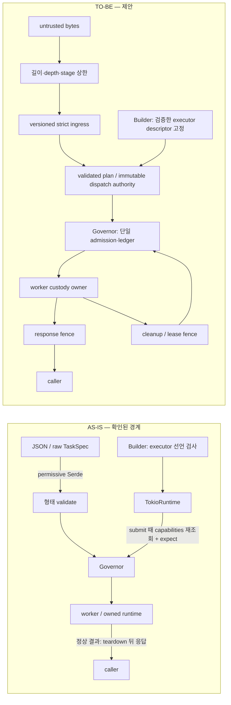

# 목표 경계와 불변식

기준은 crate 경계의 [ADR 0001](../../../../adr/0001-hexagonal-feature-sliced-architecture.md), 구현된 ownership/deadline 결정의 [ADR 0003](../../../../adr/0003-sep-16-hardening-contracts.md), [library spec](../../../../taskmesh-library-spec.md), [external interface](../../../../taskmesh-external-interface.md)다. `taskmesh-contract`는 공개 어휘/port, `taskmesh-engine`은 결정적 governance, `taskmesh`는 Tokio host, `taskmesh-rayon`은 CPU adapter다. semantic class policy와 worker/pool governance를 섞지 않는다. stage/reduce는 선언이며 엔진이 DAG나 reducer를 자동 실행하지 않는다.

## AS-IS → TO-BE

AS-IS의 permissive Serde는 라이브러리 API의 현재 사실이고, JSON이 실제 배포 ingress인지 여부는 별도다. strict 경로를 추가해도 raw `TaskSpec`의 직접 역직렬화가 저절로 안전해지지 않는다. 배포 설정 승격은 strict 경로를 거쳐야 하며, 외부 owner가 있다면 그 통합 증거는 이 저장소의 fixture와 구별한다. Serde의 `default`는 누락 필드를 채우고 `deny_unknown_fields`는 `flatten`과 조합할 수 없으므로, 실제 DTO 모양을 검토한 뒤 중첩 필드·중복 키까지 검사한다. [Serde field attributes](https://serde.rs/field-attrs.html), [Serde flatten](https://serde.rs/attr-flatten.html).

## 구조 불변식

1. **하나의 실행 계획:** builder가 검증한 executor descriptor와 resolved domain/worker limit을 런타임이 보유한다. submit, snapshot, 공개 descriptor가 서로 다른 `capabilities()` 호출 결과를 권위로 쓰지 않는다. mutable adapter의 실제 행위까지 증명할 수 없다면 선언 위반은 typed fail-closed 또는 명시적 trust contract로 취급한다.
2. **하나의 admission 권위:** class quota, capability role pool, physical domain, CPU/memory는 같은 결정에서 원자적으로 charge한다. unknown class는 reject. queue는 class limit 안에 있고 substrate 앞에 별도 무한 대기열을 만들지 않는다. 외부 공유 executor/ambient work는 Taskmesh의 독점 capacity 보장 밖이다.
3. **응답과 custody는 다른 사건:** caller timeout/cancel은 worker 종료 증거가 아니다. started `spawn_blocking`은 abort로 종료되지 않으며 owned runtime drop이 기다릴 수 있다. deadline 응답 후에도 child/worker 종료까지 lease를 유지하고 `drain`은 custody를 기준으로 판정한다. 정상 결과의 반환 전 release fence 또는 명시적 terminal outcome을 정한다. [Tokio spawn_blocking](https://docs.rs/tokio/latest/tokio/task/fn.spawn_blocking.html).
4. **경합은 상태 전이로 판정:** permit/ticket/lease/terminal은 한 번만 소유권 이동. 외부 waker, executor, clock, destructor callback은 engine lock 밖. callback panic 후에도 가능한 effect를 정리하고 독립 ledger로 보존식을 검사한다.
5. **모델의 범위를 말한다:** Loom/Shuttle은 실제 production synchronization seam을 계측한 좁은 상태 기계에 적용한다. 계측되지 않은 std/Tokio 동작은 모델 증거가 아니다. [Loom limitations](https://docs.rs/loom/latest/loom/).
6. **관측의 분모를 고정:** simulator admission wait, 실제 host end-to-end latency, terminal response, unanswered, response 후 worker custody는 각각 별도 모집단이다. 환경/baseline 없이 성능 우월성을 주장하지 않는다.

## 바꾸지 않는 경계

- engine-specific pool이나 자동 DAG scheduler를 새로 만들지 않는다.
- raw detached Tokio child를 runtime-owned child로 소급 분류하지 않는다. `LocalSet::run_until`은 root 완료 시 멈추며 남은 local task는 LocalSet이 다시 구동돼야 진전한다. [Tokio LocalSet](https://docs.rs/tokio/latest/tokio/task/struct.LocalSet.html).
- `Snapshot::conservation_violation`의 부분 helper 결과를 실제 permit-held 원장 증명으로 사용하지 않는다.
