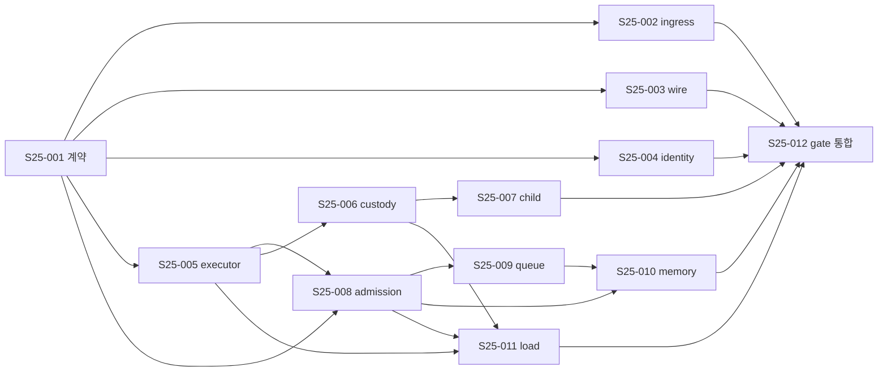

# 실행 순서와 write ownership

실행 전 HEAD/tree, dirty paths와 각 경로 owner를 다시 확인한다. `docs/misc/`의 현재 untracked 체크리스트는 사용자 작업물로 보존한다. `depends_on`은 통합 선행 조건이며 독립 read-only 조사나 fixture 설계는 진행할 수 있다.

## 의존 DAG

`S25-012`은 002–011 모두 완료가 선행이다. 도표의 합쳐진 화살표는 보기 편한 축약이며 [plan.json](plan.json)의 dependencies가 정확한 목록이다.

## 권장 wave

| Wave | 일 | 닫는 기준 |
|---|---|---|
| W0 | S25-001: 9개 계약·consumer/migration 영향 결정 | 현재/목표/owner/오류/semver가 각각 문서와 fixture 계획에 연결됨 |
| W1 | S25-002, 005, 006의 P0 경로: H33/D21/D22/D25, H30, H34 | source-backed 반례, structural fix, side effect/lease oracle. 재현 실패면 원인과 범위 갱신 |
| W2 | 003, 004, 007, 008, 009, 010의 direct/host 경합·원장 | 각 scenario의 deterministic 핵심 fixture; 공개 소비자와 engine 원장 분리 |
| W3 | 011 실측 모집단, 012 feature/gate/source-bound 통합 | 같은 source의 owner-local→CI. 성능·nightly·release는 별도 rail |

## 병렬 lane과 직렬 인계

| Lane | 순서 | 다른 lane과 병렬 가능한 시점 | 직렬 인계 |
|---|---|---|---|
| C — contract/API | 001 → 002 → 003 → 004 | 001의 결정을 고정한 뒤 H/E/B의 독립 source 조사·fixture 설계와 병렬 | `TaskSpec`, `ValidatedTaskPlan`, 공개 handle 변경은 C 단일 writer. host/engine이 요구하는 타입·오류를 먼저 합의 |
| H — host/executor | 005 → 006 → 007 | 001 완료 후 C의 wire/identity fixture, E의 독립 oracle 설계와 병렬 | 005의 executor authority가 006의 custody/response owner에게 전달돼야 함 |
| E — engine | 008 → 009 → 010 | 005의 authority 결정 후 C/H/B의 독립 파일 작업과 병렬 | `governor.rs`, `state.rs`, fairness/memory transition을 같은 시점에 두 writer가 수정하지 않음 |
| B — bench | 011 | 005·006·008 완료 후 E의 009/010과 병렬 가능 | host open-loop fixture가 H의 runtime 파일을 건드리면 H owner에 인계 |
| I — 통합/gate | 012 | 이전 lane의 read-only receipt 설계는 병렬 가능, 적용은 002–011 완료 후 | `Justfile`·inventory·required·workflow는 한 리뷰에서 결합; clean checkout에서 새 receipt |

병렬은 소스 독립성에만 근거한다. `depends_on`이 없는 C의 002/003/004도 공개 DTO 파일이 겹치면 순차 적용한다. E가 S25-008 fixture를 설계하는 동안 H가 S25-005를 수정할 수는 있지만, H의 실제 authority patch가 확정되기 전 E의 통합 PASS를 주장하지 않는다.

## 단일 적용 owner

| 범위 | 적용 owner | 병렬 허용 조건 |
|---|---|---|
| `crates/taskmesh-contract/**`, 공개 DTO/port | contract/API | engine/host는 change proposal과 fixture를 넘기고 contract owner가 적용 |
| `crates/taskmesh-engine/src/**` | engine | admission/queue/memory가 같은 `Governor`/state를 건드리면 직렬; fairness는 engine owner와 인계 |
| `crates/taskmesh/src/**`, `crates/taskmesh-rayon/**` | host/executor | S25-005→006→007 순서. S25-008/011 host fixture가 겹치면 인계 |
| `crates/taskmesh-bench/**` | bench | simulator와 host 측정 입력/분모를 같은 owner가 정리 |
| `Justfile`, `.github/**`, `tools/gates/**` | CI/integration | 기능 티켓은 gate selection 요청만 제공; S25-012에서 inventory와 required를 함께 검토 |
| `docs/taskmesh-*`, ADR, release checklist | API/integration | 실제 계약 결정 후 문구 통합; 계획 문서와 source doc이 충돌하면 source+accepted ADR 재확인 |

티켓 owner는 역할이고 실제 assignee가 아니다. 한 파일의 동시 쓰기는 금지한다. 서로 다른 fixture 파일도 공유 helper/API 계약이 바뀌면 해당 owner가 순차 통합한다. owner-local green은 다른 lane의 dirty overlay와 합산하지 않는다.

## 변경 중단·재계획 조건

- B28 opaque handle이 breaking API가 되거나 strict ingress가 raw DTO의 Serde 의미를 바꾸는 경우: S25-001의 semver/migration 결정을 먼저 갱신한다.
- H34의 cleanup owner가 child 종료 전에 lease를 버리거나 H30이 검증 descriptor와 다른 authority를 남기면 구현을 진행하지 않고 구조를 다시 검토한다.
- B22 membership을 engine에 넣어야 한다면 parent plan registry·generation·retention·배포 입력 계약을 별도 설계한다. 문자열 검사 한 줄로 닫지 않는다.
- 외부 ingress/consumer/hosted CI 설정이 이 저장소 밖이면 담당 owner와 source/receipt를 지정할 때까지 해당 통합 acceptance는 OPEN이다.
- 새 gate가 required set에 추가되거나 selector가 달라지면 `inventory.json`, `required.json`, Justfile, workflow를 함께 검토하고 exact-source receipt를 다시 만든다.
