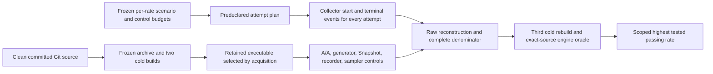

# Taskmesh host-series acquisition and admission

Scope: default-feature, single-process `run_io` / `run_blocking` / `run_cpu`
finite open-loop fixtures. Local, closed-loop, composite and requested-stack
receipts retain separate diagnostic schemas. This workflow cannot establish peer
superiority, representative consumer performance or capacity at an untested rate.

## Evidence flow



Single-run `host_perf.py --require-performance` continues to reject caller
calibration booleans. `host_admission.py` owns the separate measured series path.
The control assessor, comparator and structural receipts still report
`UNQUALIFIED` individually. No qualifying series has been acquired for this
change set.

## Build custody

Use a clean committed checkout and fresh artifact directories outside the
checkout. Set `TASKMESH_BENCH_BUILD_WITNESSES` **before** acquiring build witnesses
and retain the same setting through all acquisitions. This variable is part of
execution identity. The witness records both caller settings and effective
build settings, including its owned target directory and forced incremental-off
override. Each example has its own directory:

```sh
# Freeze these settings before acquiring witnesses or any measured controls.
export CARGO_PROFILE_DEV_OPT_LEVEL=3
export CARGO_PROFILE_DEV_DEBUG_ASSERTIONS=false
export TASKMESH_BENCH_BUILD_WITNESSES=/tmp/taskmesh-series-builds
just bench-build acquire "$TASKMESH_BENCH_BUILD_WITNESSES/host_load_probe"
just bench-build acquire "$TASKMESH_BENCH_BUILD_WITNESSES/host_generator_probe" --example host_generator_probe
```

The unchanged Cargo recipe uses the dev profile with the declared overrides.
Without an optimized actual Cargo artifact profile (level 2/3, debug assertions
off, non-test executable), the witness is structural only and measured admission
rejects it. The profile is derived from digest-bound Cargo logs and compared with
the independent rebuild; an operator-supplied `optimized: true` flag is not used.
The admission checks the four governed library profiles in both cold-build logs,
then the three governed libraries and four actual oracle test binaries in Cargo
JSON output. Optimization, assertion and overflow semantics must match the
probe; setting oracle environment variables alone is insufficient.
Custom rustflags, compiler/wrapper overrides, target rustflags and Cargo `[env]`
injections are rejected by this admission lane because Cargo profile metadata
does not describe their effective semantics. Structural custody remains available.
The output exposes the actual profile and build environment. This is a named
build configuration, not an assumption that every release/deployment build is
equivalent.

Host, minimal, A/A, Snapshot and sampler wrappers then use the retained
`host_load_probe` binary; generator uses the separately frozen generator binary.
Missing or mismatched witnesses reject; the wrappers do not fall back to a new
checkout build. Special-mode runners additionally need witnesses for their named
probe and `host_special_validate` if this environment variable is set.

`host_build.py` retains a Git archive, read-only source files, Cargo.lock identity,
verbose Rust/Cargo identities, build environment, Cargo-config digests from the
source directory, every ancestor and Cargo home,
Cargo logs and both executable copies. It performs two builds with a freshly
removed owned target directory, at the same retained source path and with
incremental compilation disabled. Byte differences reject. Verification with
`--rebuild` performs another cold build and compares the actual executable.

The witness is intentionally location-bound because debug binaries can contain
absolute paths. Move it only as historical custody; acquire a new witness to
rebuild at another location. This is local reproducibility evidence, not an
external attestation, hermetic dependency build, or independent peer rerun.
Compiler/build-system compromise and source tampering followed by restoration
between endpoint checks are outside its proof. Use an isolated owner checkout
for acquisition. Build-witness schema v3 includes ancestor configuration and actual Cargo tool
executable custody; v1/v2 witnesses must be reacquired. Every cold build and engine oracle has a 1,800-second limit
plus the supervisor termination grace. Use a separately declared `CARGO_HOME`
when the normal host configuration injects unsupported rustflags; set it before
acquiring witnesses and keep it identical for collection and admission. Timeout, interruption, or orphaned-group
failures preserve logs/execution diagnostics and never publish success proof.

## Freeze the measured population

Pilot measurements may select the common absolute rate grid. Application owners
must supply actual per-class SLOs; no SLO, representative profile, precision target
or completion floor is silently synthesized. Freeze a separate JSON contract
before the measured attempts. `host_admission.CONTRACT_KEYS` is the exact schema:

| Field | Required meaning |
|---|---|
| `schema_version`, `status` | `1`, `frozen_taskmesh_full_host_series` |
| `source_head`, `build_witness_sha256` | Clean commit and retained host build-witness byte digest |
| `rate_grid` | At least two unique increasing positive absolute rates |
| `scenario_sha256_by_rate` | Exact scenario digest for every rate, decimal rate keys |
| `control_policy_sha256_by_rate` | Exact v2 measured-control budget digest for every rate |
| `warmup_ms`, `injection_ms` | Fixed warmup and positive injection window |
| `repetitions_per_rate` | At least four pairs, even, with equal forward/reverse orders |
| `minimum_slo_fraction`, `slo_ms_by_class` | Positive application-defined floor and exact class SLO catalog |
| `min_success_samples_per_cohort` | Positive success population floor; request rows are never pooled across runs |
| `max_p99_relative_interval_width` | Positive fraction; binomial order-statistic interval width divided by per-run p99 |
| `max_span_ns` | Positive maximum span across all control and measurement processes |

The binomial rank interval has nominal 95% coverage **conditional on iid
within-run success latencies**. This is an unverified model assumption;
exchangeability alone is insufficient.
It does not establish stationarity or independence for a correlated workload. Run-level budgets must pass separately;
the result includes this assumption. A thin tail with an unbounded interval
cannot pass. SLO fraction uses **all intended arrivals**, including rejection and
late completion. Intentional cancel/drop/deadline fixtures are separate stress
populations and cannot enter this capacity admission path.

Across every rate and repetition, admission requires the same topology, full
class policies, work bodies, load settings and exact proportional offer mix.
Only arrival timestamps and population-dependent `max_records` may differ.
Distinct preregistered scenario hashes cannot authorize different workloads in
one capacity grid. This check is shared with the descriptive comparator.
Requested-stack or other public paths explicitly reject in this admission lane.

Controls have an exact per-rate manifest. The manifest's root is an object keyed
by decimal rate; each value names these relative paths under its directory:
`policy`, `scenario_path`, `host_raw`, `host_summary`, `generator_raw`,
`aa_directory`, `snapshot_directory`, `recorder_directory`, `sampler_directory`,
`bundle_path`. The assessor recomputes constituent validation and every budget;
a copied `BUDGET_PASS_DIAGNOSTIC` report is not an input.

Recorder policy v2 additionally requires
`max_recorder_process_duration_relative_delta`. Recorder bundle v2 measures the
whole probe process window, including startup, warmup, serialization and sampler
stop overhead. This is a macro recorder-cost diagnostic, **not minimal-mode
request latency or p99**. A known-duration perturbation has a sensitivity
regression; quiet-host calibration still needs real measured pairs.

## Attempt ledger

`host_study.py collect --plan PLAN DIRECTORY` seals the exact plan before the
first started event. The plan has `schema_version: 2`, `contract_sha256`, and an
ordered `attempts` array. Version 1 ledgers remain historical and reject here;
recollect with a predeclared timeout rather than retroactively rewriting them.
Each attempt requires:

- `id`: unique safe directory name;
- `rate_per_second`, `pair_index`, `arm`: one `baseline` and one `candidate` per
  contiguous pair, increasing zero-based indices within each rate;
- `scenario`, `scenario_sha256`, `calibration`, `calibration_sha256`: input paths
  relative to the plan directory, bound by exact byte digests;
- `timeout_seconds`: positive integer wall-clock limit fixed before collection;
- `features`: sorted unique feature names; measured admission currently requires
  the default feature set.

Both arm labels in this first admission version are **same-source repetition
roles**. They do not compare a changed implementation or an industry peer.
`host_compare.py` remains the descriptive two-source comparison tool and cannot
promote selected successful pairs to this measured admission.

The collector writes a started event before input validation/process launch and a
terminal event after completion or failure. Timeouts use the shared process
supervisor to terminate the owned process group and bound inherited capture
pipes. A successful leader with surviving group members fails. SIGINT/SIGTERM
stops further launches; the remaining planned population is retained as failed
with an explicit not-launched reason. Descendants that escape the process group
are outside this cleanup guarantee. Stdout, stderr, partial artifacts and
failure reasons are retained. Events form a digest chain rooted in the sealed
plan, and final accounting binds the complete event bytes and every attempt's
artifact inventory. Missing, duplicate, reordered, interrupted or altered
attempts reject. Metadata must be regular owned files and the study root must
contain exactly its sealed metadata and declared attempt directories; unplanned
artifacts reject. Failures remain in the denominator and suppress admission.
This contract permits **zero exclusions**; arbitrary exclusion labels reject.
It accounts for collector-owned attempts, not experiments run outside it.

Calibration acquisitions are separate processes from the measured attempts;
do not reuse a target/control process as a series run. All windows must be
nonoverlapping on one boot/cadence and within the frozen span.

## Admission and output

```sh
just bench-study collect /tmp/taskmesh-series --plan /tmp/plan.json
just bench-study verify /tmp/taskmesh-series
just bench-host-admit /tmp/contract.json /tmp/taskmesh-series \
  "$TASKMESH_BENCH_BUILD_WITNESSES/host_load_probe" \
  /tmp/control-series/manifest.json /tmp/taskmesh-admission
```

Admission requires the exact clean source checkout for typed raw reconstruction,
including a comparison of tracked bytes and executable modes against HEAD that
does not honor assume-unchanged or skip-worktree hints. Execution provenance
schema v5 and structural receipt schema v3 bind a source-content digest as well
as HEAD/tree/dirty state; changing one dirty checkout into another invalidates
the acquisition. Older identity/provenance receipts must be reacquired and do
not migrate by adding a copied digest. Frozen build acquisition uses the same
clean-source check before archiving the pinned commit. Build witness schema v3
also binds the resolved Cargo, rustc, launcher, configured wrappers/linkers, and
native tool executable bytes from the actual frozen build directory. This
context is rechecked before and after cold builds and correctness oracles;
older build witnesses must be reacquired. Interpreter dependencies and shared
libraries are outside this executable-file custody contract.

Admission binds every typed-validated artifact to the sealed ledger digest,
hashes the exact bytes used for tail analysis, rechecks measured controls, and
runs a third cold build. It then
executes the four named Taskmesh engine/facade oracle suites from the frozen
source, with test-profile optimization, debug assertions and overflow checking
explicitly matched to the measured artifact. The oracle inherits the frozen
effective build environment, including disabled incremental compilation, before
applying the recorded test-profile overrides. At least 45 passing tests across all four suite results, zero ignored,
failed or filtered tests are required. Oracle stdout/stderr are retained; copied
PASS receipts or zero-test runs do not satisfy this step. Mutable input custody
and source identity are rechecked before publishing `admission.json`.

The report gives:

- every planned attempt, actual run artifact digests and per-run/cohort budgets;
- per-run p99 rank interval and its assumption;
- the highest **tested** rate passing every run/cohort, and whether a higher
  failing rate brackets it; nonmonotonic points require investigation;
- sampled CPU/RSS/thread lower bounds and whole-trial sampled CPU per successful
  injection-cohort completion as a **lower bound**, including warmup/startup/drain.

It cannot report exact total CPU, steady-state CPU per success, true maximum
capacity between grid points, or a universal regression threshold. Failed
admission produces no success report. Full current-HEAD CI and release
qualification are separate rails; this command does not run mutation testing.

## Remaining actual inputs

- Frozen B00 values selected from pilots and application requirements.
- Repeated measurements on a quiet declared host; current shared-host diagnostics
  cannot establish a performance result.
- Privacy-safe consumer H7 profile and transformation/source provenance.
- A maintained named peer, proven semantic intersection, matched resource windows
  for exact efficiency, and an independent external rerun.
- Separate repeated admission contracts for local, closed-loop, composite and
  nondefault feature comparisons if those claims are requested.

## Execution safety and remaining longitudinal boundaries

The study collector, cold builds and admission oracle retain supervised
execution. Standalone A/A, Snapshot, recorder and sampler arms now use the same
owned execution adapter, with a 3,600-second arm limit. Non-witness Cargo builds,
probe execution (including sampler-off controls), and Cargo-backed typed raw
validation have 1,800-second limits. Special acquisition/receipt validators use
120 seconds. These source-declared safety limits are not performance budgets.
A timeout, interrupt, failed capture/launch or surviving process group cannot
pass; controls retain failure accounting and stop later arms.

Sampler creation uses the launched probe PID. Inner execution has a one-second
termination grace, control arms three seconds and collector execution five
seconds. Cooperative timeout/SIGINT/SIGTERM cleans inner groups before the outer
owner's deadline. Arbitrary SIGKILL or explicit session escape is outside this
proof. Revalidation still uses private digest-checked bytes. Control costs must
be measured again against the new source; earlier source receipts do not qualify.

Prelaunch metadata inspection uses owned binary capture with a 30-second safety
budget and 0.5-second termination grace. Git/source enumeration, archive bytes
and tool/host identity reject incomplete execution without using partial output.
Artifact/config/source reads and executable copies validate the opened regular
descriptor; FIFO/device/directory inputs reject without waiting for a writer.
Regular symlinks remain subject to each caller's existing confinement policy.
Study ledger append rejects nonregular/symlink replacements. Supervisor stdin
retains backpressured input across capture polls and closes EOF after delivery.
These are normal local-filesystem/process checks, not capture-volume limits,
deadlines for stalled kernel/network regular-file I/O or a hostile-writer sandbox.

Finite-run validation checks settlement and residual ownership. The active
[B07 plan](../plans/sep-25-taskmesh-benchmark/tickets/B07-minimal-recovery-soak.md)
adds same-host repeated cycles, exact capacity-return checkpoints and successful
normal-work canaries after recovery. It reuses existing validators and custody;
short smoke belongs in ordinary tests, longer stress is initially local opt-in.
Implementation and execution are pending; there is no stability command to run yet.

Separate mode-specific performance admission, RSS slope gates and recovery SLOs
are deferred until required by a declared performance claim and consumer budget.
Supported modes retain their existing correctness/cancel/drain/resource-return
test obligations. Resource samples remain observations with unavailable/capped
states, and cannot turn functional recovery into a memory-stability or performance
claim. All structural receipts remain `UNQUALIFIED`.
