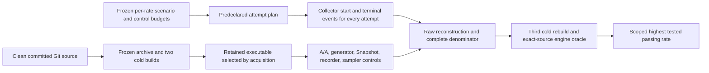

# Taskmesh host-series acquisition and admission

Scope: default-feature, single-process `run_io` / `run_blocking` / `run_cpu`
finite open-loop fixtures. Local, closed-loop, composite and requested-stack
receipts retain separate diagnostic schemas. This workflow cannot establish peer
superiority, representative consumer performance or capacity at an untested rate.

## Evidence flow



Single-run `host_perf.py --require-performance` continues to reject caller
calibration booleans. `host_admission.py` owns the separate measured series path.
The control assessor, comparator and structural receipts still report
`UNQUALIFIED` individually. No qualifying series has been acquired for this
change set.

## Build custody

Use a clean committed checkout and fresh artifact directories outside the
checkout. Set `TASKMESH_BENCH_BUILD_WITNESSES` **before** acquiring build witnesses
and retain the same setting through all acquisitions. This variable is part of
execution identity. Each example has its own directory:

```sh
export TASKMESH_BENCH_BUILD_WITNESSES=/tmp/taskmesh-series-builds
just bench-build acquire "$TASKMESH_BENCH_BUILD_WITNESSES/host_load_probe"
just bench-build acquire "$TASKMESH_BENCH_BUILD_WITNESSES/host_generator_probe" --example host_generator_probe
```

Host, minimal, A/A, Snapshot and sampler wrappers then use the retained
`host_load_probe` binary; generator uses the separately frozen generator binary.
Missing or mismatched witnesses reject; the wrappers do not fall back to a new
checkout build. Special-mode runners additionally need witnesses for their named
probe and `host_special_validate` if this environment variable is set.

`host_build.py` retains a Git archive, read-only source files, Cargo.lock identity,
verbose Rust/Cargo identities, build environment, global Cargo-config digests,
Cargo logs and both executable copies. It performs two builds with a freshly
removed owned target directory, at the same retained source path and with
incremental compilation disabled. Byte differences reject. Verification with
`--rebuild` performs another cold build and compares the actual executable.

The witness is intentionally location-bound because debug binaries can contain
absolute paths. Move it only as historical custody; acquire a new witness to
rebuild at another location. This is local reproducibility evidence, not an
external attestation, hermetic dependency build, or independent peer rerun.
Compiler/build-system compromise and source tampering followed by restoration
between endpoint checks are outside its proof. Use an isolated owner checkout
for acquisition. Frozen-build failures preserve logs and never publish a witness.

## Freeze the measured population

Pilot measurements may select the common absolute rate grid. Application owners
must supply actual per-class SLOs; no SLO, representative profile, precision target
or completion floor is silently synthesized. Freeze a separate JSON contract
before the measured attempts. `host_admission.CONTRACT_KEYS` is the exact schema:

| Field | Required meaning |
|---|---|
| `schema_version`, `status` | `1`, `frozen_taskmesh_full_host_series` |
| `source_head`, `build_witness_sha256` | Clean commit and retained host build-witness byte digest |
| `rate_grid` | At least two unique increasing positive absolute rates |
| `scenario_sha256_by_rate` | Exact scenario digest for every rate, decimal rate keys |
| `control_policy_sha256_by_rate` | Exact v2 measured-control budget digest for every rate |
| `warmup_ms`, `injection_ms` | Fixed warmup and positive injection window |
| `repetitions_per_rate` | At least four pairs, even, with equal forward/reverse orders |
| `minimum_slo_fraction`, `slo_ms_by_class` | Positive application-defined floor and exact class SLO catalog |
| `min_success_samples_per_cohort` | Positive success population floor; request rows are never pooled across runs |
| `max_p99_relative_interval_width` | Positive fraction; binomial order-statistic interval width divided by per-run p99 |
| `max_span_ns` | Positive maximum span across all control and measurement processes |

The binomial rank interval has nominal 95% coverage **conditional on exchangeable
within-run success latencies**. It does not establish stationarity or independence
for an arbitrary correlated workload. Run-level budgets must pass separately;
the result includes this assumption. A thin tail with an unbounded interval
cannot pass. SLO fraction uses **all intended arrivals**, including rejection and
late completion. Intentional cancel/drop/deadline fixtures are separate stress
populations and cannot enter this capacity admission path.

Controls have an exact per-rate manifest. The manifest's root is an object keyed
by decimal rate; each value names these relative paths under its directory:
`policy`, `scenario_path`, `host_raw`, `host_summary`, `generator_raw`,
`aa_directory`, `snapshot_directory`, `recorder_directory`, `sampler_directory`,
`bundle_path`. The assessor recomputes constituent validation and every budget;
a copied `BUDGET_PASS_DIAGNOSTIC` report is not an input.

Recorder policy v2 additionally requires
`max_recorder_process_duration_relative_delta`. Recorder bundle v2 measures the
whole probe process window, including startup, warmup, serialization and sampler
stop overhead. This is a macro recorder-cost diagnostic, **not minimal-mode
request latency or p99**. A known-duration perturbation has a sensitivity
regression; quiet-host calibration still needs real measured pairs.

## Attempt ledger

`host_study.py collect --plan PLAN DIRECTORY` seals the exact plan before the
first started event. The plan has `schema_version: 1`, `contract_sha256`, and an
ordered `attempts` array. Each attempt requires:

- `id`: unique safe directory name;
- `rate_per_second`, `pair_index`, `arm`: one `baseline` and one `candidate` per
  contiguous pair, increasing zero-based indices within each rate;
- `scenario`, `scenario_sha256`, `calibration`, `calibration_sha256`: input paths
  relative to the plan directory, bound by exact byte digests;
- `features`: sorted unique feature names; measured admission currently requires
  the default feature set.

Both arm labels in this first admission version are **same-source repetition
roles**. They do not compare a changed implementation or an industry peer.
`host_compare.py` remains the descriptive two-source comparison tool and cannot
promote selected successful pairs to this measured admission.

The collector writes a started event before input validation/process launch and a
terminal event after completion or failure. Stdout, stderr, partial artifacts and
failure reasons are retained. Events form a digest chain rooted in the sealed
plan, and final accounting binds the complete event bytes and every attempt's
artifact inventory. Missing, duplicate, reordered, interrupted or altered
attempts reject. Failures remain in the denominator and suppress admission.
This contract permits **zero exclusions**; arbitrary exclusion labels reject.
It accounts for collector-owned attempts, not experiments run outside it.

Calibration acquisitions are separate processes from the measured attempts;
do not reuse a target/control process as a series run. All windows must be
nonoverlapping on one boot/cadence and within the frozen span.

## Admission and output

```sh
just bench-study collect /tmp/taskmesh-series --plan /tmp/plan.json
just bench-study verify /tmp/taskmesh-series
just bench-host-admit /tmp/contract.json /tmp/taskmesh-series \
  "$TASKMESH_BENCH_BUILD_WITNESSES/host_load_probe" \
  /tmp/control-series/manifest.json /tmp/taskmesh-admission
```

Admission requires the exact clean source checkout for typed raw reconstruction,
rechecks the ledger and measured controls, and runs a third cold build. It then
executes the four named Taskmesh engine/facade oracle suites from the frozen
source. At least 45 passing tests across all four suite results, zero ignored,
failed or filtered tests are required. Oracle stdout/stderr are retained; copied
PASS receipts or zero-test runs do not satisfy this step. Mutable input custody
and source identity are rechecked before publishing `admission.json`.

The report gives:

- every planned attempt, actual run artifact digests and per-run/cohort budgets;
- per-run p99 rank interval and its assumption;
- the highest **tested** rate passing every run/cohort, and whether a higher
  failing rate brackets it; nonmonotonic points require investigation;
- sampled CPU/RSS/thread lower bounds and whole-trial sampled CPU per successful
  injection-cohort completion as a **lower bound**, including warmup/startup/drain.

It cannot report exact total CPU, steady-state CPU per success, true maximum
capacity between grid points, or a universal regression threshold. Failed
admission produces no success report. Full current-HEAD CI and release
qualification are separate rails; this command does not run mutation testing.

## Remaining actual inputs

- Frozen B00 values selected from pilots and application requirements.
- Repeated measurements on a quiet declared host; current shared-host diagnostics
  cannot establish a performance result.
- Privacy-safe consumer H7 profile and transformation/source provenance.
- A maintained named peer, proven semantic intersection, matched resource windows
  for exact efficiency, and an independent external rerun.
- Separate repeated admission contracts for local, closed-loop, composite and
  nondefault feature comparisons if those claims are requested.
