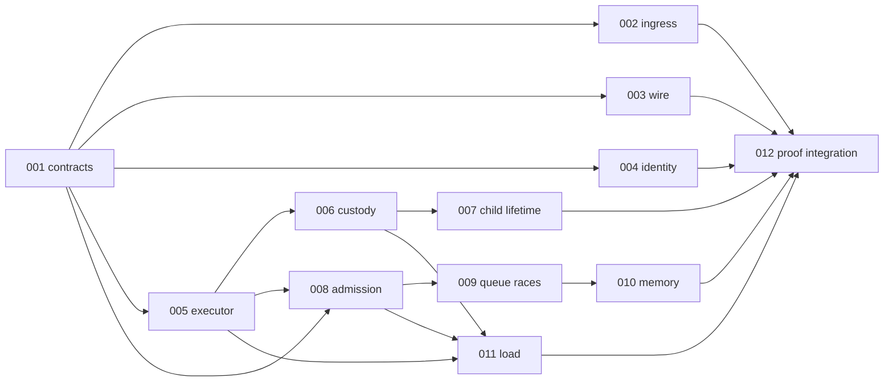

# Parallel execution and ownership

Status: **plan only**. Ticket dependencies in `plan.json` describe logical prerequisites; the integration barriers below also prevent concurrent writes to shared source. Work starts from a newly recorded HEAD/tree and dirty-file inventory. The audit source in `plan.json` is evidence for this plan, not an implementation base that can be assumed current.

## Launch conditions

1. Preserve the current dirty checkout. During this planning pass, HEAD advanced from the audit commit `76559c4` to `29bd8ce` as proof-rail/test edits were committed; the bugbash packet and other docs remain untracked. Recheck `git status --short` and `git diff <audit-head>..HEAD --name-only` before assigning files. No lane stages or overwrites another owner's paths without a handoff.
2. Pick one implementation base and record its full HEAD, tree, toolchain, and feature set. Give each code lane an isolated worktree/branch and its own `CARGO_TARGET_DIR`. A lane reports its base and changed paths; the integrator rebases or reapplies it against the latest integration commit before accepting proof.
3. BG25-001 records D1–D9 with current behavior, target behavior, consumer owner, semver/migration, and typed failure. Production contract changes wait for the relevant decision. External ingress, planner, and wire adoption remain OPEN until an actual consumer and call site are identified.
4. Reserve one Mac Cargo build slot for expensive commands. Parallel reading, fixture design, and non-Cargo tooling are fine; competing Cargo builds invalidate timing comparisons and waste compile time.

## Dependency graph

## Work lanes

| Lane | Owns | Can start in parallel | Exclusive integration window |
|---|---|---|---|
| Contract/API | 001 decision; 002 strict parser and controls; 003 wire/consumer fixtures; 004 collision repro and handle proposal | After 001: 002 parser and 003 fixture design in separate files; 004 RED repro can proceed without changing engine/host production code | One writer for `taskmesh-contract/src/**` and the two public docs. 002 Builder hook follows 005. 004 public handle migration follows the 002 hook and precedes engine 008 production edits and host 006 edits. |
| Host/executor | 005, then 006, then 007; host portions of 002/004/008/011 by handoff | 005 after 001; 006 timeline fixture design while 005 runs | One writer for `taskmesh/src/runtime.rs` and `builder.rs`. Integrate 005, then the 002 Builder hook, then 004 host migration, then 006 and 007. |
| Engine proof | 008, then 009, then 010 | Input-derived admission/queue/memory oracles and distinct new test files can be drafted after 001 | One writer for `engine/{governor,state}.rs` and overlapping feature slices. Integrate 004 handle migration first; apply 008 → 009 → 010 production fixes only for deterministic counterexamples. |
| Load/evidence | 011 simulator ledger; 012 inventory schema and 104-row draft | Denominator design and evidence schema may start immediately; no PASS status from a draft | 011 host fixture waits for 005/006/008 interfaces. 012 alone edits selectors, model producer manifest, `Justfile`, gate files, and release checklist after target names/cases stabilize. |

The four rows are ownership tracks, not four unrestricted writers. A host or engine change proposed by another lane is a patch request to that owner. `BG25-004` is a cross-crate bridge: its contract, engine, and host pieces are integrated in one short serial window so permit/ticket types cannot drift across crates.

## Merge and proof waves

| Wave | Parallel work | Serial gate to next wave |
|---|---|---|
| W0 | 001 source/consumer inventory and D1–D9 decisions; other lanes may prepare read-only negative fixtures | Accepted contract with compatibility and external-owner status. A missing external owner stays OPEN. |
| W1 | 005 H30 fix; 002 strict parser/negative fixtures if D1–D3 authorize a library entrypoint, otherwise ingress design only; 003 wire fixtures; 004 foreign-ID RED repro; 008 independent oracle design; 012 evidence schema | Merge 005 and its focused host proof. Host owner then integrates any accepted 002 Builder promotion; contract owner reconciles 002/003 docs and types. |
| W2 | 004 authority migration in its exclusive window; 011 simulator ledger tests; 006 response timeline design; 008 test-only matrix | Merge 004 across contract/engine/host with consumer-MSRV and foreign-ID proof. Rebase host and engine work on that result. If semver decision blocks 004, keep its DoD OPEN and continue only nonconflicting proof work. |
| W3 | Host owner implements 006 → 007. Engine owner runs 008 → 009 → 010 in order. Bench owner completes 011 simulator work and receives the host-open-loop fixture from host owner after 006/008. | Each ticket supplies a deterministic case, independent observable, focused result, and changed-path list. No source fix for an unconfirmed engine mismatch. |
| W4 | 012 integrates the 104-row scenario inventory, test discovery, Rayon/model selectors, and gate metadata | One integration commit lineage; `just dev`, then one clean unchanged-source `just verify-macos-ci` on the Mac. Record failed, filtered, and not-run rows honestly. |

## File ownership and collision rules

| Shared path | Collision | Resolution |
|---|---|---|
| `crates/taskmesh/src/builder.rs` | 002/005 | 005 owns descriptor freeze; 002 hands over a narrow config-promotion patch afterward. |
| `crates/taskmesh/src/runtime.rs` | 004/005/006/007 and host fixtures | 005 → 004 migration → 006 → 007. 008/011 cannot edit it directly. |
| `crates/taskmesh-engine/src/engine/{governor,state}.rs` | 004/008/009/010 | 004 migration → 008 → 009 → 010; tests in distinct files can be prepared earlier. |
| `crates/taskmesh-contract/src/**`, `docs/taskmesh-{library-spec,external-interface}.md` | 001/002/003/004/006/007 | Contract owner merges public type/doc changes; host and engine owners submit contract wording and API requirements. |
| `crates/taskmesh/tests/host_open_loop.rs` and host capacity fixtures | 008/011 versus 005/006 | Host owner creates or integrates these fixtures after runtime semantics settle; bench owner keeps simulator tests in `taskmesh-bench`. |
| `Justfile`, `tools/gates/**`, `tools/modelcheck/producer-manifest.json`, `docs/release-checklist.md` | functional lanes versus 012; current dirty edits | 012 owns selector and evidence changes after test collection; preserve and reconcile the pre-existing edits before writing. |

## Worker handoff

Each lane returns: ticket/scenario IDs; base HEAD/tree; changed paths; contract decision used; pre-fix reproduction or proof-only classification; exact test target and case; command, exit status, feature/platform, and raw output location; unresolved consumer or compatibility question. The integrator rejects a handoff when its test is uncollected, its source base differs from the integrated source without a rerun, its oracle reads only the production snapshot, or it silently changes another lane's owned path.

Keep `RunFor` worker-budget and `CompleteBy` caller-response contracts distinct. BG25-006's early normal async response must retain worker lease custody while a blocking child lives; the existing synchronous requested-stack release-before-result fence remains a separate behavior. BG25-005 Tokio-context preflight applies only to paths requiring ambient Tokio, so a valid custom/Rayon executor is not blanket-rejected.

## Completion and stop conditions

- BG25-012 closes only with all 104 scenarios inventoried: 51 existing K baselines retained and 53 P/G rows assigned once, with actual selected cases and exact-source evidence. `validate_plan.py` checks planning consistency only.
- An external ingress/planner/consumer without an identified owner leaves deployment adoption OPEN. A nonreproducing proof gap does not authorize a production patch.
- Do not release a worker lease before actual worker/child termination, add a second unbounded queue or executor-specific pool, or infer child tracking from an unawaited spawn.
- Owner-local commands are in [COMMANDS](COMMANDS.md). Mutation, modelcheck, TSan, and fuzz campaigns require separate explicit authorization; a CI-profile receipt does not imply those rails passed.
