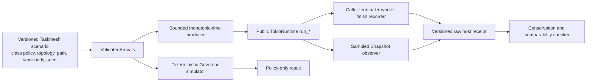

# Taskmesh benchmark qualification: source audit and work plan

Status: **plan; industry SOTA performance claim is unsupported**. Initial audit at clean `main@7253fab2002f15a65a31a2070641f0c18498912f`; adversarial claim audit at clean `main@59f88891d380c19af7a3e8c045d8b98a2ac219a3`; external-method review at clean `main@b7aad9c6970e0d3a719b40389a68c03f369d26fb`, all on 2026-09-26. These were static source/documentation reviews; no benchmark, test, or gate was run for this plan. Historical measurements and receipts do not establish performance for the reviewed HEAD.

## Measurement boundary

Taskmesh is a governed execution library. The measured product paths are `Governor::{admit,claim,release,snapshot}` and `TokioRuntime::{run_io,run_blocking,run_cpu,run_local,run_async_with_requested_stack}` with their class policies, capability topology, cancellation/deadline custody, drain, and composite stage behavior. HTTP, database, retrieval quality, and generic server RPS are outside this benchmark. A workload body may model CPU, blocking, or async work, but its own speed must be reported separately from Taskmesh overhead.

There are three distinct claims:

1. **Engine micro-cost:** governor transition cost, allocations, instruction count, and contention. This does not establish host response latency.
2. **Deterministic policy behavior:** admission, queue bounds, fairness order, conservation, and host/simulator count agreement on a finite fixture. This does not establish sustained wall-clock capacity.
3. **Host performance:** actual public facade calls under scheduled arrival load, with terminal accounting, per-class/path latency, goodput, and worker custody. This claim is currently open.

Criterion and IAI remain Taskmesh's existing engine micro-cost tools. The host-load design below comes from execution-engine benchmark cases and runs against Taskmesh's **in-process** API.

## External execution-engine benchmark precedents

These are source-inspected **benchmark cases as of 2026-09-26**, not performance numbers or thresholds to import. Tokio and Asupersync are in-process runtime analogues; Temporal is a larger worker/task-queue service whose load-shape and accounting method transfers but whose network/persistence latency does not. No single inspected project provides a canonical, semantically equivalent Taskmesh benchmark suite; the common practice below is a *method synthesis*, not an industry score standard.

| External case and inspected source | Actual benchmark design | Taskmesh mapping and current gap |
|---|---|---|
| [Tokio `spawn.rs`](https://github.com/tokio-rs/tokio/blob/master/benches/spawn.rs) | One vs ten spawned tasks, current-thread vs threaded runtime, enqueue plus await completion. | Retain one-task no-op cost, add small-batch `run_*` completion per operation with identical runtime/work body/spec-creation boundaries. Current `governance_tax` is sequential and its raw comparison includes different setup. |
| [Asupersync scheduler](https://github.com/Dicklesworthstone/asupersync/blob/main/benches/scheduler_benchmark.rs), [spawn/adversarial](https://github.com/Dicklesworthstone/asupersync/blob/main/benches/spawn_throughput.rs) | Queue/schedule/pop cases at varied population, mixed-lane order, spawn/join throughput, typed quota-denial and cancel-storm cases, teardown with pending tasks. Its deferred request-tail report explicitly measures **enqueue to ordered join observation**, not first-terminal latency. | Add Governor queue promotion over class count/depth, then real-host cancellation/rejection storms. Timestamp each Taskmesh terminal independently and do not relabel an ordered join as p99 response time. Copy the measurement split, not its lane/priority semantics. |
| [Asupersync cancel/drain](https://github.com/Dicklesworthstone/asupersync/blob/main/benches/cancel_drain_bench.rs), [tracing overhead](https://github.com/Dicklesworthstone/asupersync/blob/main/benches/tracing_overhead.rs) | Cancel plus ready mixed dispatch, draining-state population, quiescent versus active governance, and instrumentation on/off cost have separate cases. | Keep Taskmesh cancellation, drain, cold/quiescent operations, and observer cost distinct from successful steady-state throughput. Do not import Asupersync's region semantics or thresholds. |
| [Temporal Omes](https://github.com/temporalio/omes), [run configuration](https://github.com/temporalio/omes/blob/main/docs/running.md) | Current Temporal load tool separates load flags (duration/iterations, rate, maximum concurrency) from scenario-specific work; scenarios and workers can run together or separately; worker profiles and version are selected explicitly; a sidecar measures worker CPU/RSS. | Structure Taskmesh fixtures as typed load envelope plus workload/policy/topology definition, pin build/runtime profile, and measure process resources outside the hot path. Omes's concurrent cap can throttle offered work, so Taskmesh must retain the intended schedule and count missed/not-submitted offers rather than assume omission-free open loop. |
| [Temporal benchmark-workers](https://github.com/temporalio/benchmark-workers), [latency suite](https://github.com/temporalio/benchmark-latency) | A separate runner maintains fixed concurrency; the low-load suite distinguishes schedule-to-start from end-to-end latency. The latency suite is **archived in 2025**. | Add an explicitly **closed-loop fixed-concurrency** throughput mode for comparison with the open-loop overload mode; never use its completion-only latency to claim overload p99. Expose Taskmesh intended-submit-to-body-start and full caller-response distributions separately. |

[Temporal Maru](https://github.com/temporalio/maru) is archived and directs users to Omes; its started/closed/backlog interval accounting is a historical precedent, not the current Temporal tool. [Criterion's timing-loop guidance](https://bheisler.github.io/criterion.rs/book/user_guide/timing_loops.html) supports explicit setup/measurement boundaries, while [HdrHistogram's coordinated-omission guidance](https://github.com/HdrHistogram/HdrHistogram#corrected-vs-raw-value-recording-calls) applies correction when sampling has actually omitted expected requests. Taskmesh's finite, precomputed open-loop schedule should record one latency sample per submitted request and explicitly account for offers it could not submit; histogram correction cannot turn those missing offers into measured completions. This is a measurement rule, not a reason to run an HTTP benchmark. Ray's distributed node/object-store scalability envelope and Temporal's persistence/RPC absolute latencies are excluded: Taskmesh is a single-process governed execution library. No external throughput number, queue size, or latency SLO transfers to this engine.

## As-is audit

| Existing asset | What it proves or measures | Limit |
|---|---|---|
| `admit_release`, `contention`, `iai_governance`, `alloc_probe` | Governor micro-cost and lock contention; CI allocation gate is `<= 8 alloc/op` for one admit/release cycle; Linux IAI config names three cases and `Ir=5.0`. | No host work, queue residence, or end-to-end latency. The allocation threshold is a current config, not a measurement in this audit. |
| `governance_tax`, `host_edge_paths` | Sequential public-host no-op and selected deadline/saturation paths; raw Tokio, Semaphore, and Tower comparison. | The governed case creates `TaskSpec` inside the timed loop while raw Tokio does not; this is full caller cost, not isolated governance tax. No sustained concurrent host load. |
| `retrieval_saturation`, `overload_stability`, `multiclass_fairness`, `composite_reduce` | Simulator computation, deterministic promotion behavior, and child-admission/reduce-validation micro-cost. | Criterion time for the `*_sim` benches is time spent **running the simulator**, not simulated p99 or host latency. Fairness is an order property, not a host fairness-throughput result. Composite bench does not run a full parallel fan-out/reduce. |
| `workload`, `loadgen`, `host_simulator_comparison` | Seeded, validated arrival schedules and virtual admission-wait samples; finite nine-offer host/simulator admission accounting. | The simulator has no real Tokio scheduling or worker queue. The nine-offer host fixture has no paced sustained performance sweep. CSV records intended time and class only. |
| `bench-gate`, `bench-smoke`, `bench-iai` | Allocation regression and build/smoke in the CI profile; Linux IAI in nightly/manual deep workflow. | `bench-smoke` is not a latency gate. IAI first compatible run may only create a baseline. `.github/workflows/bench.yml` is manual and disabled for hosted automatic use. There is no qualified host wall-clock regression gate. |

`docs/adr/9000-benchmark-strategy.md` is a **Proposed** June north-star document, not a current implementation receipt. Its implementation-status text claims a five-allocation baseline, automatic dashboard/flamegraph jobs, and dropped-sample accounting that the current config, workflow, and load generator do not support. Its generic `< X%` governance-tax target is unset. Reconcile that text before citing it in a performance decision. Do not equate IAI instruction count with wall time or machine-independent application performance.

## Adversarial claim-readiness audit (2026-09-26)

**Verdict: insufficient for an industry SOTA performance claim.** The current code supports some micro-cost regression checks and deterministic policy experiments. The proposed host harness has no implementation or host measurement receipt. Even after B01–B04, a result against raw Tokio or a capacity-only primitive would establish *cost versus a narrower mechanism*, not superiority over a semantically equivalent governed execution engine. The benchmark designs in [Tokio](https://github.com/tokio-rs/tokio/blob/master/benches/spawn.rs), [Asupersync](https://github.com/Dicklesworthstone/asupersync/blob/main/benches/scheduler_benchmark.rs), and [Temporal's worker runner](https://github.com/temporalio/benchmark-workers) motivate cases; they are not comparable published Taskmesh scores. Temporal also includes network/persistence boundaries outside Taskmesh's single-process product.

| Candidate claim | Current evidence | Blocking gap | Current verdict |
|---|---|---|---|
| Named Governor operation cost/regression on a fixed build | Criterion/IAI cases and allocation threshold exist | No fresh compatible receipt for this HEAD; IAI covers only admit/release, unknown-class reject, and eight-class snapshot; allocation count omits bytes/peak retained memory | **Measurable narrowly; unqualified here** |
| Taskmesh host p99/goodput, SLO capacity, overload recovery | No paced public-host benchmark or raw request receipt | Bounded producer, terminal accounting, worker custody, generator validation, and repeated fixed-host runs are unimplemented | **No data** |
| Taskmesh is faster/more efficient than industry peers | Raw Tokio/Semaphore/Tower are unequal-semantic controls | No predeclared peer set, equivalent work/admission/queue/deadline/cancel contract, common rate grid, peer receipts, or uncertainty analysis | **No defensible peer comparison** |
| Whole-engine SOTA across supported features | Proposed initial host harness covers Send IO/blocking/default CPU first | Local/requested-stack/Rayon, policy costs, memory/maintenance, mixed workloads, and topology interference have no host measurements | **Scope incomplete** |

**Claim ladder and required wording:** (1) A measured microbenchmark can claim only its named operation and fixture. (2) A qualified host study can claim per-path, per-class behavior on the stated machine, topology, workload, and SLO. (3) A comparative result can claim superiority only for a *predeclared metric and matched contract* over named peer implementations, with uncertainty and counterexamples published. (4) “Industry SOTA engine” is a broad product claim and remains prohibited unless the supported feature envelope and independent reproduction are covered. A method inspired by current execution-engine benchmarks is not itself a SOTA performance result.

### Claim-validity blockers to resolve before publishing numbers

1. **Comparator equivalence:** Specify exact class/admission limit, queue bound, deadline/cancel, worker-custody, and completion semantics for each compared implementation. Retain raw Tokio and capacity-only controls as cost decomposition. If no peer implements the full contract, narrow the public claim to a named feature/workload instead of assigning a winner. Compare all candidates on one preregistered absolute arrival-rate grid spanning each observed knee; do not choose a separate favorable `R` per candidate.
2. **Denominator and SLO:** Report success goodput and SLO-goodput against **intended arrivals**, plus accepted/completed/rejected/timeout/unanswered/not-submitted fractions and queue/custody traces. State which events enter each latency population. A lower success-only p99 caused by aggressive rejection is not a win. A host capacity point requires sustained settled throughput, bounded queue/custody, and the predeclared per-class SLO; rejection policy and overload behavior must be compared separately.
3. **Generator and observer validity:** Run a generator-only/null-work calibration above the largest intended rate, an A/A run of the same binary, and recorder/Snapshot on-off studies. Report producer CPU, schedule lag, missed injections, observer cost, and timer resolution. Mark generator-limited or observer-distorted points invalid, rather than attributing them to Taskmesh.
4. **Representative workload provenance:** Keep synthetic no-op, fixed CPU, blocking sleep, and async timer as controlled mechanism cases. Add at least one versioned consumer-derived profile of path/class mix, work-duration distribution, burst/cancel/deadline mix, and topology, with trace provenance and privacy-safe transformation documented. Do not present synthetic fixtures as representative production load. Include finite async I/O through the public `run_io` path if claiming I/O-host behavior; timer sleep alone is an async scheduling fixture.
5. **Statistical and operational validity:** Warmup, duration, repetitions, p99 population floor, and effect threshold are pilot-derived per scenario. Verify stationarity and residual queue/custody before cutting a window; include longer soak/recovery for boundedness and memory growth. Pair baseline/candidate on the same quiet host with randomized or balanced order and fresh runtimes; report run-level intervals/uncertainty, noise floor, and all failed or excluded runs. Do not treat correlated per-request samples as independent repetitions.
6. **Reproduction and scope:** Preserve exact source/lock/toolchain, build flags, CPU/OS/power settings, resolved capability topology, fixture and raw-event digests, analysis code, exclusion rules, and peer revisions. Publish machine-readable raw receipts and a rerun recipe. Require an independent rerun for a broad industry claim. Any unmeasured public path or policy must be called out as outside the claim.

## Engine readiness

| Need | Current source | Decision |
|---|---|---|
| Drive all public paths | Builder constructs the host; `Runtime` exposes IO, blocking, CPU, local, and snapshot; the host also has a requested-stack async path and `_with` options. | **Ready** for black-box host workloads. No engine rewrite prerequisite. |
| Stable policy/topology | Builder validates and freezes resolved capability inventory. Without the `rayon` feature the default CPU executor shares Tokio's blocking physical domain; with it CPU uses a Rayon pool. External shared Rayon pools declare nonexclusive ownership. | **Ready**, but every receipt must record features, resolved topology, executor descriptor, and ambient-pool caveat. Compare these configurations separately. |
| Deterministic policy model | Governor and `ManualClock` support reproducible admission simulations. | **Ready** for policy oracles. `Clock::now_ms` is a wall/lease clock and explicitly is not an elapsed-time timer; host latency must use `Instant`. |
| Host observability | `Snapshot` has per-class queue/phase gauges, aggregate counters and capability occupancy; conservation check exists. | **Partly ready**. Aggregate snapshots do not timestamp an individual request. Use bench-owned intended-send, actual-submit, body-start, caller-terminal, and body-finish timestamps. Sample snapshots sparingly outside the timed critical path; quantify observation overhead. Add an internal optional phase event hook only if black-box measurements cannot answer a defined question. |
| Terminal and custody semantics | Blocking work can continue after caller deadline/cancel; drain and phase gauges retain worker ownership. | **Ready** to measure, but a benchmark must wait for post-response worker settlement and report it separately from caller latency. |

No new public Taskmesh API, semantic class, or engine-specific pool is needed to start. Unknown classes must remain rejected; a benchmark fixture must not silently register or admit them.

## To-be benchmark layout

| Lane | Entry point and code | Timed operation | Result and authority |
|---|---|---|---|
| A. Governor micro | Existing Criterion `admit_release`, `contention`, `multiclass_fairness`; add `queue_scaling`; existing allocation probe and Linux IAI | One explicit transition or admitted/released cycle; setup outside sample; class count, queue depth, and thread count declared | ns/op plus exact completed-op denominator, alloc/op, and named instruction cases. Regression signal for the engine only. |
| B. Policy model | Existing `workload.rs` + `loadgen.rs` and deterministic tests | Virtual admission/claim/release against validated fixed-rate fixtures or seeded Poisson/Zipf and MMPP burst arrivals | Conservation, promotion order, rejection, virtual *admission wait*. Never label simulator execution time or virtual wait as host latency. |
| C. Public host | New `host_load.rs` + `examples/host_load_probe.rs`, driving `TokioRuntime` public methods | Scheduled arrivals and completion of caller-owned work; `Instant` timestamps and finite outstanding cap | Raw per-request outcome, latency, and interval counters; sampled Snapshot; exact workload/topology receipt. This is the only lane for host p99/goodput. |
| D. Qualification | Existing CI allocation/smoke and Linux IAI; later `tools/bench/host_perf.py` on fixed quiet host | Comparable raw receipts for the same scenario | Missing/partial/incompatible runs reject. Host timing is diagnostic until repeated baselines establish variance and an explicit regression policy is approved. |

### Host harness contract

- **Producer:** Precompute and validate a finite schedule before timing. A dedicated pacing thread uses `Instant` and submits Send paths to a fixed Tokio runtime; it never waits for the prior request's response. Cap pending submissions explicitly. If the cap is reached, count `not_submitted` and mark that rate point **generator-limited**, not a Taskmesh capacity result. `run_local` needs a separate caller-affine adapter because its future is `!Send`; requested-stack execution is a separate path fixture.
- **Scenario source:** Versioned, validated JSON fixtures under `tools/bench/scenarios/` separate a typed **load envelope** (arrival mode, frozen rates, seed, duration/iterations, outstanding cap, warmup, measurement window, settlement timeout) from **workload semantics** (public path, class policies, body kind/work amount, resolved topology expectation). One fixture defines one scenario/run; a mixed workload is declared inside that scenario. The runner rejects unknown fields/classes/path-body mismatches before timing. The serialized fixture digest is part of every receipt.
- **Load modes:** A fixed-rate staircase establishes idle/steady/knee/overload; a seeded burst shows backlog and recovery. Run a separate closed-loop fixed-concurrency sweep for completion capacity. The two modes have different latency populations and cannot share one p99 series.
- **Body fixtures:** No-op for control cost; declared fixed CPU work for `run_cpu`; finite blocking work for `run_blocking`; awaited async work for `run_io`; local and requested-stack bodies only in their supported path fixtures. Record body-only duration. Never equate a sleeping body with CPU work or an IO future with a dedicated IO pool.
- **Timestamps:** For each request record intended send, actual submit, body start if any, caller terminal, and body finish if any. `actual_submit -> body_start` includes Tokio scheduling and Taskmesh admission, plus executor dispatch where applicable; `intended_send -> body_start` also includes producer lag. Exact governor-queue time requires the conditional B05 hook.
- **Populations:** Success end-to-end, typed rejection response, timeout/cancel response, and worker-after-response custody have separate distributions and counts per class/path. Compute goodput and SLO-goodput as successful/SLO-satisfying terminals per measured wall time, and publish each count as a fraction of intended arrivals; report intended and actual offered rates separately. Publish the success fraction next to any success-only quantile. A quantile is published only with its stated sample count, method, and pilot-derived precision floor; otherwise report the count and mark the quantile unavailable.
- **Conservation:** Check `intended = submitted + not_submitted`, `submitted = terminal + unanswered`, and final Snapshot conservation/zero owned resources after settlement. Warm up the same runtime, wait for its work to settle, then start fresh counters/histograms; take Snapshot deltas because engine totals include warmup. After scheduled injection ends, collect caller terminals and time `drain` separately to observe workers still holding custody; drain is one-way.
- **Observation:** Sample Snapshot at a fixed, documented cadence and label sampled peaks as lower bounds. Capture process CPU/RSS/thread count through a low-frequency external sampler where available; if optional Tokio runtime metrics are enabled, record their additional queue/worker context separately from Taskmesh's own gauges. Compare observer-on/off cost before using dense sampling. Never sample `snapshot()` on every request inside a hot-path timing span.
- **Artifacts:** Preallocate one record slot per intended request under a configured maximum; fill by request ID without a shared hot-path logger, then write the raw event artifact after timing. Quantify recorder-on/off overhead. Emit a schema-versioned summary with source/toolchain/host/features/topology/scenario digests, outcome counts, histogram populations, interval series, CPU time/core-seconds per completed task, allocated bytes/op and retained/peak memory where measurable, producer CPU/lag, and raw-artifact digest. A summary without its raw artifact is not a qualifying measurement.
- **Comparators:** `run_blocking` vs raw `spawn_blocking` on the same Tokio runtime and body; `run_cpu` vs the same declared CPU executor/physical domain; `run_io` vs the same async body with a capacity-only control; `run_local` vs the same local caller path. Keep raw, capacity-only, and governed results separately labeled because their semantics differ. Match spec creation inside or outside every compared timed span. An industry comparison is a separate study with a predeclared peer set and matched semantic contract; it cannot use the raw/capacity-only controls as peer winners.

**First release of the harness:** implement Send `run_io`, `run_blocking`, and default `run_cpu`, plus terminal/custody accounting. Add `run_local`, requested-stack, and Rayon feature fixtures after that denominator is stable. This keeps the first result reviewable without dropping those paths from the final matrix.

### Versioned fixture matrix

`R` below is a pilot rate recorded once for a fixed host, path, body, and topology before an internal baseline/candidate comparison. Freeze the resulting absolute rates in the scenario file; do not retune the baseline and candidate independently. For a peer study, predeclare one common absolute rate grid covering the knees of *all* candidates from a separate pilot, then freeze it before the measured runs. The values are fixture design, not performance targets.

| ID | Fixture | Load and comparison | Question answered |
|---|---|---|---|
| M1 | One registered class, no-op body; class-count series 1/8/64 and queue-depth series 0/16/128, varying one dimension at a time | Governor admit/reject/queue/claim/release; 1/2/4/8 threads capped at available cores | Where do lock contention, inventory size, and promotion cost become material? |
| H0 | Each supported public path, no-op then one declared finite body | One request and batch of ten, raw/capacity-only/governed controls | Full facade tax and its setup boundary, not a policy-capacity claim |
| H1 | One class/path/body/topology per run | Open-loop fixed rates `0.25R/0.5R/0.75R/R/1.25R/2R`; separate closed-loop concurrency sweep | Success goodput, per-outcome latency, queue growth, rejection and capacity knee |
| H2 | Same H1 fixture | Base rate → short `2R` burst → base-rate recovery, with fixed time buckets | Backlog growth, bounded shedding, time to settle and post-burst latency |
| H3 | Two registered generic classes `interactive` and `batch`, both valid WFQ policies with declared 4:1 weights | Equal-cost and skewed-cost cases; overload `batch` while `interactive` continues | Protected-class tail, windowed service share, starvation, typed rejection |
| H4 | Matched CPU+blocking bodies | Default shared-blocking physical domain vs separate `rayon` feature build; requested-stack/local in separate fixtures | Physical-pool interference and whether capability occupancy explains the tail |
| H5 | Started blocking work plus queued followers | Deadline/cancel/caller drop burst, then graceful drain | Caller response vs worker-finish gap, retained lease, drain settlement and zero final custody |
| H6 | Parent plus separately submitted governed children | Skewed child times, one failure/cancel, caller-owned deterministic reduce | Per-child governance and parent end-to-end cost without claiming Taskmesh executes the reducer |
| H7 | Versioned consumer-derived path/class/body-duration/cancel/deadline profile, transformed to remove private data | Same finite profile and fixed resource topology across measured implementations | External validity of the host result; explicitly separate from synthetic stress cases |
| H8 | Cold build, first submission, warmed submission, and settled drain as separate operations | Same fixed topology/body; never fold construction or destruction into steady-state per-request latency | Startup/teardown cost and whether lazy worker creation shifts the first-call tail |

For pilot acquisition, start with 30 seconds of warmup, at least 60 seconds of measurement, and five fresh-runtime repetitions per frozen rate point. These are **trial settings, not qualification minima**. Check per-interval stationarity, producer headroom, and settled queue/custody first. Choose final duration/repetition count and each quantile's precision target from pilot variance and the smallest effect the claim intends to detect; extend or suppress a thin-tail estimate. A 10,000-sample p99 population is only a provisional reporting floor, not a confidence guarantee. Compare independent run summaries with a balanced/randomized order and publish uncertainty and the full rate-response curve; add long soak for resource growth and recovery claims.

### Command and gate placement

| Scope | Command | Status and meaning |
|---|---|---|
| Owner edit loop | Selected `cargo bench --locked -p taskmesh-bench --bench <name>` | Existing; micro diagnostic only. Simulator benches must carry simulator labels. |
| CI profile | `just bench-gate`, `just bench-smoke` | Existing allocation gate and bench execution smoke; no host wall-clock pass. |
| Linux deep profile | `just bench-iai` | Existing named instruction cases with compatible-baseline requirement; first baseline creation is not a regression-qualified result. |
| Host exploration | Proposed `just bench-host <scenario-id>` | New bounded public-host runner; writes raw and summary artifacts, never updates CI required membership. |
| Performance qualification | Proposed `just bench-host-compare <baseline-receipt> <candidate-receipt>` | New fixed-host, exact-definition comparison after variance is established; a separate performance receipt, not automatic PR CI. |

## Required Taskmesh scenario set

| Priority | Scenario | Configuration and comparison | Required output |
|---|---|---|---|
| P0 | Governor cost | Admission success/reject, queue/claim/release, snapshot; 1/2/4/8/... physical-core contention; controlled class count and queue depth for promotion. | ns/op, alloc/op, IAI instructions where available, completed operations, contention and queue-cost curves. Keep simulator computation in its own category. |
| P0 | Real host capacity | `run_io`, `run_blocking`, `run_cpu`, `run_local` separately, under idle, rising load, knee, and overload; fixed work body and explicit class/capability limits. Open-loop rate steps for overload, separately labeled closed-loop fixed concurrency for completion capacity. | Intended/offered/submitted/started/terminal/unanswered counts, success goodput, reject by verdict, p50/p95/p99 and sample denominator per class/path, scheduler send lag, interval counts, sampled queue/phase peaks (lower bounds). |
| P0 | Backpressure and ownership | Bounded class/capability queues, deadline, cancellation, caller drop, started blocking worker, cancellation burst, drain. | Queue bound, terminal and unanswered conservation, caller-response latency, worker-finish latency, post-response custody, drain-settlement latency, final zero owned resources and recovery after burst. |
| P1 | Cross-class policy | FIFO vs weighted/deficit/deadline-aware configurations, mixed class costs, an overloaded noisy class beside a protected class. | Per-class success goodput and tail latency, rejection, share over fixed windows, starvation/priority inversion evidence. Do not use a final-total Jain score alone. |
| P1 | Physical topology | Default CPU-on-blocking and `rayon` feature CPU pool, blocking+CPU competition, requested-stack blocking/async and local slots; external shared Rayon only as a separately labeled ambient-interference case. `run_io` has no dedicated IO pool; any bound is class policy. | Resolved physical domains, configured and observed occupancy, each class/path result. Never interpret ambient external work as fully governed by Taskmesh. |
| P1 | Composite governance | Caller-owned parallel child submissions with declared deterministic reduce, skewed child durations and one failing/cancelled child. Taskmesh validates the declaration and governs separately submitted calls; it does not spawn or reduce the branches. | Parent/child admission and custody, caller-owned reduce result, end-to-end and child latency, outstanding custody at terminal/drain. Label orchestration/reducer time as caller cost. |
| P2 | Less frequent policy costs | Memory reconciliation/overcommit and maintenance saturation using real source-supported paths. | Event cost and rejection/settlement behavior. Promote to P1 only if a concrete consumer workload uses the path. |

Use a small declared matrix, not the Cartesian product of all policies and executors. Fix task body and compare the same path, concurrency, budget, features, and completion contract. Raw `spawn_blocking`/Semaphore/Tower are *mechanism baselines* with fewer semantics; label any difference as total API cost unless submission/spec construction and topology are matched.

## Tickets in execution order

### B00 — Freeze claim, peer, and workload contract

- **Purpose:** Prevent a host result or unequal-semantic mechanism baseline from silently becoming an industry SOTA claim.
- **Files:** this plan, new versioned `tools/bench/scenarios/claim-contract.json` and consumer-profile provenance note, `docs/adr/9000-benchmark-strategy.md` for current/proposed wording.
- **DoD:** State each intended claim, primary metric/SLO and denial condition, supported feature scope, comparison population, peer inclusion rule, semantic equivalence matrix, fixed absolute rate-grid selection, run/exclusion policy, and minimum detectable effect before measuring candidates. Record provenance and privacy-safe transformation for at least one consumer-derived profile, or explicitly mark representative/industry claims blocked. Raw Tokio/Semaphore/Tower stay mechanism baselines. ADR uses no unqualified SOTA performance wording or stale implementation receipts.

### B01 — Repair and extend engine microbenchmarks

- **Purpose:** Make each existing result's population and unit explicit; measure Taskmesh queue scaling and small-batch facade cost before interpreting host load results.
- **Files:** `docs/adr/9000-benchmark-strategy.md`, `crates/taskmesh-bench/benches/{retrieval_saturation,overload_stability,governance_tax,host_edge_paths}.rs`, new `crates/taskmesh-bench/benches/{queue_scaling,cold_host_lifecycle}.rs` and `crates/taskmesh-bench/Cargo.toml` if needed, this plan; `tools/bench/perf-gate.json` only if an approved measurement definition actually changes.
- **DoD:** ADR names current `8 alloc/op` config, manual/disabled bench workflow, raw started-request simulator samples, and no current host performance gate. `*_sim` output/documentation says simulator execution cost. Governance comparison states what timed setup differs; add a prebuilt-spec matched variant without deleting full API cost. Measure a fixed 1-vs-10 completed-call batch on the same path/runtime/body, queue promotion over declared class-count/depth points with setup outside the timed region, and H8 cold construction/first-use/settled teardown as separate named cases. Publish per-operation denominators; assert every operation reached the intended admitted/queued/terminal path. No old `< X%` becomes a gate by inference.

### B02 — Build a bounded, paced public-host load harness

- **Purpose:** Reuse `ValidatedArrivals` as intended arrival times but submit real `TokioRuntime` work through public methods. A synthetic simulator result remains a separate oracle.
- **Files:** new `crates/taskmesh-bench/src/{host_load,host_scenarios}.rs`, `crates/taskmesh-bench/examples/host_load_probe.rs`, `tools/bench/scenarios/*.json`, focused `crates/taskmesh-bench/tests/host_load_accounting.rs`, `crates/taskmesh-bench/Cargo.toml`, and crate exports as needed. Keep scenario-only body/path/options metadata in the bench crate; do not widen product `TaskSpec` for a benchmark.
- **DoD:** Implement the host harness contract above, including typed load-envelope/workload separation and strict fixture validation. A bounded finite schedule is paced from a monotonic run origin; submissions do not wait for prior responses. At a producer cap, record `not_submitted` and scheduled lag explicitly instead of building an unbounded competing queue or silently reducing offered load. A separate fixed-concurrency mode may submit after completion but is labeled closed-loop and never supplies overload-tail claims. Record one terminal classification per submitted request, or an explicit unanswered-at-deadline count; separate warmup from samples. Collect intended send, actual submit, body start, caller terminal, body finish, and final drain; `offered = submitted + not_submitted` and `submitted = terminal + unanswered` are checked. Report interval counts as well as run totals so a spike and its recovery remain visible. Per-class/path samples state whether rejects and timeouts belong to the population. Synthetic accounting fixtures cover a delayed producer, rejection, timeout/cancel, and caller response before worker finish. A null-work generator calibration, same-binary A/A fixture, recorder/Snapshot on-off comparison, and low-frequency process-resource sampler must detect producer saturation and measurement distortion before trusting host latency.

### B03 — Run the Taskmesh scenario matrix and establish honest baselines

- **Purpose:** Characterize capacity and failure behavior on the real host; distinguish governance cost from CPU/body cost and simulator behavior.
- **Files:** bench-owned scenario fixtures/examples under `crates/taskmesh-bench/`, `tools/bench/host_perf.py` report parser/checker, source-backed scenario documentation in this plan.
- **DoD:** Run P0 before P1. A declared fixed workload is swept across arrival rate with repeat runs on the same quiet host, including a low-rate baseline, steady saturation, spike and recovery. Use fixed concurrency as a separate capacity comparison. Report per path/class success goodput and SLO-goodput per measured wall time **plus their fractions of intended arrivals**, tail sample counts and success fractions, reject types, unanswered, send lag, interval started/terminal counts, sampled queue/capability peaks (explicit lower bounds, never exact high-water claims), custody after response, and final conservation. Include CPU/core-seconds per completed task, allocated bytes and retained/peak memory where measured; add a long soak before making bounded-resource claims. Run the consumer-derived H7 profile when representative behavior is claimed. Record clean HEAD, tree/lock digest, rustc, features, CPU/OS and power state, resolved topology, seed/trace digest, work-body definition, warmup, measurement duration, exclusions, and raw results. Compare only compatible runs. A knee or throughput limit is reported only from sustained measured points and an explicit application SLO, not a fitted USL extrapolation alone.

### B04 — Add performance qualification after a stable measurement contract

- **Purpose:** Prevent noisy hosted timing from becoming a misleading PR gate while retaining cheap correctness checks.
- **Files:** `tools/bench/` receipt/parser and configuration, `Justfile`, `tools/gates/{inventory,required}.json` only if a new required gate is intentionally adopted, workflow only after runner ownership is decided, release checklist/ADR.
- **DoD:** Keep existing CI allocation/smoke and Linux IAI scopes. Put host wall-clock measurement on a documented quiet, fixed host in a distinct manual or scheduled performance lane; first collect A/A noise, repeated baseline variance, producer headroom, and observer overhead. A regression rule states comparable fingerprint, pilot-derived duration/repetition/quantile precision, run-level uncertainty, balanced candidate order, and failure on missing or partial raw data. Keep the analysis code, rejected runs, and exact rerun recipe with the receipts. A new required gate needs explicit inventory/required membership and review; no dashboard or alert is counted as proof. A first IAI `BASELINE_CREATED` receipt is not `QUALIFIED`.

### B06 — Qualify a narrowly scoped industry peer claim

- **Prerequisite:** B00–B04 and at least one stable H7 workload. This ticket is separate from internal performance regression qualification.
- **Purpose:** Test a predeclared Taskmesh claim against named, currently maintained peers without equating narrower primitives or distributed services with Taskmesh.
- **Files:** versioned peer adapters and semantic-equivalence fixtures under `tools/bench/peers/`, common-rate scenarios, peer source/build manifests, raw receipts and analysis under a published benchmark artifact location, claim text in release documentation.
- **DoD:** Document peer selection and exclusions; assert the same public work body, admission/queue/cancel/deadline/completion contract or restrict the claim to the intersection. Freeze one common absolute arrival-rate grid, SLO, hardware/topology, metrics, and analysis before measured runs. Repeat each implementation with balanced run order, include failures/counterexamples and uncertainty, report full curves and resource efficiency, publish rerunnable artifacts, and obtain an independent rerun before a broad industry claim. If no semantically comparable peer exists, close B06 only with an explicitly narrower claim; do not assert industry-wide SOTA.

### Conditional B05 — Add low-overhead internal phase timestamps

- **Trigger:** B02/B03 show that an actionable regression cannot be separated between governor queue, executor acceptance, and work start using public closure timestamps and sparse snapshots.
- **Files:** narrowly scoped internal host/engine observation hook plus bench adapter and overhead comparison; update public specification only if a public contract change is independently justified.
- **DoD:** Disabled path has measured negligible overhead; events are bounded, never call an observer under the governor lock, preserve fail-closed behavior and phase accounting, and do not create an unbounded telemetry queue. Keep semantic policy separate from worker governance.

## Proof and stop rules

- `just bench-smoke` proves the bench targets execute, `just bench-gate` proves the configured allocation threshold, and a compatible `just bench-iai` result proves only its named instruction cases. None substitutes for B03 host measurements.
- Any performance claim must cite exact source, machine, features/topology, workload/seed, population, denominator, raw receipt, and comparator. Reject runs with missing terminals, generator saturation hidden as service latency, observer distortion, unstable source, or incompatible baseline. A SOTA performance claim additionally requires B00 and B06, including a matched peer contract, preregistered metrics/rates, uncertainty, and an independent rerun; otherwise use only the bounded claim-ladder wording above.
- No mutation/nightly/release command is part of this plan's static audit. Benchmark execution and gate changes are separate follow-up implementation/qualification work.
