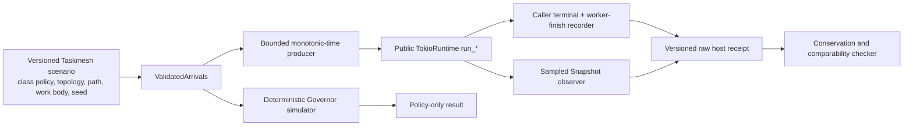

# Taskmesh benchmark qualification: source audit and work plan

## Current scope — minimal stability implementation at base `61d4e47`, 2026-09-27

Metadata/nonregular ingress and stdin backpressure remediation is committed in
`5be7e09`; its scoped owner proof is in [B04](B04-remaining-audit.md).

**Closed owner-local scope:** [B07 — minimal recovery/soak](B07-minimal-recovery-soak.md).
Reuse one host across bounded overload/settlement cycles, require exact resource
return and a successful normal-work canary after each recovery. Existing raw and
custody oracles remain the correctness owners. Short smoke joins existing tests;
longer stress starts as explicit local opt-in.

**Deferred:** all-mode repeated performance admission, automatic RSS slope gates
and performance recovery SLOs. Activate only for a declared performance claim and
frozen consumer budgets. These are not unconditional engine-completion blockers.
Existing correctness/cancel/drain/resource-return tests remain required for all modes.

B07 owner-local is **CLOSED**: Rust 118, Python 616 and Rayon 13 cases passed;
one-host H2 completed 1,000 cycles over 600.003 seconds, H5 completed 3 cycles.
Retained diagnostics remain `UNQUALIFIED`; exact commands/source digests are in B07. Current-source clean CI, optimized build/oracle E2E
and real measurement inputs retain their separate open statuses. Historical
checkpoints below do not override this scope decision.

## Previous checkpoint — follow-up code audit at base `6f16118`, 2026-09-27

Standalone diagnostic builds, probes, typed validation and all four control-arm
launchers now use owned bounded execution. Sampler PID/window identity is kept;
failed/interrupt/orphan execution cannot publish a successful arm. Shared
supervisor start notification/stdin support has focused process regressions.
**Code is still incomplete:** prelaunch metadata/binary artifact custody,
longitudinal recovery/soak admission and declared-scope other-mode admission
remain implementation work. CI/build-oracle proof and real measurement inputs
remain separately open. See [B04 follow-up audit](B04-remaining-audit.md).

## Previous checkpoint — code audit at integration base `031d7b9`, 2026-09-27

Code is **not fully complete**. The latest pass repairs cross-rate workload
consistency, explicit measured-path scope, control bundle byte custody and
special-validator input/execution custody. Remaining code owners and DoD cover
standalone acquisition process ownership, longitudinal recovery/soak gates, and
conditional mode-specific repeated admission. B00/H7/quiet-host/peer inputs and
clean-source CI/optimized end-to-end proof remain distinct open requirements.
The shared checkout advanced from initial base `f00c039` during verification;
incoming source-content regressions were preserved when resolving the additive
admission-test conflict. Build witness v3 is current; older v2 proof is historical.
See [B04 current audit](B04-remaining-audit.md).

## Previous checkpoint — additional audit at `f41862d`

[B04 remaining audit](B04-remaining-audit.md) now separates repaired acquisition
defects and implemented measurement infrastructure from still-missing measured
inputs. Frozen build witnesses, complete attempt collection and a scoped
full-host measured-series admission path are implemented; see the
[operational workflow](../../../benchmarks/host-series.md). No new qualifying
performance series, H7 profile or peer comparison has been acquired.

The additional audit repairs execution timeout/process-group custody, seals
Cargo ancestor configuration in build-witness v2, and checks actual governed
library/oracle profiles. Plan/ledger v2 requires predeclared attempt timeouts.
Conditional p99 intervals explicitly require unverified iid samples;
exchangeability alone is insufficient. Full details, DoD and remaining input
owners are in B04. Current-source CI authority is the exact-HEAD receipt, not
the historical numbers below.

## Historical checkpoints and initial audit

At clean detached `f7834d7`, structural `closed_loop`, `local` v2 and `composite`
receipts were acquired under `/tmp` and copied byte-for-byte to ignored
`bench-results/receipts/clean-f7834d7/`. They are not Git-tracked and all
report `UNQUALIFIED`. This benchmark change set preserves a
separate invalid H6 raw on parent timeout/failure and adds a source/scenario-bound
control-budget evaluator; neither has a clean exact-HEAD receipt yet. B00 values,
actual measured sampler distortion budget, fixed-host rate series, H7 and an equivalent peer
remain open. The older checkpoint notes below are historical and must not be
used as current qualification evidence.

Status: **B01 implementation and B02 partial; industry SOTA performance claim unsupported**. A clean detached worktree at `b24fbc1` passed `just bench-smoke` (53 bench-crate unit tests and every Criterion `--test` target, including B01); that is an execution smoke, not a measured benchmark or full CI receipt. Clean `verify-macos-ci` at `4f3eee7` stopped at `fmt-check` because committed `crates/taskmesh/src/ingress.rs` needed the two formatting edits that are already present as another owner's uncommitted main-checkout change. Downstream gates did not run; this is `NOT_QUALIFIED`, and later source changes need their own proof. P0a/P0b execution artifacts, typed raw validation, generator, A/A, Snapshot and same-executable recorder controls, plus a cross-control structural bundle, are implemented as diagnostics. The recorder and bundle code passed focused Rust/Python checks and an eight-process control smoke on dirty source; these are neither clean exact-HEAD CI nor measured fixed-host performance receipts. `host_perf.py --require-performance` still rejects absent measured calibration. Earlier clean `py-test` 773/773 and `test-architecture` passed at `404245d`; they do not qualify the current source. Historical benchmark measurements do not establish current-source performance.

CI probe `codex/benchmark-ci-probe@a72c4e9` applies only the already present ingress formatting in an isolated branch and includes benchmark test assertions from `7de5d1d`. It passed fmt, inventory, Python lint, architecture, semgrep, deny, Clippy and Rust `test`. Its `py-test` was interrupted after 258 seconds while other projects' Cargo work contended for the host; the gate labels this interrupted step `FAIL`, and later gates are `NOT_RUN`. This is **not** a qualified main receipt. The 17 bench-test semgrep findings were repaired by asserting named errors; one former “valid” test row was actually invalid for an unrelated reason and is now constructed correctly.

Post-`b5517b6` audit found a B02/B03 cross-layer defect: the Rust H4 requested-stack paths were accepted but `host_perf.py` rejected both as unknown. The Python path catalog now accepts both; a real `host_run.py` H4 fixture produced a raw/summary/provenance bundle and `host_perf.py verify` accepted it as `STRUCTURALLY_VALID`, `UNQUALIFIED` on the dirty checkout. B04 also has a descriptive paired-run comparator that revalidates raw receipts, rate cohorts, execution independence, source/host/topology and balanced order. It retains a rejection report and deliberately cannot qualify performance. These changes still need an exact-HEAD CI receipt.

## Measurement boundary

At clean `ef9ea08`, `just py-test` passed 785/785. P0b event-attribution code entered at `cdf9781`; focused bench 79/79 and Python receipt 29/29 passed while an unrelated `ingress.rs` edit was dirty. These focused checks do not constitute clean exact-HEAD CI or host-performance qualification for P0b.

Taskmesh is a governed execution library. The measured product paths are `Governor::{admit,claim,release,snapshot}` and `TokioRuntime::{run_io,run_blocking,run_cpu,run_local,run_async_with_requested_stack}` with their class policies, capability topology, cancellation/deadline custody, drain, and composite stage behavior. HTTP, database, retrieval quality, and generic server RPS are outside this benchmark. A workload body may model CPU, blocking, or async work, but its own speed must be reported separately from Taskmesh overhead.

There are three distinct claims:

1. **Engine micro-cost:** governor transition cost, allocations, instruction count, and contention. This does not establish host response latency.
2. **Deterministic policy behavior:** admission, queue bounds, fairness order, conservation, and host/simulator count agreement on a finite fixture. This does not establish sustained wall-clock capacity.
3. **Host performance:** actual public facade calls under scheduled arrival load, with terminal accounting, per-class/path latency, goodput, and worker custody. A diagnostic runner exists; calibrated, repeated performance qualification is open.

Criterion and IAI remain Taskmesh's existing engine micro-cost tools. The host-load design below comes from execution-engine benchmark cases and runs against Taskmesh's **in-process** API.

## External execution-engine benchmark precedents

These are source-inspected **benchmark cases as of 2026-09-26**, not performance numbers or thresholds to import. Tokio and Asupersync are in-process runtime analogues; Temporal is a larger worker/task-queue service whose load-shape and accounting method transfers but whose network/persistence latency does not. No single inspected project provides a canonical, semantically equivalent Taskmesh benchmark suite; the common practice below is a *method synthesis*, not an industry score standard.

| External case and inspected source | Actual benchmark design | Taskmesh mapping and current gap |
|---|---|---|
| [Tokio `spawn.rs`](https://github.com/tokio-rs/tokio/blob/master/benches/spawn.rs) | One vs ten spawned tasks, current-thread vs threaded runtime, enqueue plus await completion. | Retain one-task no-op cost, add small-batch `run_*` completion per operation with identical runtime/work body/spec-creation boundaries. Current `governance_tax` is sequential and its raw comparison includes different setup. |
| [Asupersync scheduler](https://github.com/Dicklesworthstone/asupersync/blob/main/benches/scheduler_benchmark.rs), [spawn/adversarial](https://github.com/Dicklesworthstone/asupersync/blob/main/benches/spawn_throughput.rs) | Queue/schedule/pop cases at varied population, mixed-lane order, spawn/join throughput, typed quota-denial and cancel-storm cases, teardown with pending tasks. Its deferred request-tail report explicitly measures **enqueue to ordered join observation**, not first-terminal latency. | Add Governor queue promotion over class count/depth, then real-host cancellation/rejection storms. Timestamp each Taskmesh terminal independently and do not relabel an ordered join as p99 response time. Copy the measurement split, not its lane/priority semantics. |
| [Asupersync cancel/drain](https://github.com/Dicklesworthstone/asupersync/blob/main/benches/cancel_drain_bench.rs), [tracing overhead](https://github.com/Dicklesworthstone/asupersync/blob/main/benches/tracing_overhead.rs) | Cancel plus ready mixed dispatch, draining-state population, quiescent versus active governance, and instrumentation on/off cost have separate cases. | Keep Taskmesh cancellation, drain, cold/quiescent operations, and observer cost distinct from successful steady-state throughput. Do not import Asupersync's region semantics or thresholds. |
| [Temporal Omes](https://github.com/temporalio/omes), [run configuration](https://github.com/temporalio/omes/blob/main/docs/running.md) | Current Temporal load tool separates load flags (duration/iterations, rate, maximum concurrency) from scenario-specific work; scenarios and workers can run together or separately; worker profiles and version are selected explicitly; a sidecar measures worker CPU/RSS. | Structure Taskmesh fixtures as typed load envelope plus workload/policy/topology definition, pin build/runtime profile, and measure process resources outside the hot path. Omes's concurrent cap can throttle offered work, so Taskmesh must retain the intended schedule and count missed/not-submitted offers rather than assume omission-free open loop. |
| [Temporal benchmark-workers](https://github.com/temporalio/benchmark-workers), [latency suite](https://github.com/temporalio/benchmark-latency) | A separate runner maintains fixed concurrency; the low-load suite distinguishes schedule-to-start from end-to-end latency. The latency suite is **archived in 2025**. | Add an explicitly **closed-loop fixed-concurrency** throughput mode for comparison with the open-loop overload mode; never use its completion-only latency to claim overload p99. Expose Taskmesh intended-submit-to-body-start and full caller-response distributions separately. |

[Temporal Maru](https://github.com/temporalio/maru) is archived and directs users to Omes; its started/closed/backlog interval accounting is a historical precedent, not the current Temporal tool. [Criterion's timing-loop guidance](https://bheisler.github.io/criterion.rs/book/user_guide/timing_loops.html) supports explicit setup/measurement boundaries, while [HdrHistogram's coordinated-omission guidance](https://github.com/HdrHistogram/HdrHistogram#corrected-vs-raw-value-recording-calls) applies correction when sampling has actually omitted expected requests. Taskmesh's finite, precomputed open-loop schedule should record one raw row per intended request and one response-latency sample per eligible response; it must explicitly account for never-submitted offers and caller drops. Histogram correction cannot turn those missing offers into measured completions. This is a measurement rule, not a reason to run an HTTP benchmark. Ray's distributed node/object-store scalability envelope and Temporal's persistence/RPC absolute latencies are excluded: Taskmesh is a single-process governed execution library. No external throughput number, queue size, or latency SLO transfers to this engine.

[wrk2's intended-send-time model](https://github.com/giltene/wrk2) and [Lancet's workload/method/tool decomposition](https://www.usenix.org/system/files/atc19-kogias-lancet.pdf) reinforce the host harness validation boundary: preserve the intended schedule, measure producer lag and observer cost, and reject configurations that cannot produce a meaningful tail sample. Their network client architecture and absolute latencies do not transfer to an in-process Taskmesh call. [Tokio's started `spawn_blocking` contract](https://docs.rs/tokio/latest/tokio/task/fn.spawn_blocking.html) is the reason the host receipt must retain worker custody after a caller's deadline, cancellation, or drop.

## As-is audit at the initial baseline

| Existing asset | What it proves or measures | Limit |
|---|---|---|
| `admit_release`, `contention`, `iai_governance`, `alloc_probe` | Governor micro-cost and lock contention; CI allocation gate is `<= 8 alloc/op` for one admit/release cycle; Linux IAI config names three cases and `Ir=5.0`. | No host work, queue residence, or end-to-end latency. The allocation threshold is a current config, not a measurement in this audit. |
| `governance_tax`, `host_edge_paths` | Sequential public-host no-op and selected deadline/saturation paths; raw Tokio, Semaphore, and Tower comparison. | The governed case creates `TaskSpec` inside the timed loop while raw Tokio does not; this is full caller cost, not isolated governance tax. No sustained concurrent host load. |
| `retrieval_saturation`, `overload_stability`, `multiclass_fairness`, `composite_reduce` | Simulator computation, deterministic promotion behavior, and child-admission/reduce-validation micro-cost. | Criterion time for the `*_sim` benches is time spent **running the simulator**, not simulated p99 or host latency. Fairness is an order property, not a host fairness-throughput result. Composite bench does not run a full parallel fan-out/reduce. |
| `workload`, `loadgen`, `host_simulator_comparison` | Seeded, validated arrival schedules and virtual admission-wait samples; finite nine-offer host/simulator admission accounting. | The simulator has no real Tokio scheduling or worker queue. The nine-offer host fixture has no paced sustained performance sweep. CSV records intended time and class only. |
| `bench-gate`, `bench-smoke`, `bench-iai` | Allocation regression and build/smoke in the CI profile; Linux IAI in nightly/manual deep workflow. | `bench-smoke` is not a latency gate. IAI first compatible run may only create a baseline. `.github/workflows/bench.yml` is manual and disabled for hosted automatic use. There is no qualified host wall-clock regression gate. |

`docs/adr/9000-benchmark-strategy.md` remains **Proposed** and now states the current measurement boundary. Its earlier June snapshot's five-allocation baseline, automatic dashboard/flamegraph jobs, dropped-sample accounting, and unset `< X%` tax were removed from current-status prose. The versioned B00 claim contract explicitly blocks host and industry performance claims until SLO, calibration, common rates, equivalent peers and profile provenance are frozen. IAI instruction count is not wall time or machine-independent application performance.

## Adversarial claim-readiness audit (2026-09-26)

**Verdict: insufficient for an industry SOTA performance claim.** The current code has micro-cost checks, deterministic policy experiments, and a bounded diagnostic public-host runner with a structural receipt checker. It has no measured calibration, repeated fixed-host result, or peer receipt. Even after B01–B04, a result against raw Tokio or a capacity-only primitive would establish *cost versus a narrower mechanism*, not superiority over a semantically equivalent governed execution engine. The benchmark designs in [Tokio](https://github.com/tokio-rs/tokio/blob/master/benches/spawn.rs), [Asupersync](https://github.com/Dicklesworthstone/asupersync/blob/main/benches/scheduler_benchmark.rs), and [Temporal's worker runner](https://github.com/temporalio/benchmark-workers) motivate cases; they are not comparable published Taskmesh scores. Temporal also includes network/persistence boundaries outside Taskmesh's single-process product.

| Candidate claim | Current evidence | Blocking gap | Current verdict |
|---|---|---|---|
| Named Governor operation cost/regression on a fixed build | Criterion/IAI cases and allocation threshold exist | No fresh compatible receipt for this HEAD; IAI covers only admit/release, unknown-class reject, and eight-class snapshot; allocation count omits bytes/peak retained memory | **Measurable narrowly; unqualified here** |
| Taskmesh host p99/goodput, SLO capacity, overload recovery | Paced finite Send IO/blocking/default-CPU runner, raw request rows, external resource samples, balanced sampler control and structural comparison parser exist | Calibration is self-asserted; frozen measured budgets, repeated fixed-host runs and complete scenario matrix are absent | **Diagnostic only; no qualified data** |
| Taskmesh is faster/more efficient than industry peers | Raw Tokio/Semaphore/Tower are unequal-semantic controls | No predeclared peer set, equivalent work/admission/queue/deadline/cancel contract, common rate grid, peer receipts, or uncertainty analysis | **No defensible peer comparison** |
| Whole-engine SOTA across supported features | Initial diagnostic host harness covers Send IO/blocking/default CPU | Local/requested-stack/Rayon, policy costs, memory/maintenance, mixed workloads, and topology interference have no host measurements | **Scope incomplete** |

**Claim ladder and required wording:** (1) A measured microbenchmark can claim only its named operation and fixture. (2) A qualified host study can claim per-path, per-class behavior on the stated machine, topology, workload, and SLO. (3) A comparative result can claim superiority only for a *predeclared metric and matched contract* over named peer implementations, with uncertainty and counterexamples published. (4) “Industry SOTA engine” is a broad product claim and remains prohibited unless the supported feature envelope and independent reproduction are covered. A method inspired by current execution-engine benchmarks is not itself a SOTA performance result.

### Claim-validity blockers to resolve before publishing numbers

1. **Comparator equivalence:** Specify exact class/admission limit, queue bound, deadline/cancel, worker-custody, and completion semantics for each compared implementation. Retain raw Tokio and capacity-only controls as cost decomposition. If no peer implements the full contract, narrow the public claim to a named feature/workload instead of assigning a winner. Compare all candidates on one preregistered absolute arrival-rate grid spanning each observed knee; do not choose a separate favorable `R` per candidate.
2. **Denominator and SLO:** Report success goodput and SLO-goodput against **intended arrivals**, plus accepted/completed/rejected/timeout/unanswered/not-submitted fractions and queue/custody traces. State which events enter each latency population. A lower success-only p99 caused by aggressive rejection is not a win. A host capacity point requires sustained settled throughput, bounded queue/custody, and the predeclared per-class SLO; rejection policy and overload behavior must be compared separately.
3. **Generator and observer validity:** Run a generator-only/null-work calibration above the largest intended rate, an A/A run of the same binary, and recorder/Snapshot on-off studies. Report producer CPU, schedule lag, missed injections, observer cost, and timer resolution. Mark generator-limited or observer-distorted points invalid, rather than attributing them to Taskmesh.
4. **Representative workload provenance:** Keep synthetic no-op, fixed CPU, blocking sleep, and async timer as controlled mechanism cases. Add at least one versioned consumer-derived profile of path/class mix, work-duration distribution, burst/cancel/deadline mix, and topology, with trace provenance and privacy-safe transformation documented. Do not present synthetic fixtures as representative production load. Include finite async I/O through the public `run_io` path if claiming I/O-host behavior; timer sleep alone is an async scheduling fixture.
5. **Statistical and operational validity:** Warmup, duration, repetitions, p99 population floor, and effect threshold are pilot-derived per scenario. Verify stationarity and residual queue/custody before cutting a window; include longer soak/recovery for boundedness and memory growth. Pair baseline/candidate on the same quiet host with randomized or balanced order and fresh runtimes; report run-level intervals/uncertainty, noise floor, and all failed or excluded runs. Do not treat correlated per-request samples as independent repetitions.
6. **Reproduction and scope:** Preserve exact source/lock/toolchain, build flags, CPU/OS/power settings, resolved capability topology, fixture and raw-event digests, analysis code, exclusion rules, and peer revisions. Publish machine-readable raw receipts and a rerun recipe. Require an independent rerun for a broad industry claim. Any unmeasured public path or policy must be called out as outside the claim.

## Engine readiness

| Need | Current source | Decision |
|---|---|---|
| Drive all public paths | Builder constructs the host; `Runtime` exposes IO, blocking, CPU, local, and snapshot; the host also has a requested-stack async path and `_with` options. | **Ready** for black-box host workloads. No engine rewrite prerequisite. |
| Stable policy/topology | Builder validates and freezes resolved capability inventory. Without the `rayon` feature the default CPU executor shares Tokio's blocking physical domain; with it CPU uses a Rayon pool. External shared Rayon pools declare nonexclusive ownership. | **Ready**, but every receipt must record features, resolved topology, executor descriptor, and ambient-pool caveat. Compare these configurations separately. |
| Deterministic policy model | Governor and `ManualClock` support reproducible admission simulations. | **Ready** for policy oracles. `Clock::now_ms` is a wall/lease clock and explicitly is not an elapsed-time timer; host latency must use `Instant`. |
| Host observability | `Snapshot` has per-class queue/phase gauges, aggregate counters and capability occupancy; conservation check exists. | **Partly ready**. Aggregate snapshots do not timestamp an individual request. Use bench-owned intended-send, actual-submit, body-start, caller-terminal, and body-finish timestamps. Sample snapshots sparingly outside the timed critical path; quantify observation overhead. Add an internal optional phase event hook only if black-box measurements cannot answer a defined question. |
| Terminal and custody semantics | Blocking work can continue after caller deadline/cancel; drain and phase gauges retain worker ownership. | **Ready** to measure, but a benchmark must wait for post-response worker settlement and report it separately from caller latency. |

No new public Taskmesh API, semantic class, or engine-specific pool is needed to start. Unknown classes must remain rejected; a benchmark fixture must not silently register or admit them.

## To-be benchmark layout

| Lane | Entry point and code | Timed operation | Result and authority |
|---|---|---|---|
| A. Governor micro | Existing Criterion `admit_release`, `contention`, `multiclass_fairness`; add `queue_scaling`; existing allocation probe and Linux IAI | One explicit transition or admitted/released cycle; setup outside sample; class count, queue depth, and thread count declared | ns/op plus exact completed-op denominator, alloc/op, and named instruction cases. Regression signal for the engine only. |
| B. Policy model | Existing `workload.rs` + `loadgen.rs` and deterministic tests | Virtual admission/claim/release against validated fixed-rate fixtures or seeded Poisson/Zipf and MMPP burst arrivals | Conservation, promotion order, rejection, virtual *admission wait*. Never label simulator execution time or virtual wait as host latency. |
| C. Public host | Initial `host_load.rs` + `examples/host_load_probe.rs`, driving Send IO/blocking/default CPU paths | Scheduled arrivals and completion of caller-owned work; `Instant` timestamps and finite outstanding cap | Diagnostic raw per-request outcome, latency, interval counters and sampled Snapshot exist. Remaining path/mode fixtures and calibration are below. This is the only lane for host p99/goodput. |
| D. Qualification | Existing CI allocation/smoke and Linux IAI; structural `tools/bench/host_perf.py`; future fixed quiet-host comparison | Comparable raw receipts for the same scenario | Current structural checker is not a performance authority. Repeated baselines must establish variance and an explicit regression policy. |

### Host harness contract

- **Producer:** Precompute and validate a finite schedule before timing. A dedicated pacing thread uses `Instant` and submits Send paths to a fixed Tokio runtime; it never waits for the prior request's response. Cap pending submissions explicitly. If the cap is reached, count `not_submitted` and mark that rate point **generator-limited**, not a Taskmesh capacity result. `run_local` needs a separate caller-affine adapter because its future is `!Send`; requested-stack execution is a separate path fixture.
- **Scenario source:** Versioned, validated JSON fixtures under `tools/bench/scenarios/` separate a typed **load envelope** (arrival mode, frozen rates, seed, duration/iterations, outstanding cap, warmup, measurement window, settlement timeout) from **workload semantics** (public path, class policies, body kind/work amount, resolved topology expectation). One fixture defines one scenario/run; a mixed workload is declared inside that scenario. The runner rejects unknown fields/classes/path-body mismatches before timing. The serialized fixture digest is part of every receipt.
- **Load modes:** A fixed-rate staircase establishes idle/steady/knee/overload; a seeded burst shows backlog and recovery. Run a separate closed-loop fixed-concurrency sweep for completion capacity. The two modes have different latency populations and cannot share one p99 series.
- **Body fixtures:** No-op for control cost; declared fixed CPU work for `run_cpu`; finite blocking work for `run_blocking`; awaited async work for `run_io`; local and requested-stack bodies only in their supported path fixtures. Record body-only duration. Never equate a sleeping body with CPU work or an IO future with a dedicated IO pool.
- **Timestamps:** For each request record intended send, actual submit, body start if any, caller response or intentional caller drop, and body finish if any. A dropped caller has **no response latency sample**. `actual_submit -> body_start` includes Tokio scheduling and Taskmesh admission, plus executor dispatch where applicable; `intended_send -> body_start` also includes producer lag. Exact governor-queue time requires the conditional B05 hook.
- **Populations:** Success end-to-end, typed rejection response, timeout/cancel response, intentional caller drop, unanswered caller, and worker-after-response/drop custody have separate counts per class/path; only response-bearing populations have response latencies. Report in-window completion throughput separately from cohort SLO-goodput (including post-injection completions within each request's SLO); use the measured injection duration and publish cohort counts as fractions of intended arrivals. Report intended and actual offered rates separately. Publish the success fraction next to any success-only quantile. A quantile is published only with its stated sample count, method, and pilot-derived precision floor; otherwise report the count and mark the quantile unavailable.
- **Conservation:** Check `intended = submitted + not_submitted`; at the window cut, `submitted = responded_at_cut + caller_dropped_at_cut + waiting_at_cut`; after bounded settlement, `submitted = responded + caller_dropped + unanswered_at_settlement`. These are mutually exclusive caller dispositions. Track body start/finish and worker custody on a **separate** ledger; caller response/drop never implies lease release. Check final Snapshot conservation/zero owned resources after settlement. Warm up the same runtime, wait for its work to settle, then start fresh counters/histograms; take Snapshot deltas because engine totals include warmup. After scheduled injection ends, collect caller outcomes and time `drain` separately; drain is one-way.
- **Observation:** Sample Snapshot at a fixed, documented cadence and label sampled peaks as lower bounds. Capture process CPU/RSS/thread count through a low-frequency external sampler where available; if optional Tokio runtime metrics are enabled, record their additional queue/worker context separately from Taskmesh's own gauges. Compare observer-on/off cost before using dense sampling. Never sample `snapshot()` on every request inside a hot-path timing span.
- **Artifacts:** Preallocate one record slot per intended request under a configured maximum; fill by request ID without a shared hot-path logger, then write the raw event artifact after timing. Quantify recorder-on/off overhead. Emit a schema-versioned summary with source/toolchain/host/features/topology/scenario digests, outcome counts, histogram populations, interval series, CPU time/core-seconds per completed task, allocated bytes/op and retained/peak memory where measurable, producer CPU/lag, and raw-artifact digest. A summary without its raw artifact is not a qualifying measurement.
- **Comparators:** `run_blocking` vs raw `spawn_blocking` on the same Tokio runtime and body; `run_cpu` vs the same declared CPU executor/physical domain; `run_io` vs the same async body with a capacity-only control; `run_local` vs the same local caller path. Keep raw, capacity-only, and governed results separately labeled because their semantics differ. Match spec creation inside or outside every compared timed span. An industry comparison is a separate study with a predeclared peer set and matched semantic contract; it cannot use the raw/capacity-only controls as peer winners.

**Initial harness scope now implemented:** Send `run_io`, `run_blocking`, and default `run_cpu`, plus terminal/custody accounting. Add `run_local`, requested-stack, and Rayon feature fixtures after the P0 receipt and failure-artifact boundaries are stable. This keeps the first result reviewable without dropping those paths from the final matrix.

### Versioned fixture matrix

`R` below is a pilot rate recorded once for a fixed host, path, body, and topology before an internal baseline/candidate comparison. Freeze the resulting absolute rates in the scenario file; do not retune the baseline and candidate independently. For a peer study, predeclare one common absolute rate grid covering the knees of *all* candidates from a separate pilot, then freeze it before the measured runs. The values are fixture design, not performance targets.

| ID | Fixture | Load and comparison | Question answered |
|---|---|---|---|
| M1 | One registered class, no-op body; class-count series 1/8/64 and queue-depth series 0/16/128, varying one dimension at a time | Governor admit/reject/queue/claim/release; 1/2/4/8 threads capped at available cores | Where do lock contention, inventory size, and promotion cost become material? |
| H0 | Each supported public path, no-op then one declared finite body | One request and batch of ten, raw/capacity-only/governed controls | Full facade tax and its setup boundary, not a policy-capacity claim |
| H1 | One class/path/body/topology per run | Open-loop fixed rates `0.25R/0.5R/0.75R/R/1.25R/2R`; separate closed-loop concurrency sweep | Success goodput, per-outcome latency, queue growth, rejection and capacity knee |
| H2 | Same H1 fixture | Base rate → short `2R` burst → base-rate recovery, with fixed time buckets | Backlog growth, bounded shedding, time to settle and post-burst latency |
| H3 | Two registered generic classes `interactive` and `batch`, both valid WFQ policies with declared 4:1 weights | Equal-cost and skewed-cost cases; overload `batch` while `interactive` continues | Protected-class tail, windowed service share, starvation, typed rejection |
| H4 | Matched CPU+blocking bodies | Default shared-blocking physical domain vs separate `rayon` feature build; requested-stack/local in separate fixtures | Physical-pool interference and whether capability occupancy explains the tail |
| H5 | Started blocking work plus queued followers | Deadline/cancel/caller drop burst, then graceful drain | Caller response vs worker-finish gap, retained lease, drain settlement and zero final custody |
| H6 | Parent plus separately submitted governed children | Skewed child times, one failure/cancel, caller-owned deterministic reduce | Per-child governance and parent end-to-end cost without claiming Taskmesh executes the reducer |
| H7 | Versioned consumer-derived path/class/body-duration/cancel/deadline profile, transformed to remove private data | Same finite profile and fixed resource topology across measured implementations | External validity of the host result; explicitly separate from synthetic stress cases |
| H8 | Cold build, first submission, warmed submission, and settled drain as separate operations | Same fixed topology/body; never fold construction or destruction into steady-state per-request latency | Startup/teardown cost and whether lazy worker creation shifts the first-call tail |

### Measurement and validity contract

- **Cohort:** One raw row per request *intended during the measured injection window*, including never-submitted offers. Count warmup separately and settle it before that window. Use the mutually exclusive caller dispositions in the conservation rule above: typed response, intentional drop without a response, or still waiting/unanswered. A task that responds during post-window settlement stays in its injection cohort and can satisfy its cohort SLO, but is not retroactively counted as in-window completion throughput. Worker finish after response/drop remains in that request's custody record. Publish in-window and cohort quantities with different labels.
- **Time boundaries:** Record intended send, actual submit, body start if any, caller response or drop if any, worker finish if any, and final capacity release/drain settlement where independently observable. Use `Instant` for elapsed time. Report `intended -> caller response`, `submit -> caller response`, `submit -> body start`, and `caller response/drop -> worker finish` as separately named, eligible populations. A missing response or body start is a count, never a zero-duration sample. Exact engine queue residence/lease release requires a separately qualified B05 hook; do not infer it from `Snapshot` polling.
- **Primary estimand:** For each predeclared class/path SLO, `SLO-goodput = measurement-cohort requests that succeed within their intended-send-to-response SLO / injection-window seconds`; count a qualifying terminal even if it arrives just after injection stops. Also report the same numerator divided by all intended arrivals in that cohort. Settlement timeout must cover the largest applicable SLO or the rate point is invalid; an unanswered request counts as noncompletion, never as a latency sample. The maximum sustainable offered rate is the upper end of a *contiguous measured rate range from low load* meeting the SLO, minimum completion fraction, no generator limit, and predeclared per-class bounded-backlog/worker-custody/settlement conditions in every qualifying repetition. An isolated high-rate pass after a lower-rate failure is diagnostic, not a capacity winner. This is a workload/host/topology-specific result, not one scalar engine capacity. Successful-response p99 is conditional on success and cannot substitute for the completion fraction.
- **Fairness:** Check exact order against a deterministic reference on small fixtures. On the host, measure per-class SLO-goodput, wait distribution, and starvation-window maxima while classes are demonstrably backlogged. A 4:1 WFQ weight does not imply 4:1 completions when one class lacks demand, task costs differ, or a capability pool blocks it; publish eligible demand, configured cost, and observed service separately.
- **Run validity:** Reject a performance rate point if source/topology differs, intended schedule is not conserved, a terminal is silently lost/duplicated, producer lag or cap affects the offered rate, recorder overhead exceeds the predeclared noise budget, the generator lacks calibrated headroom, or the measurement window contains an unexplained setup/drain phase. A correctness/oracle failure invalidates the performance result even if the latency is low. Preserve the failed artifact and reason.

### Edge and corner coverage without a Cartesian explosion

The [engine checklist](../../../misc/tmp-engine-checklist-sep-25.md) is the behavioral oracle catalog. Each benchmark fixture runs its relevant exact-result/accounting oracle first. Fast deterministic tests own rare races and invalid-input correctness; wall-clock benchmarks own only performance populations that can be injected and measured without timing assertions that depend on a particular scheduler interleaving.

| Cell | Checklist anchors | Required measured fixture and observable | Authority |
|---|---|---|---|
| E1. Exact capacity boundaries | B05–B06, D01, H01–H02, H28, H32 | For class, capability, CPU, and memory blockers individually: 0/1/limit/limit+1 where valid; queue 0/1/full/full+1; then one class+memory mixed blocker. Record typed verdict, queue bound, admitted-but-not-started custody, SLO-goodput and reject latency under paced overload. | Small deterministic verdict fixture first; host H1/H2 for rate curves. No hidden executor backlog is allowed to masquerade as capacity. |
| E2. Cancel/deadline ownership states | B07–B10, B17, D05, H11–H12, H19–H21, H34–H35 | Fix pre-submit, queued, accepted-not-started, started async, started blocking, and requested-stack-with-live-child states using barriers. Trigger cancel/deadline/caller drop; record caller response, worker finish, capacity release, follower start, and drain separately. | Deterministic barrier fixture for exact outcome; bounded host H5 for latency/custody. Do not time arbitrary race wins as a regression threshold. |
| E3. Fairness and promotion pressure | A12, B26, D08–D09, H05–H07, H26 | FIFO/WFQ/DRR with unequal cost/weight, cancellation in backlog, overlapping/disjoint capability followers, and backlog at promotion budget and +1. Measure per-class eligible demand, actual service and longest no-service window under sustained backlog. | Reference-order test first; host H3 for conditional tail/service share. Queue snapshots alone do not prove fairness. |
| E4. Memory lifecycle | A09, B14–B15, D06/D12, H07/H10/H25/H32 | Stage release, measured/hybrid reconcile, overcommit queue/degrade/reject, stale/duplicate measurement, and class+memory blocker collision. Record held units, typed result, queue promotion, fallback cost, CPU/RSS and final release. | Deterministic engine oracle first; host workload only for supported public path. Required before a whole-engine performance claim even if deferred for the first host MVP. |
| E5. Physical topology | B16/B20, D11/D16, H02–H03, H18, H27/H30 | Shared Tokio blocking CPU+blocking+maintenance, separate owned Rayon, external shared Rayon, and local role cases. Record resolved inventory, each physical domain occupancy, worker/thread counts, and cross-path interference. | Separate builds/profiles and host H4; external shared pools give no exclusive global bound. Invalid inventory is a preflight test, not throughput data. |
| E6. Lifecycle and close | A13, B17, H13–H15, H22/H29/H31, H34 | Cold build, first request, steady state, close with accepted queue, two concurrent drain callers, executor reject/panic/closure abandon, and final settlement. Record build/first-call/drain latencies in distinct populations plus exact once terminal/custody ledger. | H8/H5 for measurable costs; deterministic barriers for lost-wake/panic/lease races. |
| E7. Composite and recursion | B02/B21–B22, H08–H09, H23–H24/H33 | Parent holding its last class/pool/CPU/memory slot, declared awaited child, independent sibling, parallel branches and caller-owned reduce. Measure child admission and parent completion separately; assert typed cycle/rejection and no leaked guard. | Correctness fixture first; H6 measures only valid, explicitly governed child submissions. Caller reducer time is separate. |
| E8. Preflight and wire corners | B01–B04/B09/B18–B19/B24–B28, D02–D04/D10/D13–D18 | Unknown class/pool, invalid deadline/stack, malformed strict ingress, foreign handle, extreme identifier/counter/retention boundaries. Record rejected-call cost only for reachable hot reject paths, with zero job starts and unchanged ledger. | Mostly correctness and occasional micro-cost cases; do not inflate the sustained host matrix with malformed fixtures. |

### Final duplication audit: which tests to reuse and which to add

Baseline source: clean `4766016b4eef36abb6cf79334dd1a99653bc61a9`. A test name or checklist mapping is selection evidence; only its asserted states count here. The host runner did not exist at that baseline. The table records the **smallest uncovered assertion**, not a request to repeat the whole E cell in a second integration suite. The current committed implementation is audited after the table.

| Cell | Existing exact evidence to reuse | Nonduplicate addition and owner |
|---|---|---|
| E1 | `hardening_policy_interactions::zero_one_exact_and_plus_one_are_distinct_for_every_capacity_kind`; `hardening_admission_matrix` compound blockers; `hardening_mixed_overload` no work before permit. | B02/B03 host H1–H2 record rate curves and per-verdict populations. No new product capacity matrix. Pool/budget zero means unbounded where documented; a queueable class with zero depth is invalid, so do not manufacture a zero-capacity saturation case. |
| E2 | `runtime_cancel_timeout` pre-submit/queued; `hardening_deadline_custody` accepted/run budget and requested-stack child; `host_open_loop` started blocking deadline/cancel/drop plus pre-drain follower. | One narrow extension of `hardening_executor_protocol.rs`: **accepted but not started** CPU closure + caller cancel/drop + queued follower + drain, asserting no early worker start or capacity resale and final once-only settlement. The existing run-budget-start test remains the RunFor oracle. B02/B03 H5 measures caller response versus worker finish. |
| E3 | `hardening_fairness_reference` exact FIFO/WFQ/DRR and promotion-budget/cancel order; `hardening_multi_pool_fairness` overlap/disjoint pool behavior. | B03 H3 records eligible demand, actual starts/completions, per-class SLO-goodput, and no-service windows. No second reference-order suite or wall-clock order assertion in CI. |
| E4 | `hardening_memory_epochs` stage/epoch boundaries; `hardening_memory_ledger::stage_reconcile_promotion_and_sweep_match_an_input_derived_ledger` already combines release, reconcile, promotion, sweep. | B03 E4 only where public-host memory behavior is supported; report held units, queue movement, fallback outcome and resource cost. No duplicate stage/reconcile/sweep correctness test. |
| E5 | `hardening_executor_authority` default versus Rayon domain; `hardening_role_pool_isolation` local/stack role; `hardening_executor_protocol::two_runtimes_sharing_an_executor_each_govern_their_own_submissions`. | B03 H4 compares separate feature/topology receipts and physical occupancy. Shared external pools receive an explicit nonexclusive-scope label, never an aggregate-bound assertion. |
| E6 | `hardening_drain` two callers, close/wakeup and outstanding work; `hardening_executor_protocol` reject/panic/abandon; `hardening_deadline_custody` teardown. | B01 H8 measures cold/first/steady/drain as distinct costs; B02/B03 H5 records response and settlement. Reuse E2's one accepted-held extension; no second drain race suite. |
| E7 | `hardening_nested_wait` held class/pool/CPU/memory and sibling cases; host `hardening_nested_wait` declared versus undeclared wait; `e2e_scenarios::composite_pipeline_attribution_recursion_and_reduce`. | B03 H6 measures separately submitted governed children and **caller-owned** reduce. No Taskmesh-internal fan-out executor/reducer test; the library does not run one. |
| E8 | `strict_ingress`, `identity_authority`, `cross_governor_ids`, `hardening_deadline_boundaries`, and lifecycle retention tests. | B02 validates **bench-owned** scenario schema and reject-population accounting. Product raw DTO stays permissive; adoption of strict ingress by a deployed consumer belongs to the external adoption ledger, not a duplicate library test. |

**The four original deterministic ownership targets now have tests:** the existing E2/H19 protocol test, bench scenario/accounting tests, one bench real-host integration file, and one receipt-checker test file. Their current assertions and the smaller remaining gaps are below. Use an injected monotonic reading for pacer decisions; no scheduler-race winner or elapsed-time threshold belongs in CI.

The simulator already has `hellgate::multiclass_multiseed_population_has_no_unaccounted_request`; `host_simulator_comparison` already checks one finite nine-offer host/virtual accounting case. Extend that file only if B02's real-host adapter cannot establish a **new, model-comparable** per-class admission invariant. Do not equate simulator virtual wait with host response latency or duplicate the multiclass seed test. A/A, generator headroom, recorder-on/off cost, and run-level uncertainty are **B04 measured qualification**; B03 acquires scenario raw results. Synthetic receipt/parser tests prove rejection logic, not wall-clock thresholds.

#### Re-audit of committed B02 source (2026-09-26)

This is an **in-progress implementation**, not a full CI or performance receipt. Focused local checks passed for the bench crate's 78 unit/integration cases and 29 receipt-checker cases after raw v2 and execution provenance. The `host_run.py` wrapper test builds and runs a real binary, then checks its raw/summary/sidecar linkage. The earlier clean `py-test` 773/773 and `test-architecture` passed at `404245d`; a later 782-test `py-test` was invalidated by concurrent source movement. No clean full CI or measured calibration receipt exists at `0df0f42`. Preserve this owner work; do not start another product capacity/fairness/drain matrix.

| Unique obligation | Present at audited HEAD | Remaining assertion or implementation; owner | Stop/accept rule |
|---|---|---|---|
| E2/H19 product collision | Accepted-but-unstarted CPU closure, caller cancel/drop, queued follower, pre-drain and once-only settlement are in the existing protocol test; focused case passed. It is distinct from the older accepted-caller-drop and started-blocking cases. | Re-run at frozen source; no second product test file. | Fail on early capacity resale, early follower start, or nonzero final custody. |
| B02 fixture preflight | Strict JSON, class/path/body/limit checks and integer-nanosecond round-trip validation; equal-time offers retain distinct IDs. Validation no longer creates a throwaway host. | Keep absolute arrival times as the authority and reject nonrepresentable schedules; freeze the scenario bytes for measured runs. | Malformed or out-of-order fixtures fail before timing; one measured host is constructed. |
| B02 caller and worker ledger | One row per intended offer, derived cut/settlement equations, per-row timestamp checks, typed rejection, body/caller separation, fixed interval series, SLO numerator/denominator, sparse Snapshot samples and zero final capability occupancy are implemented. Raw schema v2 returns `invalid` plus bounded rows/reason on producer, sampler, caller-task and drain failures; the CLI writes it before rejecting. | B04 owns external process sampling and observer-cost qualification. B02 only adds raw fields that B04 cannot derive. An accepted-but-unstarted phase is proven by E2, not inferred from a black-box missing body timestamp. | Duplicate, missing, impossible, or misattributed events reject; missing responses never become latency samples. Sampled peaks are lower bounds. |
| B02 real-host adapter | Public IO/blocking/CPU and requested-stack blocking/async open-loop paths, per-path warmup, finite two-class mixed-path test, requested-stack parity and held-worker/reject barrier pass locally. Bench `rayon` forwards the product feature. `closed_loop.rs` runs fixed caller slots with one response before each next request. `local_host.rs` executes `!Send` payloads on a caller-affine current-thread LocalSet with finite arrivals and a distinct raw schema. | Bind closed-loop and local runners to independent build/provenance and strict external receipts before capacity claims. Retain separate feature artifacts; local Snapshot mode explicitly rejects. | Closed-loop completion samples never enter the open-loop intended-arrival p99/SLO-goodput series. No scheduler timing threshold is a CI assertion. |

#### Final nonduplicate addition plan (2026-09-26)

This table is the single implementation delta for B00–B06. The E1–E8 table above owns exact Governor correctness oracles; B00–B06 below own claim-level acceptance. P0a execution custody and P0b cross-layer event attribution are implemented diagnostics, subject to a clean exact-HEAD receipt. Do not add another capacity, fairness, cancellation, or drain product matrix for benchmark work.

| Order / owner | Current source-backed state | One addition and owned files | Acceptance / stop rule |
|---|---|---|---|
| 1. B04 measurement authority | `host_perf.py` reconstructs full-host raw and invokes typed Rust validation. `host_run.py` retains binary, resolved topology, resource samples and execution provenance. `generator_run.py`, `host_aa.py` and `host_observer.py` acquire generator, same-binary A/A and balanced Snapshot diagnostics. `host_sampler.py` acquires balanced external sampler on/off pairs. `host_control_assess.py` computes diagnostic lag, omission, goodput and p99 budgets from those pairs plus recorder response counts, with a policy-bound minimum p99 population. All acquisition wrappers forward explicit feature flags; a focused six-process Rayon control acquisition passed as `UNQUALIFIED`. `minimal_host.rs`, `minimal_run.py` and `host_recorder.py` add same-executable full/minimal recorder pairs, with no latency field in the minimal arm. Provenance v4 binds the declared full/minimal/generator runner mode and flags; this is controller evidence, not an independent process/build attestation. The v3 `host_controls.py` bundle revalidates constituent raw/provenance, requires an exact 2x replay generator scenario at the same injection duration, accepts a target with Snapshot off or on at the declared control cadence, binds the recorder to the same workload with Snapshot off, and checks shared identity, topology, binary roles, resource cadence, boot and nonoverlapping epoch windows. One eight-process Snapshot-on target smoke passed as `UNQUALIFIED`. Resource schema v2 keeps monotonic duration within each process and records epoch time for cross-process order. Old v1/v2 bundles and same-rate generators cannot be promoted. | Freeze pilot-derived budgets before candidate runs and prove their stability on the fixed host. Replace the three caller-supplied calibration assertions in `host_perf.py` only after measured admission is implemented. Retain a clean build log and independently rebuild or attest source-to-binary custody. The bundle span is caller supplied and covers sampling windows, not build time, so it cannot qualify freshness by itself. | A forged boolean, missing arm, swapped rate/host/feature/binary, altered row, failed/late producer, unsettled worker, thin tail, changed sampler cadence or excess observer effect fails closed. Retain failures. Synthetic parser tests prove only rejection logic; the fixed-host pilot establishes budgets and false-positive behavior. Minimal mode cannot supply response latency or SLO-goodput. `--require-performance` stays closed until this is measured and independently verified. |
| 2. B01 named micro costs | Full-facade/prebuilt-spec cases, six queue class/depth points, named cold/steady/1-vs-10 batch cases and `*_sim` labels are implemented. Clean detached `b24fbc1` passed `just bench-smoke`; this is target execution only, with no retained fixed-host measurement. | Retain per-operation denominator and setup definitions in the ADR; separately record measured distributions only if making a micro-cost claim. | Each case asserts its named state and completed-operation denominator, timed setup, class/depth/threads and body. No host p99 threshold or duplicate policy test. |
| 3. B02 public paths / B03 fixture registry | The bounded Send open-loop host covers IO, blocking, CPU and requested-stack blocking/async; H4 fixture parity passed under default and Rayon builds. H3 represents explicit 4:1 WFQ class weights. H2/H5 diagnostic fixtures produced typed raw. H1 has one-path IO/blocking/CPU rate templates and separately tagged fixed-concurrency IO completion fixture. H4 has a current-thread caller-affine `!Send` local fixture with bounded arrivals and distinct raw. H6 has a bounded parent plus three separately governed child calls, one failed child and caller-owned keyed reduction, with a distinct validated raw schema. All are diagnostic. `tools/bench/scenarios/index.json` registers H0–H8 with question, path, feature/topology, E-cell oracle, existing artifact and explicit partial/unavailable status. | Acquire clean-source closed-loop/local/H6 receipts with the new structural path; add only versioned fixtures tied to an unanswered matrix question. | One normal parity fixture per new path/mode, plus build/feature identity. Unsupported paths say unavailable; external shared Rayon is nonexclusive. Closed-loop samples never join open-loop overload tails. Stop any cell whose exact E-cell oracle fails. |
| 4. B00 contract then B03 acquisition | `claim-contract.json` explicitly blocks unfrozen SLO, rate grid, repetitions/MDE and H7 provenance. No fixed-host performance series exists. | Preregister workload body, per-class SLO/completion floor, common absolute rate grid, exclusion policy, run duration, precision target and minimum detectable effect before candidate acquisition. Pilot H1/H2, then H5 and H3/H4, then H6–H8; store every accepted and rejected raw/provenance/control/resource artifact. | Only contiguous qualifying rates from low load establish capacity; intended arrivals are the denominator, worker custody settles and producer/observer controls pass at each rate. Pilot selects sample/repetition budget; a large number of request samples is not a substitute for independent runs. No manual/scheduled timing result enters required PR CI. |
| 5. B04 repeated-run comparison | `host_compare.py` and `just bench-host-compare` revalidate structural receipts, require at least four independent pairs per absolute rate, balanced order, unchanged per-arm source/binary and common workload/host/topology, then report per-cohort paired SLO-goodput difference and a descriptive run-level bootstrap interval. They reject run reuse/overlap, excess acquisition span and missing rows; CLI retains a rejected report. This is synthetic-checker evidence only. | Freeze B00 duration/repetition/MDE and rate grid; add measured-calibration admission, resource-efficiency analysis, failed-run inventory and quiet-host candidate acquisition before making a performance decision. | Current comparator always emits `UNQUALIFIED`; the four-pair floor is a diagnostic minimum, not a precision guarantee. No single-run win, post-hoc SLO/rate selection or request-level pseudoreplication. |
| 6. B06 named peer claim | Raw Tokio, Semaphore and Tower are mechanism controls in the claim contract; no equivalent peer receipt exists. | After 1–5, version named maintained peer adapters and equivalence fixtures under `tools/bench/peers/`. Publish one preregistered common rate grid, full source/build/raw/rejected-run manifest, analysis and an independent rerun. | Claim only the proven semantic intersection on the declared host/workload. If no comparable peer exists, retain a narrower Taskmesh-only claim; do not call a mechanism control an industry peer. |

**Conditional B05:** Add bounded internal phase timestamps only after B02/B03 demonstrates a real queue-versus-executor attribution ambiguity that public closure timestamps and sparse Snapshot cannot resolve. The disabled path must have measured negligible cost; no observer runs under a Governor lock and no unbounded telemetry queue is introduced.

**Gate transitions:** B04 measured controls are required for any performance-qualified H1–H8 point; B00 precedes comparative acquisition; B03 raw evidence precedes B04 statistical comparison; B06 alone owns the peer claim. Resource schema v1 and execution provenance v3 artifacts require reacquisition for the structural bundle; they cannot be silently promoted. Keep `bench-host` outside required PR CI and leave `tools/gates/required.json` unchanged while it is diagnostic. Correctness and performance receipts remain separate.

For pilot acquisition, start with 30 seconds of warmup, at least 60 seconds of measurement, and five fresh-runtime repetitions per frozen rate point. These are **trial settings, not qualification minima**. Check per-interval stationarity, producer headroom, and settled queue/custody first. Choose final duration/repetition count and each quantile's precision target from pilot variance and the smallest effect the claim intends to detect; extend or suppress a thin-tail estimate. A 10,000-sample p99 population is only a provisional reporting floor, not a confidence guarantee. Compare independent run summaries with a balanced/randomized order and publish uncertainty and the full rate-response curve; add long soak for resource growth and recovery claims.

### Command and gate placement

| Scope | Command | Status and meaning |
|---|---|---|
| Owner edit loop | Selected `cargo bench --locked -p taskmesh-bench --bench <name>` | Existing; micro diagnostic only. Simulator benches must carry simulator labels. |
| CI profile | `just bench-gate`, `just bench-smoke` | Existing allocation gate and bench execution smoke; no host wall-clock pass. |
| Linux deep profile | `just bench-iai` | Existing named instruction cases with compatible-baseline requirement; first baseline creation is not a regression-qualified result. |
| Host exploration | `just bench-scenario-rate <template> <absolute-rate/s> <out>`; `just bench-host <scenario> <raw> 
 <calibration>` | The deterministic generator copies one class/path/body into a full-second uniform open-loop schedule and writes a digest manifest. It does not freeze the claim rate grid. The bounded public-host runner writes diagnostic raw and summary artifacts, never updates CI required membership. Its calibration file is currently an assertion, not measured evidence. |
| Host controls | `just bench-generator-above <scenario> <raw>`; `just bench-host-minimal <scenario> <raw>`; `just bench-host-aa <scenario> <calibration> <directory> --pairs N`; `just bench-host-snapshot <scenario> <calibration> <directory> --pairs N --snapshot-ms C`; `just bench-host-recorder <scenario-off> <calibration> <directory> --pairs N`; `just bench-host-controls <scenario> <host-raw> <host-summary> <generator-raw> <aa-dir> <snapshot-dir> <recorder-dir> <out> <max-span-seconds>` | The v3 bundle requires a separate 2x replay generator scenario from `bench-generator-above`; `bench-generator` at target rate remains diagnostic alone. If target Snapshot is on, feed Snapshot study's `scenario-off.json` to recorder acquisition; if target is off, use the target scenario. Same-binary A/A, balanced Snapshot and full/minimal recorder pairs are diagnostic. All preserve raw receipts and report `UNQUALIFIED`; none is required CI timing. |
| Performance qualification | Proposed `just bench-host-compare <baseline-receipt> <candidate-receipt>` | New fixed-host, exact-definition comparison after variance is established; a separate performance receipt, not automatic PR CI. |

## Required Taskmesh scenario set

| Priority | Scenario | Configuration and comparison | Required output |
|---|---|---|---|
| P0 | Governor cost | Admission success/reject, queue/claim/release, snapshot; 1/2/4/8/... physical-core contention; controlled class count and queue depth for promotion. | ns/op, alloc/op, IAI instructions where available, completed operations, contention and queue-cost curves. Keep simulator computation in its own category. |
| P0 | Real host capacity | `run_io`, `run_blocking`, `run_cpu`, `run_local` separately, under idle, rising load, knee, and overload; fixed work body and explicit class/capability limits. Open-loop rate steps for overload, separately labeled closed-loop fixed concurrency for completion capacity. | Intended/offered/submitted/started/terminal/unanswered counts, success goodput, reject by verdict, p50/p95/p99 and sample denominator per class/path, scheduler send lag, interval counts, sampled queue/phase peaks (lower bounds). |
| P0 | Backpressure and ownership | Bounded class/capability queues, deadline, cancellation, caller drop, started blocking worker, cancellation burst, drain. | Queue bound, terminal and unanswered conservation, caller-response latency, worker-finish latency, post-response custody, drain-settlement latency, final zero owned resources and recovery after burst. |
| P1 | Cross-class policy | FIFO vs weighted/deficit/deadline-aware configurations, mixed class costs, an overloaded noisy class beside a protected class. | Per-class success goodput and tail latency, rejection, share over fixed windows, starvation/priority inversion evidence. Do not use a final-total Jain score alone. |
| P1 | Physical topology | Default CPU-on-blocking and `rayon` feature CPU pool, blocking+CPU competition, requested-stack blocking/async and local slots; external shared Rayon only as a separately labeled ambient-interference case. `run_io` has no dedicated IO pool; any bound is class policy. | Resolved physical domains, configured and observed occupancy, each class/path result. Never interpret ambient external work as fully governed by Taskmesh. |
| P1 | Composite governance | Caller-owned parallel child submissions with declared deterministic reduce, skewed child durations and one failing/cancelled child. Taskmesh validates the declaration and governs separately submitted calls; it does not spawn or reduce the branches. | Parent/child admission and custody, caller-owned reduce result, end-to-end and child latency, outstanding custody at terminal/drain. Label orchestration/reducer time as caller cost. |
| P2 | Less frequent policy costs | Memory reconciliation/overcommit and maintenance saturation using real source-supported paths. | Event cost and rejection/settlement behavior. Promote to P1 only if a concrete consumer workload uses the path. |

Use a small declared matrix, not the Cartesian product of all policies and executors. Fix task body and compare the same path, concurrency, budget, features, and completion contract. Raw `spawn_blocking`/Semaphore/Tower are *mechanism baselines* with fewer semantics; label any difference as total API cost unless submission/spec construction and topology are matched.

## Tickets in execution order

### B00 — Freeze claim, peer, and workload contract

- **Purpose:** Prevent a host result or unequal-semantic mechanism baseline from silently becoming an industry SOTA claim.
- **Files:** this plan, new versioned `tools/bench/scenarios/claim-contract.json` and consumer-profile provenance note, `docs/adr/9000-benchmark-strategy.md` for current/proposed wording.
- **DoD:** State each intended claim, primary metric/SLO and denial condition, supported feature scope, comparison population, peer inclusion rule, semantic equivalence matrix, fixed absolute rate-grid selection, run/exclusion policy, and minimum detectable effect before measuring candidates. Record provenance and privacy-safe transformation for at least one consumer-derived profile, or explicitly mark representative/industry claims blocked. Raw Tokio/Semaphore/Tower stay mechanism baselines. ADR uses no unqualified SOTA performance wording or stale implementation receipts.
- **Current partial:** `claim-contract.json` declares three claim populations, metrics/denominators, denial and peer-inclusion rules, and explicitly blocks unfrozen SLO, rate grid, repetition/MDE, equivalent peer and H7 provenance. `test_claim_contract.py` prevents accidental promotion of that blocked state. B00 cannot close until measured candidates have a frozen, reviewable contract; the placeholder values are not qualification thresholds.

### B01 — Repair and extend engine microbenchmarks

Code update: `cold_host_lifecycle` now has separately labeled completed 1/10-call
batches for IO and blocking on the same warmed runtime. This adds a fixture,
not a measured fixed-host distribution.

- **Purpose:** Make each existing result's population and unit explicit; measure Taskmesh queue scaling and small-batch facade cost before interpreting host load results.
- **Files:** `docs/adr/9000-benchmark-strategy.md`, `crates/taskmesh-bench/benches/{retrieval_saturation,overload_stability,governance_tax,host_edge_paths}.rs`, new `crates/taskmesh-bench/benches/{queue_scaling,cold_host_lifecycle}.rs` and `crates/taskmesh-bench/Cargo.toml` if needed, this plan; `tools/bench/perf-gate.json` only if an approved measurement definition actually changes.
- **DoD:** ADR names current `8 alloc/op` config, manual/disabled bench workflow, raw started-request simulator samples, and no current host performance gate. `*_sim` output/documentation says simulator execution cost. Governance comparison states what timed setup differs; add a prebuilt-spec matched variant without deleting full API cost. Measure a fixed 1-vs-10 completed-call batch on the same path/runtime/body, queue promotion over declared class-count/depth points with setup outside the timed region, and H8 cold construction/first-use/settled teardown as separate named cases. Publish per-operation denominators; assert every operation reached the intended admitted/queued/terminal path. No old `< X%` becomes a gate by inference.
- **Current implementation evidence:** `governance_tax` retains full-facade cost and adds prebuilt-spec cost; the mechanism controls have narrower semantics. `queue_scaling` measures one holder release and verifies exactly one promotion at `(classes, depth) = (1/8/32, 1/16)` with setup excluded. `cold_host_lifecycle` separates construction, first IO call, warmed IO call, quiescent drain and sequential completed 1/10-call batches on one warmed runtime and IO no-op body. Criterion reports a batch duration; divide by 1 or 10 for a per-completed-call figure. The drain case starts quiescent and does not claim active-work shutdown cost. The three simulator benches carry `_sim` labels. Focused bench compile/Clippy passed on dirty source; clean detached `b24fbc1` passed `just bench-smoke`. Measured distributions and full exact-HEAD CI remain outstanding.

### B02 — Build a bounded, paced public-host load harness

- **Purpose:** Reuse `ValidatedArrivals` as intended arrival times but submit real `TokioRuntime` work through public methods. A synthetic simulator result remains a separate oracle.
- **Files:** existing `crates/taskmesh-bench/src/{host_load,host_scenarios}.rs`, `crates/taskmesh-bench/examples/host_load_probe.rs`, `tools/bench/host_run.py`, `tools/bench/scenarios/*.json`, `crates/taskmesh-bench/tests/{host_load_accounting,host_load_integration}.rs`, and crate exports as needed. The E2/H19 accepted-held collision is already covered in `crates/taskmesh/tests/hardening_executor_protocol.rs`. Keep scenario-only body/path/options metadata in the bench crate; do not widen product `TaskSpec` for a benchmark.
- **DoD:** Implement the host harness contract above, including typed load-envelope/workload separation and strict fixture validation. A bounded finite schedule is paced from a monotonic run origin; submissions do not wait for prior responses. At a producer cap, record `not_submitted` and scheduled lag explicitly instead of building an unbounded competing queue or silently reducing offered load. A separate fixed-concurrency mode may submit after completion but is labeled closed-loop and never supplies overload-tail claims. Record exactly one mutually exclusive caller disposition per submitted request: typed response, intentional drop without response, or outstanding/unanswered at the cut/settlement boundary. Record body start/finish and custody independently. Separate warmup from samples. Collect intended send, actual submit, body start, caller response/drop, body finish, and final drain; enforce the cut and settlement equations in the host harness contract above. Report interval counts as well as run totals so a spike and its recovery remain visible. Per-class/path samples state whether rejects, timeouts, and drops belong to the population; drops have no response-latency sample. The focused bench integration and existing host protocol tests satisfy the exact obligations in the duplication audit above. B02 owns the missing P0a/P0b execution artifacts and P1b adapters above; **B04 owns calibration and performance admission**.
- **Current partial:** The finite Send open-loop runner covers IO/blocking/CPU and requested-stack blocking/async with a fixed positive large-stack slot declaration. H4 requested-stack parity and CPU/blocking topology parity under separately compiled default/Rayon builds passed locally; malformed stack size/slot combinations reject before timing. The H4 requested-stack Python parser gap was repaired and one real CLI raw/summary/receipt round trip passed diagnostically. `just bench-host-closed-loop SCENARIO RAW TOPOLOGY` runs a separate IO fixed-caller-concurrency completion smoke with six completed calls, per-slot response-before-next-submit checks, bounded request population and maximum duration. `just bench-host-local SCENARIO RAW TOPOLOGY` runs a separate current-thread `!Send` local smoke with two intended/submitted calls and no competing Send queue. Local raw schema v2 binds pacer observation to lag even for unsubmitted offers; older v1 artifacts remain historical. `just bench-host-composite SCENARIO RAW TOPOLOGY` runs a parent and three separately governed IO/blocking/CPU children, records one injected child task error, and validates caller-owned keyed reduction and root-attribution cleanup. Each has a strict Rust raw validator. `just bench-host-special MODE SCENARIO DIRECTORY` retains mode-specific binary/validator, source-content identity, raw/topology and resource digests; `just bench-host-special-verify DIRECTORY` revalidates them. No clean-source receipt is retained in the repository and no rate sweep has been acquired. Local Snapshot, cancel/drop and deadline variants are not implemented; these scopes are unavailable rather than silently mapped to IO. None of these fixtures is a performance receipt.

### B03 — Run the Taskmesh scenario matrix and establish honest baselines

H6 code update: a parent timeout/failure now retains an `invalid` raw with
per-child partial timestamps and post-drain governance observations. The typed
validator checks this failure schema during acquisition; the receipt remains
invalid and cannot enter a successful comparison. A preflight/build failure
before the runner starts still has only a rejection record.

- **Purpose:** Characterize capacity and failure behavior on the real host; distinguish governance cost from CPU/body cost and simulator behavior.
- **Files:** bench-owned scenario fixtures/examples under `crates/taskmesh-bench/`, a versioned `tools/bench/scenarios/index.json` mapping H0–H8 to path/feature/topology, E-cell, existing correctness oracle, and unique measurement question, raw acquisition artifacts and source-backed scenario documentation in this plan. B04 owns `tools/bench/host_perf.py` admission and comparison logic.
- **DoD:** Run P0 before P1. Each measured scenario identifies its applicable existing deterministic oracle from the duplication table; do not implement a second verdict test under a benchmark name. A declared fixed workload is swept across arrival rate with repeat runs on the same quiet host, including a low-rate baseline, steady saturation, spike and recovery. Use fixed concurrency as a separate capacity comparison. Report per path/class success goodput and SLO-goodput per measured wall time **plus their fractions of intended arrivals**, tail sample counts and success fractions, reject types, caller drops, unanswered, send lag, interval started/response counts, sampled queue/capability peaks (explicit lower bounds, never exact high-water claims), custody after response/drop, and final conservation. Include CPU/core-seconds per completed task, allocated bytes and retained/peak memory where measured; add a long soak before making bounded-resource claims. Run the consumer-derived H7 profile when representative behavior is claimed. Record clean HEAD, tree/lock digest, rustc, features, CPU/OS and power state, resolved topology, seed/trace digest, work-body definition, warmup, measurement duration, exclusions, and raw results. Compare only compatible runs. A knee or throughput limit is reported only from sustained measured points and an explicit application SLO, not a fitted USL extrapolation alone. If an exact oracle fails, preserve that scenario's raw artifact and exclude its performance point from qualification; do not skip the scenario silently.
- **Current partial:** The H0–H8 index records support and missing fixtures. H1's one-path IO/blocking/CPU templates expand by a preselected integer absolute rate while retaining each body/topology/producer cap; the 25/s, 60-second diagnostic output had 1,500 intended rows per path and each passed Rust scenario preflight. H2/H5 diagnostic CLI runs produced 15/6 intended rows respectively and ten interval summaries each; those runs were on dirty source and supply no recovery/custody timing threshold. Do not promote the mixed three-offer smoke to H1 capacity evidence, the H3 weighted host smoke to a fairness result, or the H8 quiescent drain to active teardown. No H1–H8 fixed-host measurement receipt exists.

### B04 — Add performance qualification after a stable measurement contract

Code update: `just bench-host-sampler` acquires balanced external resource-sampler
on/off runs with one scenario, source and binary. `just bench-host-control-assess`
revalidates that study and the v3 control bundle
and evaluates explicitly supplied clean-source/scenario budgets for producer
lag and omission, A/A SLO-goodput/p99 spread, Snapshot SLO-goodput/p99 effect,
recorder response fraction, and sampler SLO-goodput/p99 change. Each p99 cohort
must meet the policy's minimum successful-response population. It retains a pass/fail/rejected
diagnostic report. The budget policy
must be frozen before candidate acquisition; this evaluator does not establish
B00 or grant performance
qualification.

The evaluator checks target and every control arm for omitted offers, unanswered
callers at settlement, producer lag, and late Snapshot observations, and retains
each arm's health in the report. Minimal recorder health uses its typed raw and
does not fabricate a latency population. Snapshot/recorder/sampler budget inputs
require equal forward/reverse pair counts; sampler acquisition rejects odd pair
counts before writing. Final cross-run verification happens before publishing a
complete control bundle; failures retain an `incomplete` bundle and partial raw.
Artifact publication uses private temporary files and atomic no-replace hard
links, preserving another writer's artifact even on an executable copy failure.

`host_compare.py` also retains each run's sampled CPU delta and sampled
RSS/thread peaks with sample count and observed span. These are lower-bound
process observations, not a qualified CPU-per-success or memory-efficiency
comparison.

- **Purpose:** Prevent noisy hosted timing from becoming a misleading PR gate while retaining cheap correctness checks.
- **Files:** existing `tools/bench/host_perf.py` and `tools/bench/tests/test_host_perf.py`, new measured calibration/resource/comparison tools under `tools/bench/`, `Justfile`, `tools/gates/{inventory,required}.json` only if a new required gate is intentionally adopted, workflow only after runner ownership is decided, release checklist/ADR.
- **DoD:** Keep existing CI allocation/smoke and Linux IAI scopes. P0c replaces self-asserted calibration with measured, digest-bound artifacts; performance verification rejects any missing or incompatible binary/provenance/calibration/resource input. Put host wall-clock measurement on a documented quiet, fixed host in a distinct manual or scheduled performance lane; first collect A/A noise, repeated baseline variance, producer headroom, and observer overhead. A regression rule states comparable fingerprint, pilot-derived duration/repetition/quantile precision, run-level uncertainty, balanced candidate order, and failure on missing or partial raw data. Keep the analysis code, rejected runs, and exact rerun recipe with the receipts. A new required gate needs explicit inventory/required membership and review; no dashboard or alert is counted as proof. A first IAI `BASELINE_CREATED` receipt is not `QUALIFIED`.
- **Current partial:** `just bench-host-compare MANIFEST OUTPUT` accepts a v1 manifest with `max_span_ns` and increasing absolute `rate_per_second` points. Each point names one scenario and at least four `pairs`; each pair declares `baseline_candidate` or `candidate_baseline` order and two run objects with `raw`, `summary`, `provenance`, `binary`, `topology`, and `resources` paths relative to the manifest directory. It rechecks each complete receipt, shared workload mix/host/feature/topology, per-arm source and binary stability, nonoverlapping windows, same boot/cadence, balanced order and the declared acquisition span. The output is a run-level paired SLO-goodput difference with a deterministic descriptive bootstrap interval; rejected analyses persist a `REJECTED` report. The four-pair floor is not a pilot-derived repetition budget. No fixed-host input series or measured calibration has been acquired, so output remains `UNQUALIFIED` and `host_perf.py --require-performance` remains closed. Resource-efficiency comparison and independent source-to-binary attestation are still open.

### B06 — Qualify a narrowly scoped industry peer claim

- **Prerequisite:** B00–B04 and at least one stable H7 workload. This ticket is separate from internal performance regression qualification.
- **Purpose:** Test a predeclared Taskmesh claim against named, currently maintained peers without equating narrower primitives or distributed services with Taskmesh.
- **Files:** versioned peer adapters and semantic-equivalence fixtures under `tools/bench/peers/`, common-rate scenarios, peer source/build manifests, raw receipts and analysis under a published benchmark artifact location, claim text in release documentation.
- **DoD:** Document peer selection and exclusions; assert the same public work body, admission/queue/cancel/deadline/completion contract or restrict the claim to the intersection. Freeze one common absolute arrival-rate grid, SLO, hardware/topology, metrics, and analysis before measured runs. Repeat each implementation with balanced run order, include failures/counterexamples and uncertainty, report full curves and resource efficiency, publish rerunnable artifacts, and obtain an independent rerun before a broad industry claim. If no semantically comparable peer exists, close B06 only with an explicitly narrower claim; do not assert industry-wide SOTA.

### Conditional B05 — Add low-overhead internal phase timestamps

- **Trigger:** B02/B03 show that an actionable regression cannot be separated between governor queue, executor acceptance, and work start using public closure timestamps and sparse snapshots.
- **Files:** narrowly scoped internal host/engine observation hook plus bench adapter and overhead comparison; update public specification only if a public contract change is independently justified.
- **DoD:** Disabled path has measured negligible overhead; events are bounded, never call an observer under the governor lock, preserve fail-closed behavior and phase accounting, and do not create an unbounded telemetry queue. Keep semantic policy separate from worker governance.

## Proof and stop rules

- `just bench-smoke` proves the bench targets execute, `just bench-gate` proves the configured allocation threshold, and a compatible `just bench-iai` result proves only its named instruction cases. None substitutes for B03 host measurements.
- Any performance claim must cite exact source, machine, features/topology, workload/seed, population, denominator, raw receipt, and comparator. Reject runs with missing terminals, generator saturation hidden as service latency, observer distortion, unstable source, or incompatible baseline. A SOTA performance claim additionally requires B00 and B06, including a matched peer contract, preregistered metrics/rates, uncertainty, and an independent rerun; otherwise use only the bounded claim-ladder wording above.
- No mutation/nightly/release command is part of this plan's static audit. Benchmark execution and gate changes are separate follow-up implementation/qualification work.
