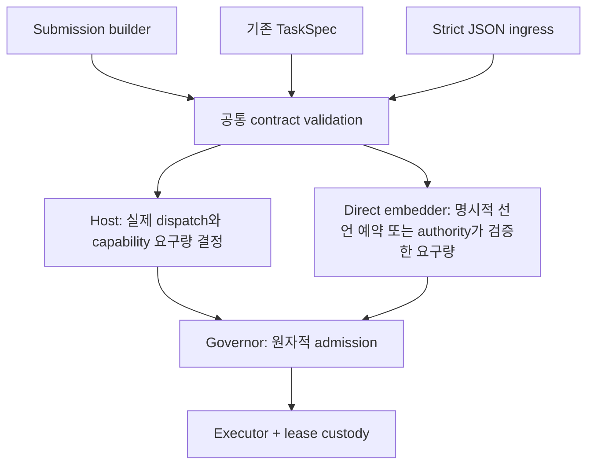

# SEP-27: SDK DX와 확장성 최종 제안

- 상태: **Proposed — 구현·배포 승인 및 검증 결과가 아닌 설계 제안**
- 날짜: 2026-09-27
- 범위: `taskmesh` facade, contract vocabulary, Tokio host, direct Governor embedding
- 최초 감사 기준: `a3241e358e82b26f39ab30010536b8978f203c22`
- 문서 작성 시 재확인: `8a4f3a6e58403c8aede2355a658a8884831a0745`; 두 HEAD 사이 관련 runtime/contract/engine/Rayon 소스 변경 없음
- 작업 환경: 다른 작업의 dirty 변경이 있는 shared checkout. 이 문서는 소스 정적 검토이며 clean-source qualification을 주장하지 않는다.
- 대체 문서: [RFC 0002](../rfcs/0002-sdk-dsl-contract.md)

## 1. 제안 결정

기존 엔진 위에 **얇은 submission builder**를 추가한다. 일상 호출의 중복 지정을
줄이고, 오류 처리·시간 제약·고급 admission의 의미를 명확히 한다. 모든 경로는
기존 contract validation, host dispatch resolution, Governor admission과 custody
종료 처리를 공유한다.

우선 구현 범위는 오류 타입 노출, 검증 생성자, 시간 제약 이름, runtime 설정 공유,
submission builder, direct admission 명명, 선택적 관측성이다. generic runtime trait와
실행 가능한 flow는 실제 소비자 요구가 확인된 뒤 별도 결정한다.

기존 API 제거 일정, 새 breaking version, 범용 production preset의 숫자는 이 RFC로
확정하지 않는다. 현재 manifest는 `0.3.0`, changelog는 unreleased 상태다.

## 2. 현재 구현과 감사 결과

아래 상태는 작성 기준 소스에서 확인했다. 성능 병목이나 테스트 통과를 측정한 표가 아니다.

| 영역 | 현재 사실 | 처분 |
|---|---|---|
| 중복 class 등록 | `Builder::class_policy`는 duplicate를 기록하고 build에서 거부 | 기존 구현 유지; 과거 silent replacement 이슈 재등록 금지 |
| class 검증 | `TaskClass::new`는 raw 값 생성; build/direct Governor 구성에서 검증 | `try_new`를 additive API로 추가 |
| mixed direct/host drain | Builder가 `SettlementWaker`를 Governor에 연결 | 기존 정확성 계약과 회귀 증거 유지; 미구현 기능으로 취급하지 않음 |
| 외부 입력 | strict JSON ingress에 byte/depth/stage 제한 존재; 기본 stage 상한 64 | 일반 in-process `TaskSpec` validator에도 같은 상한이 있다고 주장하지 않음 |
| 오류 DX | `PlanSource::new`, `TaskSpec::validate`가 반환하는 `TaskPlanError` 등이 facade에 재노출되지 않음 | facade만 의존하는 소비자가 타입과 variant를 이름으로 사용할 수 있게 보완 |
| 실행 DX | `TaskSpec::cpu`와 `run_cpu_with` 양쪽에서 substrate를 지정 | 단일 선택 submission builder 추가 |
| 시간 제약 | `with_deadline(Duration)`은 worker 시작부터의 예산; 기본 class policy는 deadline을 거부 | 명시적 이름과 정책 설정 예제 제공 |
| 공개 구조체 | `TaskSpec`, `SubmitOptions`, 여러 설정 타입이 all-public fields | 기존 layout 계약 보존; 새 builder는 private fields |
| clone 비용 | `TokioRuntime`의 derived Clone이 owned `RuntimeConfig`의 map/vector도 복제 | 불변 설정을 Arc로 공유; 실제 allocation/latency 효과는 측정 필요 |
| generic Runtime | bare async trait가 반환 future의 Send를 약속하지 않으며 options 메서드가 없음 | 실제 generic 소비자 요구가 있을 때 좁은 trait 설계 |
| executor 확장 | CPU adapter port 존재; 추가 substrate 등록은 새 실행 타깃을 만들지 않음 | inventory와 실행 지원을 구분하여 문서화 |
| 검증 기반 | 외부 consumer/MSRV fixture와 semver 도구가 이미 존재 | 기존 fixture를 확장; 중복 검증 체계 신설 금지 |

근거 소스:

- [facade exports](../../crates/taskmesh/src/lib.rs)
- [Builder](../../crates/taskmesh/src/builder.rs)
- [TaskClass / TaskSpec](../../crates/taskmesh-contract/src/task.rs), [validator](../../crates/taskmesh-contract/src/validation.rs)
- [TokioRuntime](../../crates/taskmesh/src/runtime.rs), [RuntimeConfig](../../crates/taskmesh-contract/src/config.rs)
- [deadline/options](../../crates/taskmesh/src/executor/cancel.rs), [Runtime trait](../../crates/taskmesh-contract/src/runtime.rs)
- [strict ingress](../../crates/taskmesh/src/ingress.rs), [executor ports](../../crates/taskmesh-contract/src/ports.rs)
- [Governor](../../crates/taskmesh-engine/src/engine/governor.rs), [외부 consumer](../../tools/consumer-msrv/src/main.rs)

## 3. AS-IS → TO-BE

| AS-IS | TO-BE | 호환성 |
|---|---|---|
| raw identifier 생성 후 build/admission 검증 | 외부 입력은 `try_new`; 최종 authority 경계의 검증도 유지 | 기존 `new` 유지 |
| spec와 실행 메서드에 substrate 중복 지정 | `runtime.cpu(class, operation).…run(job)` | 기존 `run_*_with` 유지 |
| facade 밖에 있는 반환 오류 타입 | facade에서 typed error 처리 완결 | 재노출 추가 |
| `with_deadline` 의미를 문서에서 해석 | `run_for`, `complete_by`, `acquire_timeout` | 기존 이름의 동작 유지 |
| runtime clone이 설정 registry 복제 | 불변 설정 공유 | private representation 변경; public getter 유지 |
| direct admit의 선언 전체 예약과 host 실제 dispatch 예약 | 이름과 문서에서 예약 범위 명시 | 기존 semantics를 patch에서 변경하지 않음 |
| full snapshot 중심 관측 | 주기적 snapshot + 선택적 host tracing | accounting authority는 Governor 유지 |



단일 submission은 한 실행 단위다. 이후 stage, fan-out 실행, 결과 reduce는 호출자가
소유한다. stage/reduce 선언만으로 실제 작업이 실행됐다고 해석하지 않는다.

## 4. 일상 SDK 형태

다음은 제안 문법이며 현재 컴파일 가능한 예제가 아니다. `runtime`에는 해당 class가
등록되어 있고 `CancellationPolicy::CooperativeWithDeadline`이 설정되어 있다고 가정한다.

```text
let class = TaskClass::try_new("retrieval")?;

let result = runtime
    .cpu(class, "rank:42")
    .acquire_timeout(Duration::from_millis(50))
    .complete_by(request_deadline)
    .cancel(cancel.child_token())
    .run(move || rank(input))
    .await?;
```

- `cpu`, `blocking`, `io`, `local`은 각 실행 종류에 맞는 submission builder를 반환한다.
- `CpuSubmission` 등의 private 필드가 spec와 options를 보관한다. operation은 시작 인자로 요구한다.
- 종단 `run`이 CPU/blocking closure와 IO/local future의 타입·lifetime 조건을 구분한다.
- builder 구성은 capacity를 예약하지 않는다. 실행 future를 poll할 때 admission에 진입한다.
- 기존 `run_*_with`와 공통 구현을 사용한다. 별도 scheduler, queue, policy 상태를 만들지 않는다.
- `RunError<E>`를 보존한다. 작업 오류와 governor 오류를 합쳐 문자열로 반환하지 않는다.
- caller drop, queued cancellation, worker 시작 이후 timeout과 drain은 기존 custody 계약을 따른다.
- raw `TaskSpec` 경로는 복잡한 lineage 및 직접 embedding 용도로 유지한다.

새 builder는 입력 편의 계층이다. builder에서만 유효하고 raw/JSON 경로에서는 우회되는
검증 규칙을 만들지 않는다. hot path의 allocation 증가 여부는 기존 호출과 비교한다.

## 5. 시간·취소·종료 계약

| 이름 | 의미 |
|---|---|
| `acquire_timeout(duration)` | admission 획득 대기 예산. 0은 기다리지 않는 시도 |
| `run_for(duration)` | worker 시작부터의 상대 실행 예산 |
| `complete_by(instant)` | 대기부터 caller 응답까지 적용되는 절대 경계 |
| `cancel(token)` | class policy에 따른 취소 요청 |

`run_for`와 `complete_by`는 기존 `SubmissionDeadline`의 두 대안이다. 별개의 숨은
deadline을 추가하지 않는다. fluent setter를 연달아 사용하면 기존 options처럼 마지막
deadline 설정이 앞의 설정을 대체한다는 규칙을 문서화한다.

자식 submission에는 전체 요청의 동일한 absolute deadline을 전달한다. 각 단계에서
새 duration으로 예산을 재시작하지 않는다. `Instant`는 프로세스 내부 제어값이며 wire에
직렬화하는 공통 시간값으로 취급하지 않는다.

deadline이 지원되지 않는 class는 기존처럼 typed error를 반환한다. production 예제는
class policy 설정까지 포함한다. 이미 시작한 blocking worker는 caller timeout으로
강제 종료되지 않으며, 실제 worker 종료와 정리까지 capacity를 유지한다. deadline은
OS scheduling에 대한 hard real-time 보장이 아니다.

## 6. 타입·오류·고급 API

### 6.1 Facade만으로 사용할 수 있는 오류

`TaskPlanError`, `TaskIdentifierField`, `IdentifierViolation`을 적절한 facade 경로에
재노출한다. `rayon` feature의 `RayonBuildError`와 advanced capability API의 공개
시그니처도 조사해, 의도적으로 지원하는 API의 타입을 소비자가 이름으로 쓸 수 있게 한다.
모든 내부 타입을 일괄 export하는 방식은 사용하지 않는다.

`TaskClass::try_new`와 필요 시 `TaskStage::try_new`는 공통 identifier validator를 사용한다.
기존 생성자는 유지한다. 자동 deprecated 처리나 제거 일정은 소비자 이전 근거가 있을 때 결정한다.

상세 field/reason을 validation 단계에서 제공하고 실행 경로의 기존 `RunError<E>` 및
`AdmissionVerdict`를 유지한다. 기존 `retry_after_ms`를 활용한다. timeout을 일괄
재시도 가능으로 분류하지 않는다. 이전 worker의 부작용과 idempotency는 호출자 계약이다.

### 6.2 Direct admission

`admit_declared_plan`과 같은 이름으로 기존 direct admission의 선언 전체 예약 의미를
드러낸다. 실제 단일 dispatch를 예약하는 경로는 기존 authority가 검증한 capability
집합을 사용한다. 이름 변경은 `admit`, `admit_validated`, `admit_waitable` 전체를 함께
검토하고 기존 호출을 동일한 내부 구현에 연결한다.

IO→CPU 선언에서 host IO 호출은 실제 IO dispatch만 예약한다. 다음 CPU 작업은 별도
submission으로 예약한다. direct 선언 예약은 예약한 capability를 ledger/관측 API로
설명할 수 있어야 한다. 선언 예약을 CPU 실행 증거로 표시하지 않는다.

foreign Governor에서 해석한 capability handle 재사용은 거부한다. 새 경로가 raw pool
이름이나 stale handle로 authority 검증을 우회하지 못해야 한다.

### 6.3 확장 가능한 공개 타입

새 builder/config에는 private 필드와 accessor를 사용한다. 기존 all-public struct에 필드를
추가하거나 `non_exhaustive`를 붙이는 변경은 별도 breaking 검토 대상이다. wire DTO와
SDK builder는 공통 validator를 사용하고 별도의 policy authority를 만들지 않는다.

`RuntimeWithOptions`는 facade-only generic 소비자가 실제 필요로 할 때 검토한다. 해당
trait는 multithreaded 실행 메서드의 반환 future에 `Send`를 명시해야 한다. local 실행의
non-Send 계약과 기존 borrowed input 지원을 보존한다. Tokio cancellation 타입을 편의상
순수 contract crate로 옮기지 않는다.

## 7. 확장성과 운영 비용

### 7.1 불변 설정 공유

`TokioRuntime` 내부의 config 또는 적절한 immutable inner를 Arc로 공유한다. public
`config()` 관찰 결과와 동일 Governor/드레인 상태 공유를 보존한다. class registry 크기를
바꿔 clone allocation과 지연을 비교한 뒤 효과를 기록한다. 현재 단계에서 병목으로 단정하지 않는다.

### 7.2 관측과 contention

현재 `snapshot()`은 engine mutex 안에서 class/capability map을 구성한다. 매 요청마다
전체 snapshot을 호출하는 예제를 기본으로 제공하지 않는다. 주기적 수집과 선택적 host
tracing으로 queue, admit, start, caller completion, worker settlement, drain을 설명한다.

- subscriber 호출은 engine lock 밖에서 실행한다.
- class/pool 등 등록된 유한 inventory만 metric label로 사용한다.
- operation/root ID는 opt-in trace context로 두고 민감도·크기 정책을 적용한다.
- 이벤트 유실이나 observer 실패가 permit release/drain notification을 누락시키면 안 된다.
- 진단 이벤트는 accounting authority가 아니며, 기능 off/on에 따라 verdict가 바뀌면 안 된다.

class 수, 경쟁 caller 수, snapshot 빈도별 admission latency와 allocation을 측정한다.
mutex sharding은 측정 후 판단한다. 다중 자원 원자 예약, fairness, root 회계를 보존하는
비용까지 비교한다. 새 metrics용 독립 accounting map을 만들지 않는다.

### 7.3 Capacity와 입력 범위

기본 운영 안내는 한 runtime을 구성해 clone하는 형태다. 서로 다른 Governor를 가진
runtime이 동일 executor를 공유해도 전체 admission 상한이 자동 합쳐지지 않는다.
`exclusive_pool=false`는 외부 ambient 작업까지 제어하지 못한다는 의미를 유지한다.

안전한 구성 예제는 class 비용, inflight/queue 상한, resource budget, executor domain을
명시한다. consumer 측정 없이 보편적인 production preset 숫자를 고정하지 않는다.

strict JSON ingress의 byte/depth/stage 제한과 in-process plan 검증 범위를 구분한다.
공통 stage 상한을 추가하려면 기존 소비자의 최대 계획 크기와 호환성 영향을 확인한다.
JSON parsing 이전 byte 제한과 parsing 이후 plan 검증은 서로 대체할 수 없다.

## 8. 조건부 확장: executor와 flow

새 executor 지원은 actual dispatch, physical domain, nonblocking submission, capacity
authority, worker 종료 계약을 함께 명시한다. inventory 등록만으로 실행 타깃이 되지 않는다.
같은 물리 pool을 product/engine별로 복제하는 형태로 확장하지 않는다.

실행 가능한 flow는 실제 소비자 파이프라인 두 개와 자원 envelope, 결과 oracle을 확보한
뒤 별도 결정한다. 얇은 facade module로 가능한지 먼저 검토한다. 필요 계약은 다음과 같다.

- typed stage closure와 intermediate result
- 명시적 bounded fan-out과 실제 reducer
- 완료 순서가 바뀌어도 동일한 reduce 결과
- duplicate/tie/error/partial-result 정책
- child identity, cancel 전파, 동일한 전체 요청 deadline
- 각 실제 실행 단위의 독립 admission과 정확한 custody 종료

orchestrator가 CPU permit을 잡은 채 같은 capacity를 요구하는 자식 CPU 작업을 기다리는
구조는 피한다. 불가피한 nested wait는 기존 awaited-child 계약과 typed refusal을 따른다.
stage metadata를 실행 flow로 해석하거나 새 unbounded queue를 추가하지 않는다.

## 9. 구현 순서와 완료 기준

| 단계 | 변경 | 필요한 확인 |
|---|---|---|
| A: 현재 DX 결함 | 오류 타입 재노출, try_new, 시간 alias, runtime 설정 공유 | facade-only typed error 사용, invalid identifier, 기존 options와 동치, clone 후 config/authority 공유 |
| B: 일상 호출 | submission builder, class policy 포함 quickstart | 기존 호출과 verdict/capacity/custody 동치; builder 생성·drop은 미예약; queued drop과 worker-start 이후 timeout |
| C: 고급 계약 | direct admission 명명과 adapter 안내 | IO→CPU host/direct 예약 비교, foreign authority 거부, 기존 embedding 동작 보존 |
| D: 관측성 | optional tracing와 운영 설명 | off/on 의미 동치, lock 밖 이벤트, high-cardinality 제한, observer 실패 후 settlement 완료 |
| E: 소비자 이전 | migration guide와 기존 consumer fixture 확장 | default/rayon, MSRV 1.81, 오류 match, deadline 지원/거부, 문서 예제, semver diff |
| 조건부 | generic trait / flow | 이름 있는 실제 소비자, Send/local 계약 또는 deterministic reducer와 bounded fan-out 증거 |

기존 [consumer fixture](../../tools/consumer-msrv/src/main.rs),
[Justfile](../../Justfile), [semver 도구](../../tools/release/semver.py)를 확장한다.
owner-local 확인 후 최종 소스가 고정된 시점에 ordinary CI를 수행한다. 같은 소스에서
통과한 검증을 이유 없이 반복하지 않는다. 이번 문서 저장으로 테스트를 실행하거나
mutation/nightly/release campaign을 승인한 것으로 해석하지 않는다.

완료 판단은 점수나 API 개수가 아니라 typed facade 사용 가능 여부, 구·신 경로 의미 동치,
호환성, 운영 설명의 정확성, 측정된 비용으로 한다.

## 10. 호환성과 이전

현재 0.2→0.3에는 이미 breaking migration이 있다. 기존 0.2 consumer가 무수정으로
컴파일되는 것을 이번 계획의 완료 기준으로 삼지 않는다. 이번 additive 변경의 기존
0.3 caller 호환성과, 문서화된 0.2→0.3 이전 사례를 각각 검증한다.

- 기존 `new`, `run_*_with`, raw DTO의 의미를 유지한다.
- old/new API는 공통 내부 구현에 연결하고 정책을 이중 관리하지 않는다.
- direct reservation semantics와 default budget을 patch에서 조용히 바꾸지 않는다.
- 이전된 call site와 잔여 소비자 inventory를 확인한 뒤 deprecated/removal을 결정한다.
- additive facade의 rollback은 새 호출을 기존 API로 되돌리는 경로를 제공한다.
- API, wire, behavior, feature, MSRV 호환성을 각각 검토한다.

## 11. 문서 권위와 과거 초안 정리

이 RFC는 앞으로의 SDK 보완안이다. 구현된 계약의 권위는
[library spec](../taskmesh-library-spec.md), [external interface](../taskmesh-external-interface.md),
[ADR 0001](../adr/0001-hexagonal-feature-sliced-architecture.md),
[ADR 0004](../adr/0004-sep-25-ingress-plan-identity-and-wire.md),
[ADR 0005](../adr/0005-sep-25-execution-response-and-custody.md)에 있다.

SEP-24 RFC 0002의 duplicate replacement와 direct drain gap 설명은 과거 baseline의
관찰이다. [원문 archive](../archive/2026-09-27/0002-sdk-dsl-contract.md)는 이력으로 보존하며
현재 미해결 목록으로 사용하지 않는다. 초기 RFC 0001은 역사적 원칙 요약으로 남긴다.

표준 참고:

- [Cargo SemVer compatibility](https://doc.rust-lang.org/cargo/reference/semver.html): 공개 필드·trait·pre-1.0 호환성
- [Rust public async traits](https://blog.rust-lang.org/2023/12/21/async-fn-rpit-in-traits/): 반환 future의 Send 계약

구현 진행 시 각 단계에 실제 commit과 검증 범위를 기록한다. 문서가 Proposed라는 사실과
기존 기능의 구현 상태, release/consumer activation 상태를 혼합하지 않는다.
