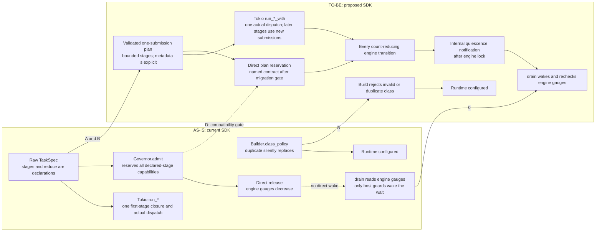

# RFC 0002: SDK DSL and execution contract

- Status: Proposed; design only
- Date: 2026-09-24
- Scope: `taskmesh` 0.3.x public SDK, contract, Tokio host, and direct Governor embedding
- Decision owner: pending
- Source baseline: `main@e5aa4b63a1fedb3b416d33d1ea7ff364258002b5`; the checkout also has uncommitted CI/test-catalog work in progress

## Decision requested

Keep Taskmesh a governed execution library. Make the everyday DSL describe **one
submitted unit of work**, and make every declared property have a named owner:
contract validation, engine admission/accounting, host dispatch, or caller-owned
execution. Do not imply that `TaskSpec::stage` schedules steps or that
`DeterministicReducePolicy` merges values. If a consumer needs an executable
pipeline, add an optional composition layer with closures and typed results;
do not make the engine interpret product workflows.

This RFC proposes a first SDK hardening slice, beginning with the existing
direct-Governor/host lifecycle seam, and a separate design gate for executable
flows. It does not change code, claim test qualification, or authorize
release/mutation campaigns.

## AS-IS → TO-BE

The left side is the current source at the stated HEAD. The right side is the
proposed contract; it is not an implemented state. Edge labels identify the
delivery waves below. Wave D's direct-API rename needs a compatibility decision.



The drain change is a notification change, not a second accounting authority:

```mermaid
sequenceDiagram
    participant Direct as Direct Governor caller
    participant Shutdown as Shutdown caller
    participant Host as TokioRuntime.drain
    participant Engine as Governor
    participant Wake as Internal quiescence signal
    Direct->>Engine: admit(spec)
    Shutdown->>Host: drain(timeout)
    Host->>Wake: begin draining
    Host->>Engine: close_admission()
    Host->>Wake: create Notified
    Host->>Engine: snapshot() = outstanding
    Direct->>Engine: release(permit)
    Note over Engine,Wake: TO-BE: signal after the state lock is released
    Engine->>Wake: signal quiescence
    Wake-->>Host: notify_waiters() wakes drain
    Host->>Engine: snapshot() = idle
    Host-->>Shutdown: Ok promptly
    Note over Direct,Host: AS-IS: direct release has no wake; finite drain rechecks at timeout
```

`RuntimeWithOptions` and an executable `flow` layer are conditional consumer
decisions (waves C and F), so neither appears as a required step in the core
path. The current concrete `_with` methods and metadata-only stage semantics
remain usable while these decisions are pending.

## Current source facts

| Surface | Current behavior | Consequence |
|---|---|---|
| `Builder::class_policy` | `BTreeMap::insert` replaces an earlier policy for the same class; `TaskClass::new` accepts any string. `Governor::validate_policy` checks policy arithmetic but not class identifier syntax. | A duplicate registration can silently change governance; an unusable class can survive `build()` and fail at submission. |
| `TaskSpec` | Constructors create a bootstrap stage; `operation` supplies root identity; `validate_task_spec` checks identity, stage shape, and reduce-policy presence. | The simple single-submission path is concise and fail-closed at admission, but raw public fields and Serde require validation at every ingress. |
| Stage DSL | `TaskSpec` explicitly documents later stages as governance declarations. The Tokio host executes one caller closure on the first stage's substrate. Reduce validation checks a policy exists and its key is nonempty; it does not execute a reducer. `CheckpointPolicy` is host-inspected metadata. | A valid multi-stage spec does not prove any later stage ran, any fan-out was bounded, or any output was reduced deterministically. |
| Capability accounting | Direct `Governor::{admit, admit_waitable, admit_validated}` reserves each distinct declared stage-hint pool once for the permit; explicit resolved admission uses caller-supplied requirements. `TokioRuntime` preflight reserves only the resolved first dispatch's role and applicable physical domain. | The same multi-stage spec can reserve different capability sets depending on the entry point. Later host work requires another submission and permit. |
| Submission control | `SubmitOptions` and `_with` methods support cancel, acquire timeout, and deadline on `TokioRuntime`. The public contract `Runtime` trait only has unbounded methods. | Generic `R: Runtime` callers cannot express those controls without depending on the concrete host API. |
| Async trait bound | The public `Runtime` trait uses bare `async fn`; it does not promise that returned futures are `Send`. | A generic consumer cannot assume it can spawn a `Runtime` call on a multithreaded executor. `run_local` correctly needs a different, non-`Send` contract. |
| Lifecycle | The host closes admission and drains charged work; a started blocking worker retains custody after caller timeout/cancel. Snapshot exposes accounting and inventory. | Host-owned lease accounting has a defined lifecycle. Mixed direct/host notification has the separate gap below. |
| Mixed direct/host lifecycle | `TokioRuntime::governor()` exposes the mutable Governor. Direct `release`, `abandon`, and leak reclamation change the same gauges that host `drain()` reads, but only host `ExecutionLease`/`TicketGuard` drops ping its `DrainSignal`. The drain module explicitly documents that direct releases are observed at timeout. | A fully settled direct permit can leave a finite drain waiting for its entire timeout; a clock-unrepresentable timeout has no final recheck. This is an existing documented limitation, but it is material to an SDK that presents both paths on one runtime. |
| Shared executor | The default CPU adapter uses Tokio's blocking pool and declares `exclusive_pool=false`. | Taskmesh bounds its own submissions but cannot reserve worker time against unrelated Tokio users of that pool. |

The first four rows follow `crates/taskmesh-contract/src/{task,validation,runtime}.rs`,
`crates/taskmesh/src/{builder,execution_plan,runtime}.rs`, and
`crates/taskmesh-engine/src/{engine/governor,features/composite/reduce}.rs`.
The mixed-lifecycle row follows `crates/taskmesh/src/runtime.rs:119-123,1191-1250`,
`crates/taskmesh/src/runtime/drain.rs:27-36,195-243`, and
`crates/taskmesh-engine/src/engine/governor.rs:370-422,440-477,843-868`.
These are source observations, not an executed acceptance receipt.

## 2026 comparison criteria

There is no single standard for a governed execution DSL. The relevant Rust
comparators establish specific constraints:

- [Tower `ServiceBuilder`](https://docs.rs/tower/latest/tower/struct.ServiceBuilder.html)
  composes concurrency, buffering, and shedding, and documents that layer order
  changes total in-flight capacity. Taskmesh should expose its one-queue/one-
  admission semantics clearly before offering a Tower adapter. `poll_ready`
  cannot reserve a class-specific slot when the request class is not known
  until `call`.
- [Tokio graceful shutdown](https://tokio.rs/tokio/topics/shutdown) separates
  cancellation notification from waiting for task completion. Taskmesh's
  admission close and drain should remain separate from per-submission cancel.
- [Tokio `Notify`](https://docs.rs/tokio/latest/tokio/sync/struct.Notify.html)
  guarantees that `notify_waiters()` reaches an already-created `Notified`
  future, even before it is polled. The host's current create-before-snapshot
  ordering uses this guarantee; the missing piece is a signal on direct
  Governor state transitions, not a different wait primitive by itself.
- [Tokio `spawn_blocking`](https://docs.rs/tokio/latest/tokio/task/fn.spawn_blocking.html)
  cannot abort already-started work. A response timeout must not free the
  worker's lease early or promise forced cancellation.
- [Rust API Guidelines](https://rust-lang.github.io/api-guidelines/checklist.html)
  favor validated arguments, meaningful errors, builders for complex values,
  and private fields for future evolution. Taskmesh's public wire structs may
  remain public for 0.3 compatibility, but new SDK configuration types should
  not repeat that expansion constraint. The [Cargo SemVer guide](https://doc.rust-lang.org/cargo/reference/semver.html)
  treats adding a field to an all-public struct as breaking for struct literals.
- The [Rust Async Working Group's public-trait guidance](https://blog.rust-lang.org/2023/12/21/async-fn-rpit-in-traits/)
  requires a deliberate `Send` decision for returned futures. The proposed
  host trait must state which methods support multithreaded spawning and keep
  `run_local` non-`Send`.
- [`tracing::Instrument`](https://docs.rs/tracing/latest/tracing/trait.Instrument.html)
  can propagate async spans without putting a subscriber or I/O in the pure
  engine. Metric labels must stay low-cardinality; operation/root IDs belong in
  bounded trace context, not metric dimensions.

These are comparison inputs, not a claim that Taskmesh must implement every
Tower layer or own the caller's workflow.

## Goals and non-goals

Goals:

1. Every accepted DSL field has a documented enforcement level and owner.
2. Invalid or duplicate class policy fails before the first submission.
3. A consumer can request bounded acquisition, cancellation, and deadlines
   through the existing concrete host methods; add a host SDK trait only when
   an external generic consumer needs one and its `Send` contract is proven.
4. Direct-engine and Tokio-host admission never silently claim equivalent
   capacity accounting when they are not equivalent.
5. SDK examples prove overload, cancel, drain, and stage boundaries without
   requiring consumers to import internal crates.
6. Observability is opt-in, bounded, and emitted outside the engine lock.
7. A runtime that exposes direct Governor mutation can drain promptly after
   direct custody returns, with no lost wakeup or idle polling.

Non-goals:

- A distributed workflow engine, retries, persistence, or durable DAG recovery.
- Automatic execution of existing `TaskSpec::stage` entries.
- A second queue, an engine-specific worker pool, or a product taxonomy in the
  public API.
- A new required mutation/nightly gate for ordinary SDK development.

## Proposed SDK contract

### 0. Close the direct-Governor drain gap

The public `governor()` accessor is a reachable mixed-mode API, used by the
repository's own consumers and examples. Keep its direct admission and
maintenance operations in the lifecycle inventory. Repro sequence for an
owner fixture: directly admit one permit; start `TokioRuntime::drain` and wait
until admission is closed and the drain has observed nonzero custody; directly
release the permit. The engine snapshot is now idle, but no host guard calls
`DrainSignal::settled()`. The current drain only revisits the snapshot at its
deadline (or on an unrelated host release); with an unrepresentable deadline
it may wait indefinitely. The wakeup gap is source-confirmed; exact timing and
the unbounded case still need a focused executable oracle.

Recommended implementation: register one **internal, correctness-critical**
quiescence notification port when `Builder` constructs the Governor, before the
runtime is exposed. The pure engine records whether a transition reduced
charged `inflight` or `queued` work and invokes the port only after releasing
its state mutex. The host port wakes all active drain waiters. Audit every
count-reducing path, including direct `release`, `release_leased`, `abandon`,
leak reclamation, and transitions that remove queued work; promotions alone
do not imply quiescence. Registration must not be mutable by public direct
callers. The host implementation should contain only a flag check and
notification, never user callbacks. If the engine exposes a general port for
other embedders, a panicking implementation is a contract fault: catch it
alongside existing transition effects, finish all pending notifications, and
then propagate the panic. A diagnostic observer remains separate and
droppable. Do not route this signal through optional tracing or rely on
periodic polling.

Preserve create-`Notified`-before-snapshot ordering, the mirror flag's
begin-before-close ordering, and the final authoritative snapshot. Require
independent interleaving oracles for release before/after the first snapshot,
release between snapshot and wait, concurrent drain callers, direct queued
abandon, and leak sweep. A later breaking version may narrow the mutable
`governor()` escape hatch to read-only inspection plus named maintenance
operations, but that alone cannot repair current callers while the accessor
remains public.

### 1. Make the enforcement levels explicit

Publish one table in rustdoc and the external interface:

| DSL field | Contract | Engine | Tokio host | Caller |
|---|---|---|---|---|
| class, operation, root/parent identity | syntax and lineage shape | registered class, recursion and root accounting | passes validated identity | chooses stable IDs |
| first-stage substrate | valid hint | capacity if direct API | resolves actual dispatch and charges its pools | chooses matching `run_*` |
| later `stage` hints | shape only | direct API reserves each distinct declared pool once per permit | does not execute or charge them | submits later work with a new permit |
| fan-out/reduce policy | presence and stable key | refuses malformed declaration | does not spawn branches or merge outputs | bounds branch execution and implements the reducer |
| checkpoint policy | valid class policy | preserves/exposes it | no automatic checkpoint | decides/checks checkpoint timing |
| cancellation/deadline | compatible policy | protects permit lifecycle | bounds wait or cooperative work per path | supplies token/deadline |

Add an explicit rustdoc sentence to `reduce_stage` and `fan_out_stage`:
“declaration validation is not result reduction.” Keep the current
`MalformedTask` gate. Do not expose `fan_out_stage` as the recommended builder
path; it intentionally produces an invalid plan and is useful only for negative
fixtures. Changing or removing the existing method is a separately reviewed
breaking API decision.

### 2. Validate configuration at construction

- Validate every registered `TaskClass` with the same identifier rules used by
  `TaskSpec` before `Builder::build` returns. Also validate class keys in the
  direct `PolicySet` → `Governor::new` route. Error identifies the class and
  violated rule; no panic and no delayed `MalformedTask` surprise.
- Detect duplicate `.class_policy(class, ...)` registrations. Preserve the
  current consuming builder signature in 0.3.x by recording the duplicate and
  returning a typed build error. If intentional override is needed, provide an
  explicitly named `replace_class_policy` operation with an auditable call site.
- Keep `TaskClass::new` for wire/source compatibility; add `TaskClass::try_new`
  for user input and recommend it at external boundaries. Do not make raw
  `TaskSpec` construction impossible in 0.3.x; `ValidatedTaskPlan` remains the
  admission boundary.
- Review the current zero/unbounded defaults (`ResourceBudget` ceilings,
  `ClassPolicy::max_inflight`, slot counts) as a documented opt-in profile. Do
  not silently change existing defaults. Offer a named bounded configuration
  example and only add a `bounded_defaults(...)` helper after consumer cost
  measurements determine safe values.
- Set a documented maximum for stage count in `ValidatedTaskPlan` construction;
  the validator currently bounds identifier length but not `stages.len()`.
  This protects downstream validation/admission, but Serde may already have
  allocated a large `Vec`. The external ingress owner must cap serialized
  request bytes **before** parsing untrusted input. Choose both limits from
  consumer inventory and document their distinct enforcement points.

### 3. Give submission controls a stable host-facing seam

Keep the minimal `taskmesh_contract::Runtime` trait and its engine-independent
dependency graph. The existing `TokioRuntime::run_*_with` methods are already
the production-oriented host surface. Do not add `RuntimeWithOptions` merely
for symmetry: the contract trait explicitly treats the host as its only
intended implementation, and an extra public trait would add a second API
contract without an identified consumer. First obtain a facade-only generic
consumer that cannot use a concrete `TokioRuntime`. If it exists, add a
facade-side `RuntimeWithOptions` trait exposing the required subset of `_with`
methods and `SubmitOptions`, preserving the concrete methods. Do not move
Tokio's `CancellationToken` into `taskmesh-contract` merely to make the trait
look runtime-neutral. If a second host is built, design a host-neutral
cancellation port from that concrete requirement and revise the trait.

If this conditional trait is approved, specify `Send` on the returned futures
of methods intended for multithreaded spawning, and leave the local method
non-`Send`. Prove the generic call can be spawned in a facade-only external
fixture on the Rust 1.81 floor. If doing so would tighten an existing method's
accepted inputs or force allocations on its hot path, keep the existing
inherent `_with` methods and record that tradeoff instead of publishing a
trait that does not serve generic consumers.

Document `RunFor` versus `CompleteBy`, `Duration::ZERO`, and the sync-work
custody distinction at this seam. Plain `Runtime` remains an unbounded
convenience surface; show `_with` in production-oriented examples.

Illustrative everyday shape after the additive `try_new` change (the rest of
this call is today's facade API):

```rust
let class = TaskClass::try_new("retrieval")?;
let runtime = Builder::new()
    .class_policy(class.clone(), bounded_policy)
    .build()?;
let spec = TaskSpec::blocking(class).operation("request:42");
let value = runtime.run_blocking_with(
    spec,
    SubmitOptions::unbounded()
        .with_cancel(parent_cancel.child_token())
        .with_acquire_timeout(acquire_budget),
    job,
).await?;
```

The caller must still choose a class policy and handle `RunError<E>`; the SDK
does not infer a class or discard the governor-versus-task error distinction.

### 4. Resolve the multi-stage capability semantics

Recommended rule for the current host: a single `run_*` invocation reserves
only the capabilities its **actual dispatch** occupies. A later declared
stage is not prepaid or executed; its separate submission must acquire its own
permit. Direct `Governor` embedding currently has different all-stage
reservation semantics and must retain them only behind an explicitly named
`admit_declared_plan`/equivalent API with a clear lifetime contract. A direct
embedder of one executable unit should use a resolved single-dispatch
requirement API. Do not silently rewrite direct admission in a patch release:
first inventory actual embedders and their use of multi-stage specs.

The acceptance oracle is a spec with IO first and CPU second: the host's first
call must not claim CPU execution; a separate CPU submission must charge CPU.
The direct plan-reservation API must report exactly what it reserved. Neither
path may return a snapshot that claims work has run when it was only declared.
The default CPU adapter's shared Tokio pool remains explicitly
`exclusive_pool=false`: an engine capability limit constrains Taskmesh's own
submissions, not ambient users of the same executor. Document that operational
limit and compare observed queue/start latency under ambient blocking load
before claiming an exclusive physical capacity guarantee.

### 5. Add low-cost host observability

An optional `tracing` feature emits stable, documented events for submit,
queue, admit, start, reject, cancel/timeout, terminal release, and drain. Emit
after the transition lock is released. Reuse typed verdicts and a bounded
class/pool inventory; do not use operation/root IDs as metric labels or log
untrusted `source`/`reason` by default. A trace span may carry an opt-in
redacted operation identity. Snapshot remains the accounting authority; traces
are diagnostic and can be dropped without changing admission.

### 6. Gate executable flows separately

If a real consumer needs a workflow DSL, create a separate `flow` composition
surface above `TokioRuntime`. It must own executable stage closures, typed
intermediate values, a bounded fan-out count, a deterministic reducer that
actually applies the declared ordering/duplicate/error policy, child identity,
cancel propagation, and a terminal outcome. It invokes `run_*_with` for every
unit and never opens another unbounded queue. Its builder returns a validated
`ExecutableFlow`; a metadata-only `TaskSpec` cannot masquerade as one.

Do not implement this layer from the present `StageDescriptor` alone: that
type has no closures, result type, or reducer function. Start only after a
consumer submits two concrete pipelines, expected resource envelopes, and
deterministic output oracles. A new crate is justified only if those examples
show the composition API cannot stay a small facade module.

Illustrative flow shape, **not** a committed API or compilable example:

```text
flow(root_identity)
  .step("fetch", io_closure)
  .fan_out("transform", max_parallel = 8, cpu_closure)
  .reduce("merge", key + duplicate/tie/error/partial policies + reducer_fn)
  .finish() -> Result<ExecutableFlow, PlanError>
```

## Delivery plan and proof

| Wave | Owner files | Acceptance evidence |
|---|---|---|
| 0: mixed-mode drain | `taskmesh-engine/src/engine/{governor,state}.rs` and its transition-effects path; `taskmesh/src/{builder,runtime,runtime/drain}.rs`; direct/host owner fixture; external interface | Every direct count-reducing transition wakes an active drain after the engine lock is released. No lost wake around close/snapshot/wait, no polling interval, concurrent drain callers complete, and timeout still reports genuine outstanding custody. The fixture first reproduces the existing documented delay. |
| A: contract truth | `docs/taskmesh-external-interface.md`, `docs/taskmesh-library-spec.md`, rustdoc on `TaskSpec`, stage/reduce/checkpoint methods | A facade-only example makes a later stage a separate `run_*` call; no document says metadata executes a reducer. Explain the mixed-mode drain behavior at the implemented state. Retire the spec's stale “0.2 migration window” wording against the current 0.3.0 package. |
| B: fail-closed configuration | `taskmesh-contract/src/{task,validation}.rs`, `taskmesh/src/builder.rs`, `taskmesh-engine/src/engine/governor.rs`; owner tests | Invalid/duplicate class fails build and direct Governor construction; old valid configs keep their behavior. |
| C: conditional host SDK seam | A named external generic consumer first; then `taskmesh/src/{lib,runtime,executor/cancel}.rs` and a facade-only consumer fixture | If a real generic need exists, its bound reaches the required `_with` cancel/deadline methods, `Send` calls can be spawned, local calls remain non-`Send`, and existing paths keep their error/custody semantics. Otherwise retain the concrete API and close this wave without a new trait. |
| D: accounting contract | `taskmesh-engine/src/engine/governor.rs`, `taskmesh/src/execution_plan.rs`; paired direct/host fixture | IO→CPU stage example proves each API's exact reservation and reports a separate CPU execution only when submitted. |
| E: observability | optional facade feature, host event source, external interface | Event sequence and status match snapshot/verdict; callback/panic cannot run under engine lock; disabled feature adds no event work. |
| F: optional flow design | separate consumer examples and follow-up RFC | Two real pipelines, bounded fan-out, executable reducer, cancel/drain and deterministic output oracles; no implementation before this gate. |

Route implementation evidence through the repository's
`docs/plans/2026-09-24-ci-verification-stages.md` contract: `local` runs the
changed owner fixture and its impacted crate/consumer closure; `dev` adds the
current worktree's core Rust/static checks; `ci` runs the complete clean-source
16-gate profile, including full `test`, feature/consumer MSRV, doctest, and
rustdoc coverage for public SDK changes. Wave 0's concurrency fixture belongs
in the host test target and therefore in ordinary `test`; an appropriate
model/TSan case may be added to the separately authorized nightly rail after
the transition inventory identifies the race. Neither a model-only result nor
a nightly subset replaces the host behavior oracle or clean CI receipt. A
documentation-only RFC edit does not itself establish implementation proof.

Minimum negative oracles for 0–E:

1. A direct permit released after a drain has observed it returns `Ok` promptly
   without waiting for the long timeout; a direct queued abandon and leak
   reclamation do the same once all custody is zero. Release before the first
   snapshot, during the snapshot/wait gap, and with two simultaneous drains
   cannot lose a wake. A truly live lease still yields `NotDrained` at timeout.
2. Blank/invalid/overlong class, duplicate class, and a deliberate replacement
   exercise construction and direct Governor admission separately. A bad class
   cannot produce a usable runtime through either path.
3. A valid IO→CPU declaration submitted only through `run_io` runs exactly one
   IO closure; CPU occupancy and output remain absent until an explicit CPU
   submission. Direct plan admission reports every reserved pool by name.
4. A fan-out declaration without a reduce policy rejects, while a complete
   declaration still does **not** claim to have merged outputs. Any future
   `ExecutableFlow` runs the reducer against reordered completions and proves
   identical results, including duplicate and task-error cases.
5. Queued cancel, timeout racing promotion, caller drop after worker start,
   worker panic, and drain timeout retain the existing exact-once capacity
   and terminal-state invariants under both concrete and generic SDK entry
   points when a generic seam exists.
6. Trace disabled/enabled produces the same verdict and snapshot. Reentrant or
   panicking diagnostic callbacks cannot execute under the engine mutex or
   alter admission; high-cardinality IDs never become metric labels.

Use owner-local focused checks and facade-only compile examples while editing.
Before calling a candidate qualified, freeze a clean exact HEAD and use the
ordinary CI receipt. Mutation, nightly, Linux release, and consumer activation
are separate decisions under the repository verification policy.

## Compatibility and rollback

- 0/A/C/E can be additive in 0.3.x if existing public struct layouts and trait
  requirements stay unchanged. B is source-compatible but intentionally changes
  the behavior of invalid/duplicate configs; inventory and migrate such users
  before enabling fail-closed construction. Changing `TaskSpec`, `ClassPolicy`, or
  `SubmitOptions` public fields; removing `fan_out_stage`; and changing the
  semantics of direct `Governor::admit` require an explicit breaking-version
  decision and downstream migration examples.
- Do not introduce a parallel compatibility DSL or duplicate policy authority.
  Retain strict rejection of stale serialized artifacts and document the one
  current wire schema.
- Roll back an additive helper by removing its use from new consumers first;
  preserve the existing `run_*` paths and admission invariant. Roll back an
  accounting change only with a paired direct/host semantic receipt.

## Open decisions before implementation

1. Inventory every transition that can reduce `inflight` or `queued`, then
   choose the smallest construction-time quiescence port that preserves the
   engine's after-lock transition-effects and panic discipline.
2. Are any external embedders using `Governor::admit` with more than one stage,
   and do they depend on pre-reserving all declared pools?
3. Which existing consumer needs generic `_with` calls rather than a concrete
   `TokioRuntime`, and which cancellation/deadline combinations does it use?
4. What are the measured maximum stage count and serialized request size at
   the external ingress? Choose bounds from those observations.
5. Is there a real executable flow use case? If so, provide two pipelines and
   independent reducer-output oracles before approving the optional layer.
